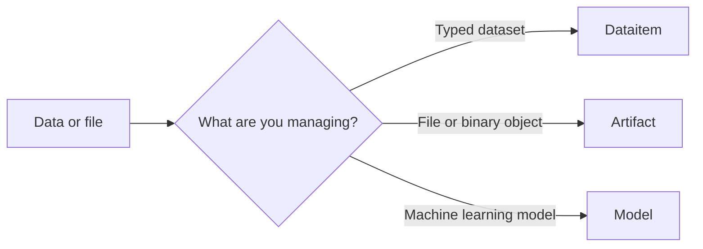

# Data, artifacts, and models

Use a [Dataitem](../reference/objects/dataitem/entity.md) when the object is a typed dataset that should be understood by data-aware components (e.g. a pandas dataframe). Use an [Artifact](../reference/objects/artifact/entity.md) when you need to store and move a file or another binary object.
Use a [Model](../reference/objects/model/entity.md) when you need to store and manage a machine learning model with model-specific metadata.

| | Dataitem | Artifact | Model |
| --- | --- | --- | --- |
| Represents | A typed dataset | A file or binary object | A machine learning model |
| Choose it when | The data kind and dataset semantics matter | File storage and transfer are the primary concerns | Model metadata and model-specific operations matter |
| Supported kinds | `table`, `croissant`, `dataitem` | `artifact` | `model`, `mlflow`, `sklearn`, `huggingface`, `tvm-ir`, `tvm-so` |
| Typical operations | Load data with kind-specific methods, upload, download, represent as dataframe | Upload, download, and access as a file | Upload or register models, move model files, and log metrics |
