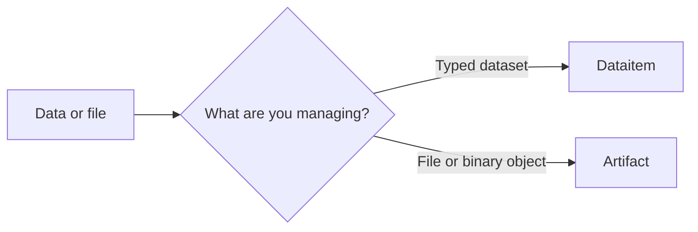

# Data and artifacts

Use a `Dataitem` when the object is a typed dataset that should be understood by data-aware components (e.g. a pandas dataframe). Use an `Artifact` when you need to store and move a file or another binary object.

| | Dataitem | Artifact |
| --- | --- | --- |
| Represents | A typed dataset | A file or binary object |
| Choose it when | The data kind and dataset semantics matter | File storage and transfer are the primary concerns |
| Supported kinds | `table`, `croissant` | `artifact` |
| Typical operations | Load data with kind-specific methods, upload, download, represent as dataframe | Upload, download, and access as a file |

For entity and API details, see [Dataitems](../reference/objects/dataitem/entity.md) and [Artifacts](../reference/objects/artifact/entity.md).

[Back to What can I do?](what-can-i-do.md)
