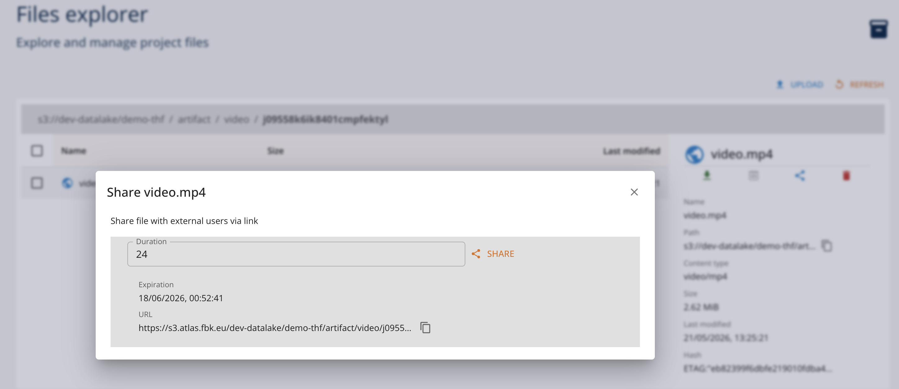
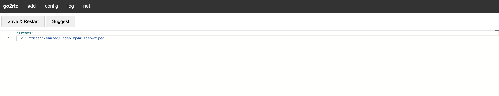

# Creating Distributed Anonymized Streaming with ServiceGraph

[Service Graph project](https://github.com/scc-digitalhub/digitalhub-servicegraph) allows for creating composed service pipelines for synchronous (HTTP) and asynchronous (RTSP, WebSocket) services. It uses a proprietary declarative DSL for defining the service flows and information passing. 

In this scenario we will create and deploy a simple video data processing scenario, where data streamed from a video source in MJPEG format is being anonymized using an IA model deployed as an Open Inference v2 service. and is sinked as MJPEG endpoint.


## 1. Create a Service Graph Function

We start defining the service graph function definition. The flow is as follows:

- read MJPEG stream from video source
- anonymize stream using IA model
- sink anonymized stream to MJPEG sink

```python
from pathlib import Path
Path("src").mkdir(exist_ok=True)
```

Lets create the Service Graph function definition:

```python
%%writefile src/flow.yaml

input:
  kind: "mjpeg"
  spec:
    url: "http://source:1984/api/stream.mjpeg?src=example"
    frame_interval: 5
    read_timeout: 30

output:
  kind: "mjpeg"
  spec:
    port: 7777
    path: "/stream"

flow:
  type: "sequence"
  name: "anonymization-pipeline"
  nodes:
    - type: "service"
      name: "anon-service"
      config:
        kind: "openinference"
        spec:
          address: "anonymization:9000"
          model_name: "haar_face_cascade"
          num_instances: 4  
          timeout: 10      

          input_tensor_spec:
            - name: "image"
              datatype: "UINT8"
              shape: [-1, -1]
          
          output_tensor_spec:
            - name: "image"
              datatype: "UINT8"
              shape: [-1, -1]
          
          output_template: |
            {{. | jp "$.outputs[0].data" | raw}}
```

Specifically, this simple graph

- reads MJPEG stream from video source representing (or simulating) a videe camera stream. The stream takes each 5th frame from the source.
- uses an IA model exposed using the Open Inference v2 service to anonymize the stream frames. The model accepts a list of frames of arbitrary dimensions.
- sinks anonymized stream to MJPEG endpoint that the graph may expose

To work with the platform we wil need SDK runtimes:

```shell
pip install digitalhub digitalhub-runtime-servicegraph digitalhub-runtime-container
```

Initialize the project and create the function in your prefered enviroment (e.g. Jupyter Notebook):

```python
import digitalhub as dh

project = dh.get_or_create_project("demo-servicegraph")

func = project.new_function("anonymization-pipeline", kind="servicegraph", code_src="src/flow.yaml")
```

## 2. Create the anonymization function

We will use a simple Open Inference function in order to implement the anonymization task and will rely on OpenInference runtime to deploy and execute it.

```python
%%writefile src/anonymization.py

import base64
import os
import time
from urllib import request

import numpy as np
from io import BytesIO
from PIL import Image
import json
import cv2


def init_model(context):
    """Initialize face detection models at server startup."""
    # Fallback to Haar Cascade (comes with OpenCV)
    context.logger.info("Loading Haar Cascade face detector...")
    model = cv2.CascadeClassifier(
        cv2.data.haarcascades + 'haarcascade_frontalface_default.xml'
    )
    setattr(context, "model", model)
    context.logger.info("Haar Cascade face detector loaded successfully")

def init_context(context):
    init_model(context)


def detect_faces_haar(model, image):
    """
    Detect faces using Haar Cascade.
    
    Args:
        image: OpenCV image (BGR format)
        
    Returns:
        List of (x, y, w, h) tuples for detected faces
    """
    gray = cv2.cvtColor(image, cv2.COLOR_BGR2GRAY)
    faces = model.detectMultiScale(
        gray,
        scaleFactor=1.1,
        minNeighbors=5,
        minSize=(30, 30)
    )
    return faces


def blur_region(image, x, y, w, h, blur_factor=50):
    """
    Apply Gaussian blur to a specific region of the image.
    
    Args:
        image: OpenCV image
        x, y: Top-left corner of region
        w, h: Width and height of region
        blur_factor: Blur intensity (higher = more blur)
        
    Returns:
        Image with blurred region
    """
    # Ensure coordinates are within image bounds
    height, width = image.shape[:2]
    x = max(0, x)
    y = max(0, y)
    w = min(w, width - x)
    h = min(h, height - y)
    
    # Extract region
    roi = image[y:y+h, x:x+w]
    
    # Apply Gaussian blur (kernel size must be odd)
    kernel_size = blur_factor if blur_factor % 2 == 1 else blur_factor + 1
    blurred_roi = cv2.GaussianBlur(roi, (kernel_size, kernel_size), 0)
    
    # Replace region with blurred version
    image[y:y+h, x:x+w] = blurred_roi
    
    return image


def pixelate_region(image, x, y, w, h, pixel_size=15):
    """
    Apply pixelation effect to a specific region.
    
    Args:
        image: OpenCV image
        x, y: Top-left corner of region
        w, h: Width and height of region
        pixel_size: Size of pixels for pixelation effect
        
    Returns:
        Image with pixelated region
    """
    # Ensure coordinates are within image bounds
    height, width = image.shape[:2]
    x = max(0, x)
    y = max(0, y)
    w = min(w, width - x)
    h = min(h, height - y)
    
    # Extract region
    roi = image[y:y+h, x:x+w]
    
    # Downscale and upscale to create pixelation effect
    temp = cv2.resize(roi, (w // pixel_size, h // pixel_size), interpolation=cv2.INTER_LINEAR)
    pixelated_roi = cv2.resize(temp, (w, h), interpolation=cv2.INTER_NEAREST)
    
    # Replace region
    image[y:y+h, x:x+w] = pixelated_roi
    
    return image


def anonymize_image(context, model, image_bytes, method='blur', blur_factor=50, pixel_size=15, draw_boxes=False):
    """
    Anonymize an image by detecting and obscuring faces.
    
    Args:
        image_bytes: Image data as bytes
        method: Anonymization method ('blur' or 'pixelate')
        blur_factor: Blur intensity for blur method
        pixel_size: Pixel size for pixelate method
        
    Returns:
        Tuple of (anonymized_image_bytes, face_count)
    """
    # Convert bytes to OpenCV image
    nparr = np.frombuffer(image_bytes, np.uint8)
    image = cv2.imdecode(nparr, cv2.IMREAD_COLOR)
    
    if image is None:
        raise ValueError("Failed to decode image")
    
    # Detect faces
    faces = detect_faces_haar(model, image)
    

    # Anonymize each face
    for (x, y, w, h) in faces:
        #context.logger.info(f"Face {x} {y} {w} {h}")
        if method == 'pixelate':
            image = pixelate_region(image, x, y, w, h, pixel_size)
        else:  # blur
            image = blur_region(image, x, y, w, h, blur_factor)
        if draw_boxes:
            cv2.rectangle(image, (x, y), (x+w, y+h), (0, 255, 0), 2)
    
    # Convert back to bytes
    _, buffer = cv2.imencode('.jpg', image)
    return buffer.tobytes(), len(faces)

def handler(context, request):
    """
    Anonymize faces in the provided image.
    
    Expects: Image bytes in request body
    Query params:
        - method: 'blur' or 'pixelate' (default: blur)
        - blur_factor: Blur intensity (default: 50)
        - pixel_size: Pixelation size (default: 15)
        - draw_boxes: Whether to draw bounding boxes around detected faces (default: False)
        - store_files: Whether to save anonymized images to disk for debugging (default: False)
    
    Returns: Anonymized image bytes
    """
    model  = getattr(context, 'model', None)
    if model is None:
        init_model(context)
            
    try:
        # Get image from request body
        data = request.inputs[0].data[0] if request.inputs[0].datatype == "BYTES" else request.inputs[0].data
        image_bytes = bytes(data)
            
        # Get parameters
        method = request.parameters['method'] if  request.parameters and 'method' in request.parameters else 'blur'
        blur_factor = int(request.parameters['blur_factor']) if request.parameters and 'blur_factor' in request.parameters else 50
        pixel_size = int(request.parameters['pixel_size']) if request.parameters and 'pixel_size' in request.parameters else 15
        draw_boxes = bool(request.parameters['draw_boxes']) if request.parameters and 'draw_boxes' in request.parameters else False
        store_files = bool(request.parameters['store_files']) if request.parameters and 'store_files' in request.parameters else False

        # Validate method
        if method not in ['blur', 'pixelate']:
            return {"error": "Method must be 'blur' or 'pixelate'"}
        
        # Anonymize the image
        anonymized_bytes, face_count = anonymize_image(
            context, model, image_bytes, method, blur_factor, pixel_size, draw_boxes
        )

        # write anonymized image to disk for debugging 
        # the image name has timestamp in UTC format to avoid overwriting files
        if (face_count > 0) and store_files:
            # check if exists the output directory, if not create it
            if not os.path.exists("/workspace/output"):
                os.makedirs("/workspace/output")
            timestamp = time.strftime("%Y%m%d-%H%M%S", time.gmtime())   
            output_filename = f"/workspace/output/anonymized_{timestamp}.jpg"
            with open(output_filename, "wb") as f:
                f.write(anonymized_bytes)
        
        context.logger.info(f"Anonymized {face_count} face(s) using {method} method")

        anonymized_bytes_list = list(anonymized_bytes)

        # Return anonymized image
        return {
            "outputs": 
                [
                    {"name": "image", "datatype": "UINT8", "data": anonymized_bytes_list, "shape": [1, len(anonymized_bytes_list)]}
                ]            
        }
        
    except Exception as e:
        context.logger.error(f"Error processing image: {e}")
        return {
            "error": str(e),
            "status": "error"
        }
```

Declare and register the function in the project, build its image and deploy it as a Open Inference service:

```python
anon_func = project.new_function(name="anonymization-service",
                            kind="openinference",
                            python_version="PYTHON3_10",
                            code_src="src/anonymization.py",
                            handler="handler",
                            init_function="init_model",
                            model_name="haar_face_cascade",
                            inputs=[{
                                "name": "image",
                                "datatype": "UINT8",
                                "shape": [-1,-1]
                            }],
                            outputs=[{
                                "name": "image",
                                "datatype": "UINT8",
                                "shape": [-1,-1]
                            }],
                            requirements=[
                                "opencv-python-headless==4.12.0.88", 
                                "opencv-contrib-python-headless==4.12.0.88", 
                                "numpy>=1.24.0", "pillow>=10.0.0", 
                                "requests>=2.31.0"]
                           )

anon_func.run(action="build", wait=True)
anon_func.run(action="serve", wait=True)
```

## 3. Simulate a video source

To create a video source in MJPEG format we will use the [go2rtc.org](https://go2rtc.org/) project. Specifically, we will run a container that streams the video. To accomplish this, we have to

- start go2rtc container with custom launch script
- configure it with the a video source (e.g., from a video artifact file)

### 3.1. Create a video artifact and share with presigned link

For demo purposes, we will use a test video and create a presigned link to share it with the go2rtc container. Indeed, it is possible to use any arbitrary video source for the same purpose.

```python
project.log_artifact("video", kind="artifact", source="video.mp4")
```

To create a presigned S3 link, it is sufficient to do this using Core UI. Access the file in the browser and share it. This will generate the presigned link of defined duration.



## 3.2 Create a streaming container

We will create a container from go24rtc project and configure it to stream the video source in MJPEG format. We add a custom start script that will be executed when the container is started. This is needed to download the video source from the presigned link.

```python
%%writefile src/launch.sh

#!/bin/bash
ls -la /shared
cd /shared
curl -Lo video.mp4 $1
go2rtc -config /shared/go2rtc.yaml
exit
```

```python
stream_func = project.new_function("videostream", kind="container", image="alexxit/go2rtc", command="/bin/bash", code_src="launch.sh")
stream_func.run(action="serve", 
                service_ports=[{"port": 1984, "target_port": 1984}], 
                fs_group=8877, run_as_user=8877, run_as_group=8877, 
                args=["/shared/launch.sh", "<presigned_link>"],
                wait=True)
```

Once started, it is possible to configure the container. Using the "Browser" client of the UI it is possible to open the integrated Web interface of the go2rtc.



Specifically, it is necessary to add the configuration of the following form:

```yaml
streams:
  v1: ffmpeg:/shared/video.mp4#video=mjpeg
```

Here v1 is the reference to a stream, while ``video=mjpeg`` indicates the output in MJPEG format.

Save configuration and access the MJPEG stream link:  ``api/stream.mjpeg?src=v1`` relative to the container address.


# 4. Run service graph

Now as all the entities are in place, we can deploy the service graph function. We need to replace the static URLs of the source and the anonimization service withe references to the deployed instances. Specifically,

- use address of the stream container in input url. Note the name of the src in the URL parameter as ``v1``.
- use address of the anonimization service in anon-service parameter. Note that we use OpenInference gRPC port (9000).

```python
graph_run = func.run(action="serve", parameters={
    "input.url": "http://s-containerserve-13bca54c08204ec18c23519b699ab6af.dev-platform:1984/api/stream.mjpeg?src=v1",
    "anon-service.address": "s-openinferenceserve-0a12e534832043fc88f05b316f01b45c.dev-platform:9000"
}, service_ports=[{"port": 7777, "target_port": 7777}])
```

Check the log and of the graph; it should report the success of the deployment and connection to the MJPEG source.


## 4.1. Access the MJPEG stream

It is possible to preview the streamed output opening the client browser function of UI of the servicegraph run. Specifically, the streamed url is available on port ``7777`` of the conrtainer under ``/stream`` path.
