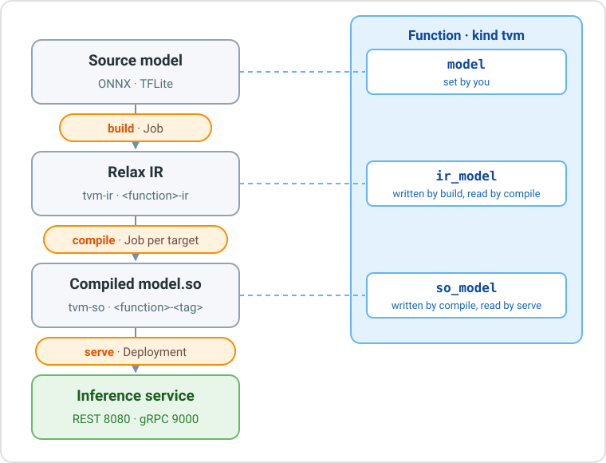

# Compiled models with TVM: introduction

This scenario takes a trained model, compiles it into fast native code with the [TVM runtime](../../../runtimes/tvm/) and serves it through the Open Inference v2 protocol. The model is **YOLOv8n**, an object detector exported to ONNX.



The scenario has two parts:

1. [**Build, compile and serve**](deploy.md): upload the model, create a TVM function, run `build`, `compile` and `serve`, and compile the same model for ARM devices.
2. [**Test the model**](test.md): send a picture to the service from your computer, run the model locally with Docker, or on a Raspberry Pi.

Every step can be done from the **console** or from the **CLI** (`dhcli`): each page shows both.

## Names used in this scenario

| What | Name |
| --- | --- |
| Project | `tvm-test` |
| Source Model | `yolo` |
| Function | `yolo-function` |
| IR Model | `yolo-function-ir` (created by `build`) |
| Compiled Models | `yolo-function-x86`, `yolo-function-arm64`, `yolo-function-armv7l` (created by `compile`) |

Use your own names if you prefer, and change the commands accordingly.

## Prerequisites

- **A project** on the platform. To create it from the CLI: `dhcli create project -n tvm-test`.
- **The [CLI](../../../components/cli/)**, version 0.15 or later (it provides `port-forward`), registered on your platform and logged in:

    ```sh
    dhcli register https://core.my-digitalhub-instance.it
    dhcli login
    ```

- **Python 3** with `numpy` and `Pillow`, to test the model.
- **Docker**, only to run the model on your computer or on a device.
- **The ONNX model.** Export YOLOv8n with the Ultralytics package:

    ```sh
    pip install ultralytics
    yolo export model=yolov8n.pt format=onnx
    ```

    This creates `yolov8n.onnx`, with input `images` `[1, 3, 640, 640]` and output `output0` `[1, 84, 8400]`.
