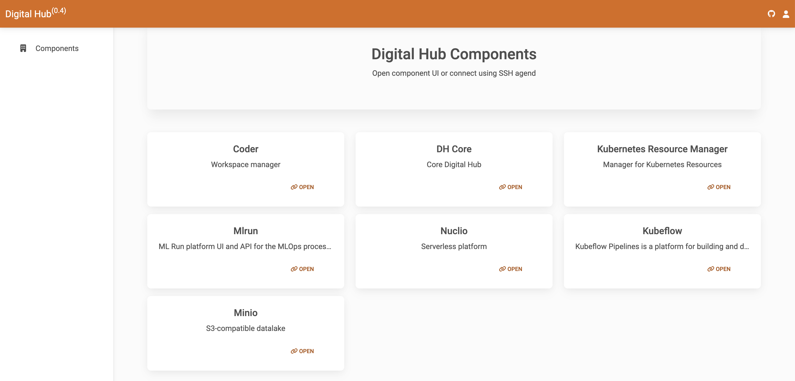

# Landing Page

The landing page is a central access point to reach a number of tools that are automatically run when the platform is installed. It provides access to the platform components and to the monitoring subsystem of the platform.

**Components**

- *Coder*, Tool for managing interactive workspaces
- *DH Core Console*, UI for the platform management
- *KRM*, or Kubernetes Resource Manager, is the tool for organizing and managing standard and custom Kubernetes resources
- *Kubeflow*, a tool for ML pipelines on Kubernetes
- *MinIO*, an S3-compatible object datalake UI
