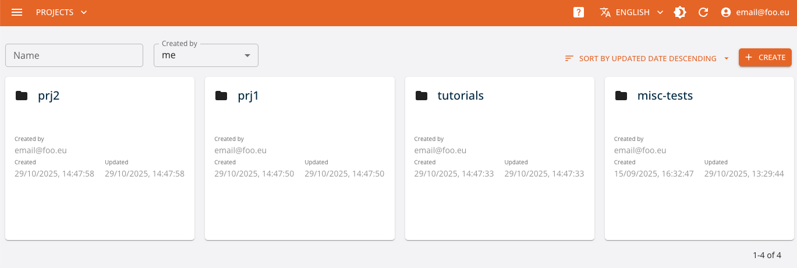

# Core UI

The Core console is a front-end application backed by the  Core API. It provides a management interface 
for the organization and operations over the Data Science [Projects](../tasks/projects.md) and the associated entities, such as:

- **functions** of various runtimes (see the [Functions and Runtimes](../tasks/functions.md) section for details), as well as their executions (runs) grouped by the corresponding operations (tasks)
- **workflows** - composite pipelines combining executions of different functions
- **dataitems** - structured [Data Items](../tasks/data.md) managed by the project
- **artifacts** - unstructured files related and maanged by the project
- **models** - versioned ML Model artifacts with their metrics and metadata (see [ML Models](../tasks/models.md) section for details)

When you access the console, you land to the project management page, where you can create or delete projects.

Note that all the functionality that is performed via UI console through the Core API can be also performed
using the platform management Python SDK reflecting management of the same platform entities.

## Create a Project

Start by clicking the `CREATE A NEW PROJECT` button.

Fill the form's properties.

Following the selection of a project, you can get an overview of the associated objects on its dashboard and manage them on their dedicated pages.

## Dashboard

The console dashboard shows the resources that have been created with a series of cards and allows you to quickly access them. You can see the runs performed and their respective status, as well as artifacts, data items and functions.

## Objects

Through the console it is also possible to manage directly the entities related to the project and perform different operations over those. This amounts
not only to CRUD (create, update, delete, and read) operations, but also track relations, view detailed metadata and versions, execute functions and pipelines, etc. 

### Functions

[Functions](../tasks/functions.md) define the executable procedures implemented in various ways that can be run by the platform. In console it is possible to
create new functions selecting the corresponding runtime and, based on that, providing its specification, e.g., source code. For each function the console lists the different versions of the function, the specification and the code (if available) of the function, as well as different tasks that can be performed over the function in the corresponding runtime. For example, in case of Python runtime, it is possible to ``build`` function (generating the corresponding Docker image and caching in the regsitry), to run the function as ``job`` (to be executed on the Kubernetes), or to expose the function as a service, that is to ``serve`` the function. 

Within the tab corresponding to the specific task, it is possible to access the list of runs executed over the function, the status of execution, the execution log. It is also possible to create new run of the task, defining the specific parameters and configurations for the run. 

### Workflows

[Workflows](../tasks/workflows.md) represent a composition of function executions that is run over the platform, specifying their dependencies (in terms of data and order). This allows for creating complex pipelines for AI/ML and data operations. Currently, the implementation of the workflow relies on the [Kubeflow Pipelines](https://www.kubeflow.org/docs/components/pipelines/) framework, that in turn relies on Kubernetes Argo Workflows so that each step of the workflow is executed as a single Kubernetes Job. 

From the console it is possible to define a new workflow providing the code of the pipeline and run the ``pipeline`` task. As in case of the function runs, the execution of the pipeline is being tracked, as well as the progress of single steps, and the corresponding log. 

### Dataitems 

Through [Dataitems](../tasks/data.md) the project may define the relevant structured and semi-structured datasets. Dataset may created manually, starting from a reference to an URL of the file or DB table, or may be produced as a result of some data transformation function execution. As in case of the functions, the dataitems are equipped with the relevant metadata (e.g., creation and changes, tags, ownership, etc). Furthermore, the datasets structured as tables (i.e., ``table`` kind datasets) are equipped with the derived schemas and profiling and data preview.

Through the console it is possible to manage the datasets, i.e., create (from a URL or from file), update and delete them.

### Artifacts 

Similar to dataitems, [Artifacts](../tasks/data.md) it is possible to explicitly capture the relevant unstructured objects and files. Artifacts may be of arbitrary type, and equipped with a generic metadata properties.  

Through the console it is possible to manage the artifacts, i.e., create (from a URL or from file), update and delete them.

### ML Models

[ML Models](../tasks/models.md) represent a specific type of artifacts, which are produced by the AI tranining activites and represent the datasets used for inference operations. While managed in the same manner as other types of entities, ML Models may have a specific set of metadata and specification attributes, such model kind, metrics, algorithm and framework specification, etc. 

ML Models are further used by the inference services.

### Secrets

When executing operations with the platform, the execution might need access to some sensitive values, for example to access data residing on a data-store that requires credentials (such as a private S3 bucket), access a private repository, or many other similar needs.

The platform provides the functionality to manage these values, reffered to as Secrets, both through UI and SDK, where it is possible to associate the key-value pair to the project. The data is managed as Kubernetes secrets and is embedded in the execution of a run that relies on that.

The management of secrets allows through the console to create, delete, and read the secret values.

## Versioning

All entities operated by Core are versioned. When you view the details of an object, all of its versions are listed and browsable. Moreover, when you view a dataitem, its schema and data preview are available.
