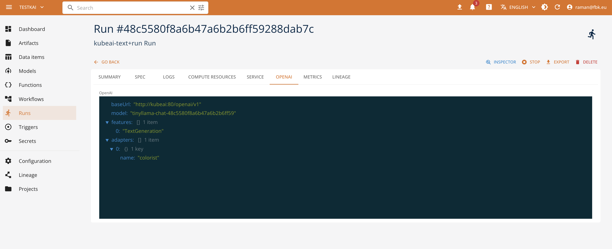
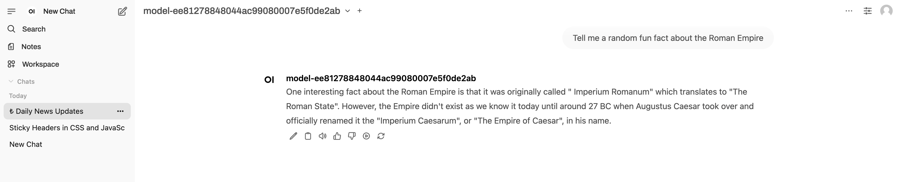

# KubeAI

[KubeAI](https://www.kubeai.org/) is an AI Inference Operator for deploy and scale machine learning models on Kubernetes currently built for LLMs, embeddings, and speech-to-text.

 KubeAI does not depend on other systems like Istio & Knative (for scale-from-zero), or the Prometheus metrics adapter (for autoscaling). This allows KubeAI to work out of the box in almost any Kubernetes cluster. Day-two operations is greatly simplified as well - don't worry about inter-project version and configuration mismatches.

 To accomplish this, KubeAI as a part of the platform is offered with these primary sub-components:

1. The model proxy: the KubeAI proxy provides an OpenAI-compatible API. Behind this API, the proxy implements a prefix-aware load balancing strategy that optimizes for KV the cache utilization of the backend serving engines (i.e. vLLM). The proxy also implements request queueing (while the system scales from zero replicas) and request retries (to seamlessly handle bad backends).

2. The model operator: the KubeAI model operator manages backend server Pods directly. It automates common operations such as downloading models, mounting volumes, and loading dynamic LoRA adapters via the KubeAI Model CRD. The KubeAI operator abstract the concepts of specific implementations and tasks providing a common specification model for defining models under different engines (OLlama, vLLM, Infinity, FasterWhisper).

3. [Open WebUI](https://openwebui.com/) component - an extensible, feature-rich, and user-friendly self-hosted AI platform designed to operate entirely offline. It supports OpenAI-compatible APIs, with built-in inference engine for RAG, making it a powerful AI deployment solution. Its interface is integrated with the SSO authentication adopted by the platform and provides the management tools to expose and test the AI models. 
 
## Exposing AI models with KubeAI

Currently, KubeAI allows for serving the LLM models for text generation and text embedding and speech-to-text processing, in line with the OpenAI specification. To expose a model, it is possible to use Python SDK or directly the Core UI. More specifically,

- it is necessary to define the corresponding KubeAI function (of ``kubeai-text`` or ``kubeai-speech`` kinds), define a set of parameters, like the task (feature) to perform, reference to an engine (e.g., vLLM or OLlama for text generation), reference to a model to expose (HuggingFace id, OLlama model, or S3 resource reference) and model name.
- activate serving operation on the function passing extra parameters (like engine arguments, HW resource profile and number of GPUs, secrets and/or envirnoment variables).

Once deployed, the serving run provides the information about the model name (which is randomized to avoid naming clashes), exposed endpoints and status. Depending on your environment, the deployment may require some time for the model to be operative.

It is also possible to access the exposed model API through the KubeAI model proxy. The proxy exposes the OpenAI-compatible endpoints in function of the specified task. See the KubeAI documentation on how to use and access the models, to integrate this with the client libraries and applications. 

## Testing and using the models with Open WebUI

To simplify the testing and usage of the model, we provide Open WebUI instance integrated with the platform and configured to access the KubeAI models. 

The possibility to access and test the models with Open WebUI depends, however, on the configuration of the latter. By default, the installation
foresees two roles - admin and user. The former can configure the tool functionality, users, groups, and the model visibility (public, private or group-scoped). The deployed model are not available to the users unless the admin changes their visibility.

## See Also

- [How to manage LLM Models with KubeAI Runtime](../scenarios/mlllm/llmkubeai.md)
- [How to manage speech-to-text models with KubeAI Runtime](../scenarios/mlspeech/kubeaispeech.md)
- [Model Serving Runtime Reference](../runtimes/modelserve.md)

