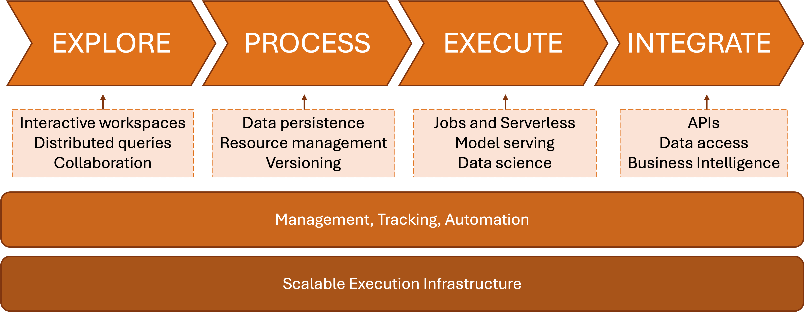

# Introduction

**Digital Hub** is an Open-Source platform for building and managing Data and AI applications and services.
Bringing the principles of **DataOps**, **MLOps**, **DevOps** and **GitOps**, integrating the state-of-art open source technologies and modern standards, DigitalHub extends your
development process and operations to the whole application life-cycle, from exploration to deployment, monitoring, and evolution.

- **Explore**. Use on-demand interactive scalable workspaces of your choice to code, explore, experiment and analyze the data and ML. Workspace provide a secure and isolated execution environments natively connected to the platform, such as Jupyter Notebooks or VS Code, Dremio distributed query engine, etc. Use extensibility mechanisms provided by the underlying workspace manager to bring your own workspace templates into the platform.
- **Process**. Use persistent storages (Datalake and Relational DBs) to manage structured and non-structured data on top of the data abstraction layer. Elaborate  data, perform data analysis activites and train AI models using frameworks and libraries of your choice (e.g., from python-based to DBT, to arbitrary containers). Manage the supporting computational and storage resources in a declarative and transparent manner.
- **Execute**. Delegate the code execution, image preparation, run-time operations and services to the underlying Kubernetes-based execution infrastructure, Serverless platform, and pipeline execution automation environment.
- **Integrate**. Build new AI services and expose your data in a standard and interoperable manner, to facilitate the integration within different applications, systems, business intelligence tools and visualizations.

To support this functionality, the platform relies on scalable Kubernetes platform and its extensions (operators) as well as on the modular architecture and functionality model that allows for dealing with arbitrary jobs, functions, frameworks and solutions without affecting your development workflow. The underlying methodology and management approach aim at facilitating the re-use, reproducibility, and portability of the solution among different contexts and settings.

## Interested?

- [Quick Start](quickstart.md). Bring the platform up and explore it in few minutes!
- [Installation](installation.md). Learn how to install, configure, and manage the platform in different settings.
- [Overview](architecture.md). Deep dive into the platform functionality, architecture, components, and functionality.
