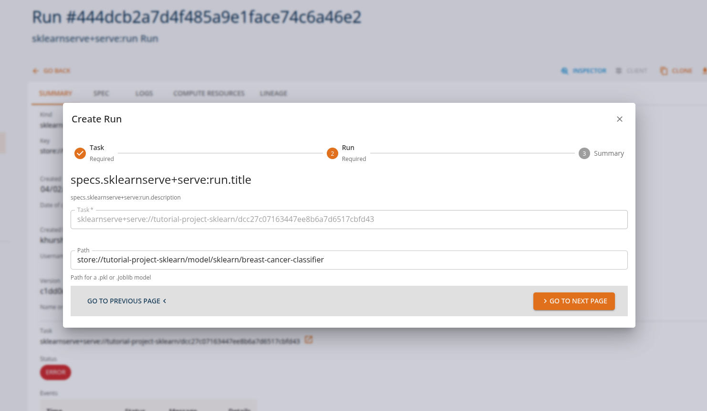
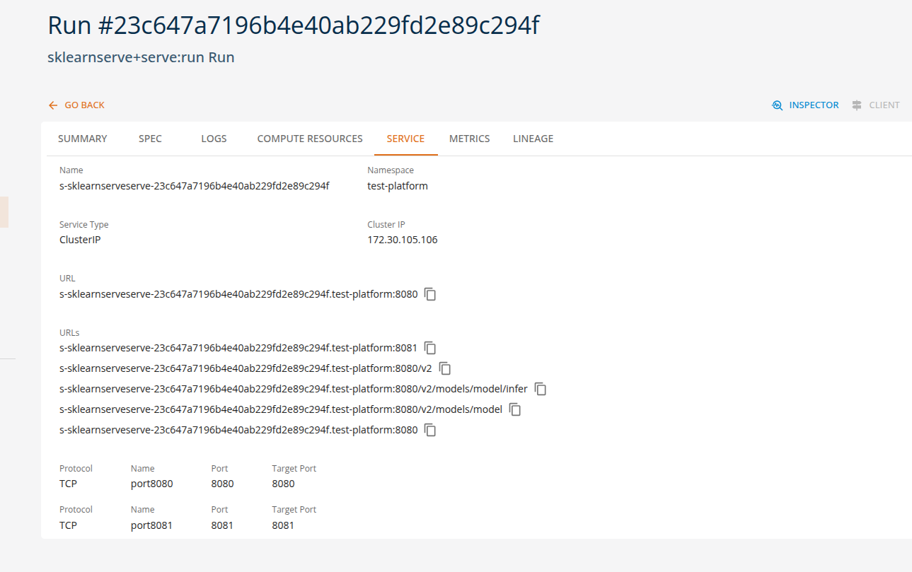
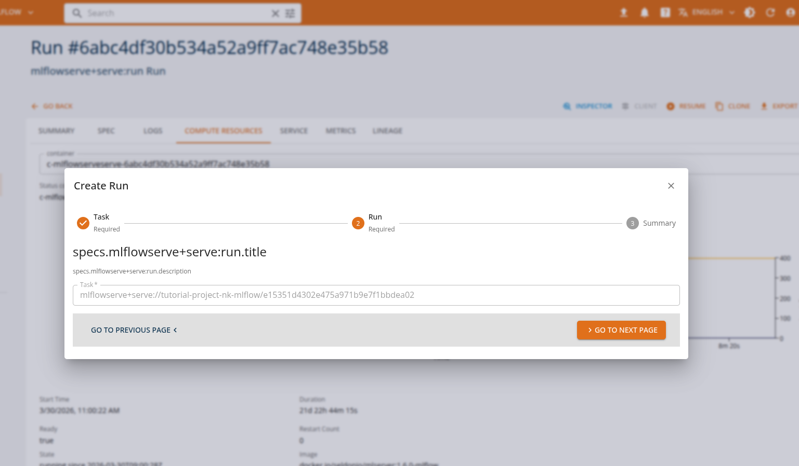
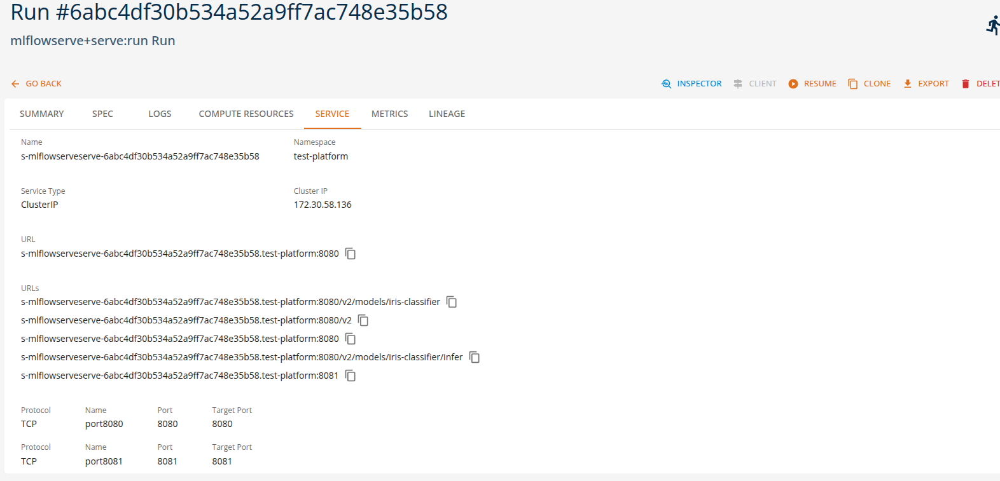

# Serving Machine Learning Models

Serving machine learning models means exposing trained models through APIs so that applications can send requests and receive predictions in real time. Once deployed, the runtime environment manages inference requests, routing, preprocessing, and response generation.

On the platform, these interactions are performed through **standard ML APIs**, allowing applications and tools to interact with deployed models using industry-standard protocols, such as [Open Inference v2](https://github.com/kserve/open-inference-protocol) protocol. This enables easy integration of machine learning capabilities into applications, automation pipelines, and development tools without requiring custom APIs.

Using the available runtimes, users can configure and deploy models directly through the platform by specifying only a small set of parameters such as the model name, runtime type, and optional runtime arguments.

This approach enables **no-code or low-code model deployment**, where the platform automatically handles the underlying infrastructure required to run the model, including container configuration, API exposure, and runtime orchestration.

Different runtimes support different types of machine learning workloads. The following examples illustrate typical runtime tasks that can be executed on the platform using either the platform SDK or the core console UI.

---

## Scikit-Learn Model Serving

The [**sklearnserve runtime**](../runtimes/sklearnserve.md) is commonly used for serving scikit-learn models for classification, regression, and clustering tasks. Applications can send feature vectors and receive predictions through standardized prediction APIs.

### Example runtime tasks

**Classification predictions**

Applications send feature data to generate classification predictions.

Example:

- Train a breast cancer classifier, deploy it as a REST API service.

From the Core Manage UI, users can create a model serving task of kind 'sklearnserve+serve:run'.



Users can view the API endpoints for their deployed services in the 'services' tab.



---

## MLflow Model Serving

The [**mlflowserve runtime**](../runtimes/mlflowserve.md) is designed for serving models tracked and logged with MLflow, supporting multiple frameworks including scikit-learn, TensorFlow, PyTorch, and XGBoost. These tasks can be executed through MLflow's standard serving API.

### Example runtime tasks

**Multi-framework model serving**

Applications send inference requests to models regardless of the underlying framework.

Example:

- Train an iris classifier (e.g., scikit-learn), log the model with MLflow, and deploy the logged artifact as a REST serving endpoint.

From the Core Manage UI, users can create a model serving task of kind 'mlflowserve+serve:run'.



Users can view the API endpoints for their deployed services in the 'services' tab.



---

## Custom Model Serving

It is possible to expose a custom model through the [**python serverless**](../runtimes/python.md) or [**openinference**](../runtimes/oi.md) runtimes. In the first case, the API is not limited to a specific format or protocol, and it is possible to define arbitrary HTTP API for interacting with the model. In the second case the exposed API is defined by the Open Inference v2 protocol, and allows for both HTTP and gRPC protocols. A custom model can be loaded from a local file or from a remote URL.

### Example runtime tasks

- Train a computer vision object detector using HuggingFace transformers library and publish the model on huggingface.co
- Define a Python inference function that accespts the image as byte array input and returns a prediction
- Define the corresponding input and ouptu tensor definitions and deploy the function using the Open Inference runtime.

---

## InferenceV2 Client

The **InferenceV2 Client** is a specialized HTTP client built into the console for interacting with models served using the [Open Inference Protocol (V2)](https://kserve.github.io/website/latest/modelserving/data_plane/v2_protocol/). It provides a streamlined interface for sending inference requests and inspecting model metadata, along with real-time health monitoring.

The InferenceV2 Client is automatically selected when a service run exposes an Inference V2 endpoint. This applies to models deployed with the **MLflow Serve** or **Scikit-learn Serve** runtimes — both of which expose models via the Open Inference Protocol V2.

### Accessing the InferenceV2 Client

When a service run is in a **RUNNING** state and provides an Inference V2 endpoint, the **CLIENT** button becomes available on the service list or run detail page. Clicking the button opens a dialog with the InferenceV2 Client.


<!-- Screenshot: Show the InferenceV2 Client dialog with health chips and the Inference tab active -->

If the service does not expose an Inference V2 endpoint, the console will use the standard [HTTP Client](../tasks/services.md#http-client) or the [Chat Client](../runtimes/chat-client.md), depending on the service type.

### Health Monitoring

At the top of the InferenceV2 Client, two health indicators are displayed:

- **Ready**: Indicates whether the model server is ready to accept inference requests. Calls `GET {baseUrl}/v2/health/ready`.
- **Live**: Indicates whether the model server process is alive and responsive. Calls `GET {baseUrl}/v2/health/live`.

Each indicator is shown as a colored chip: **green** when healthy, **red** when unhealthy. If a health check fails, an error message is displayed below the chips.
Health checks are performed automatically when the client opens and reflect the current state of the model server.

### Tabs

The InferenceV2 Client provides two tabs:

#### Inference

The **Inference** tab is used to send prediction requests to the model. It provides:

- A pre-configured **POST** request to `{baseUrl}/v2/models/{model}/infer`
- A JSON request body editor for composing the inference payload
- Response viewer for inspecting the model's prediction output
- Request history for reviewing and replaying previous requests

The request body must follow the Open Inference Protocol V2 format. A typical inference request looks like:

```json
{
  "inputs": [
    {
      "name": "input-0",
      "shape": [2, 4],
      "datatype": "FP64",
      "data": [
        [5.1, 3.5, 1.4, 0.2],
        [4.9, 3.0, 1.4, 0.2]
      ]
    }
  ]
}
```

And the response follows the V2 protocol format:

```json
{
  "model_name": "iris-classifier",
  "id": "242bb1fa-7c32-424b-9bb8-ac413fc555ad",
  "parameters": { "content_type": "np" },
  "outputs": [
    {
      "name": "output-1",
      "shape": [2, 1],
      "datatype": "INT64",
      "parameters": { "content_type": "np" },
      "data": [0, 0]
    }
  ]
}
```


<!-- Screenshot: Show the Inference tab with a sample request body and the model's response -->

#### Metadata

The **Metadata** tab retrieves model metadata from the server. It sends a **GET** request to `{baseUrl}/v2/models/{model}` and displays information such as:

- Model name and version
- Supported inputs and outputs (names, shapes, data types)
- Platform and runtime details


<!-- Screenshot: Show the Metadata tab displaying model metadata information -->

### Features

- **Pre-configured endpoints**: The inference and metadata URLs are automatically constructed from the service's base URL and model name — no manual URL entry is required.
- **Health checks**: Real-time readiness and liveness indicators give immediate feedback on model availability.
- **Request history**: Previous inference requests and their responses are saved and can be replayed, making iterative testing easier.
- **JSON editor**: The request body editor supports syntax highlighting and validation for JSON payloads.
- **Response viewers**: Responses can be viewed as formatted JSON, raw text, or rendered HTML.
- **Full-screen mode**: Toggle full-screen mode for more working space.

### Usage

1. Deploy an ML model using the **MLflow Serve** or **Scikit-learn Serve** runtime. See [MLflow Serve Runtime](../runtimes/mlflowserve.md) or [Scikit-learn Serve Runtime](../runtimes/sklearnserve.md) for details.
2. Wait for the service to reach the **RUNNING** state.
3. Click the **CLIENT** button in the service list or run detail page.
4. Check the health indicators at the top — both **Ready** and **Live** should be green.
5. In the **Inference** tab, compose your request body in the JSON editor.
6. Click **Send** to submit the inference request.
7. Inspect the response in the viewer below.
8. Optionally, switch to the **Metadata** tab to view model information.

### Notes

- The InferenceV2 Client restricts requests to **POST** for inference and **GET** for metadata — the HTTP method cannot be changed manually.
- All communication is mediated by the platform backend. The model's service URL is internal to the cluster and not accessible from outside the platform.
- Request history is stored locally in the browser and is **not** shared across users or devices.
- The number of saved history entries is limited to the 10 most recent requests.

---

## Summary

On the DigitalHub platform, machine learning models can be served using multiple runtimes while maintaining **consistent prediction API interfaces**. This enables applications to perform various ML inference tasks without changing client-side integration.

| Runtime           | Example Tasks                                          | Console Client                                           |
| ----------------- | ------------------------------------------------------ | -------------------------------------------------------- |
| sklearnserve      | classification, regression, clustering                 | [InferenceV2 Client](../runtimes/inference-v2-client.md) |
| mlflowserve       | multi-framework serving, model versioning, A/B testing | [InferenceV2 Client](../runtimes/inference-v2-client.md) |
| python serverless | custom model serving                                   | [HTTP Client](../tasks/services.md#http-client)          |
| openinference     | custom model serving with Open Inference v2 protocol   | [HTTP Client](../tasks/services.md#http-client)          |

**Note**: Refer to the Tutorial section for more detailed usage and examples.
