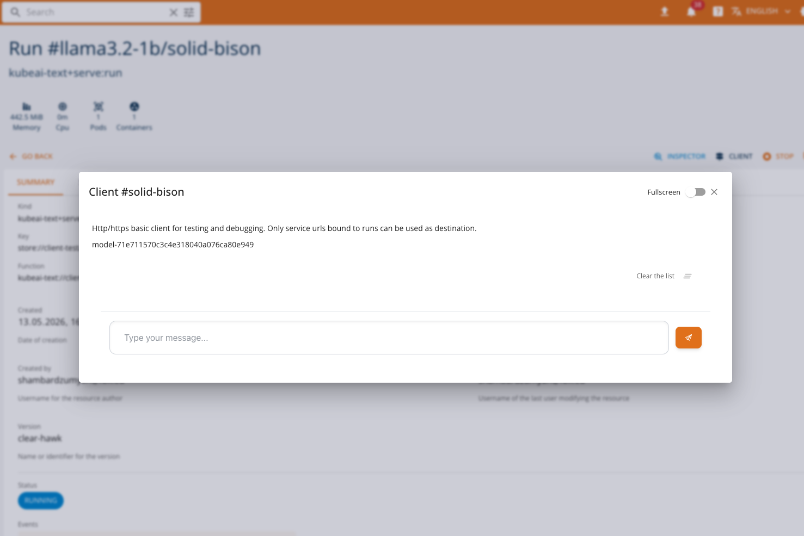
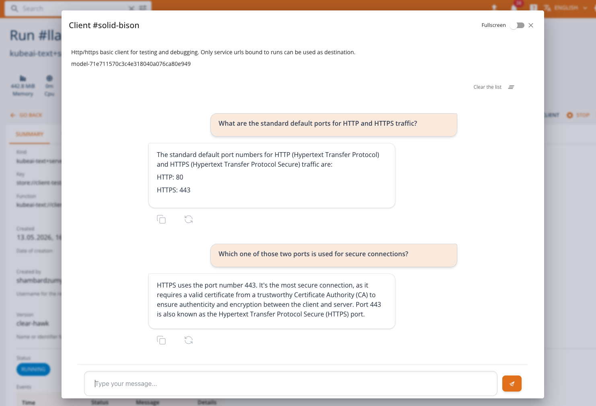

# Chat Client

The **Chat Client** is a built-in interactive interface for communicating with LLM (Large Language Model) services deployed on the platform. It provides an OpenAI-compatible chat experience directly from the console, enabling users to test and interact with their served language models without external tools.

The Chat Client is available for services deployed through LLM-serving runtimes (e.g., HuggingFace Serve, KubeAI Text) that expose an OpenAI-compatible API. It is automatically selected when the service run status indicates OpenAI compatibility and supports one of the following features: **TextGeneration**, **Chat Completions API**, or **Completions API**.

## Accessing the Chat Client

When a service run is in a **RUNNING** state and exposes an OpenAI-compatible endpoint, the **CLIENT** button becomes available on the service list or run detail page. Clicking the button opens a dialog with the Chat Client.



<!-- Screenshot: Show the Chat Client dialog open with a conversation in progress -->

If the service does not support chat features, the console will fall back to the standard [HTTP Client](../tasks/services.md#http-client) or the [InferenceV2 Client](inference-v2-client.md), depending on the service type.

## Features

The Chat Client provides the following capabilities:

- **Streaming responses**: Messages are streamed in real time as the model generates its response, providing immediate feedback.
- **Conversation history**: The full conversation context is sent with each request, allowing the model to maintain context across multiple exchanges.
- **Persistent sessions**: Conversation history is persisted in the browser, so you can close and reopen the dialog without losing your conversation.
- **Stop generation**: An in-progress response can be stopped at any time by clicking the stop button.
- **Regenerate responses**: You can regenerate the last model response to get a different answer.
- **Clear conversation**: Use the clear button in the toolbar to reset the entire conversation history.
- **Copy responses**: Model responses can be copied to the clipboard with a single click.
- **Error handling**: If the model returns an error during streaming, the partial response is preserved along with the error message.
- **Full-screen mode**: Toggle full-screen mode for a more immersive chat experience.

## How It Works

The Chat Client connects to the deployed model's OpenAI-compatible endpoint using the service URL and model name provided in the run status. All requests are proxied through the platform backend — the model endpoint is **not** directly exposed to the user's browser.

Under the hood, the client uses the OpenAI SDK to call the **Chat Completions** API with streaming enabled:

```
POST {baseUrl}/chat/completions
Content-Type: application/json

{
  "model": "<model-name>",
  "messages": [
    { "role": "user", "content": "Hello!" },
    { "role": "assistant", "content": "Hi there! How can I help?" },
    { "role": "user", "content": "Tell me about machine learning." }
  ],
  "stream": true
}
```

The full conversation history is included in each request so the model has full context of the exchange.

## Usage

1. Deploy an LLM model using one of the supported serving runtimes (e.g., HuggingFace Serve or KubeAI Text). See [Model Serving: LLMs](llmserve.md) for details.
2. Wait for the service to reach the **RUNNING** state.
3. Click the **CLIENT** button in the service list or run detail page.
4. The Chat Client dialog opens with the model name displayed at the top.
5. Type your message in the input field and press **Enter** or click **Send**.
6. The model's response will stream in real time.



<!-- Screenshot: Show a multi-turn conversation with the Chat Client, including user messages and model responses -->

## Notes

- The Chat Client is only available when the model exposes an OpenAI-compatible chat API. Models serving other protocols (e.g., Open Inference Protocol) will use the [InferenceV2 Client](inference-v2-client.md) or the standard [HTTP Client](../tasks/services.md#http-client).
- All communication is mediated by the platform backend. The model's service URL is internal to the cluster and not accessible from outside the platform.
- Conversation history is stored locally in the browser and is **not** shared across users or devices.
