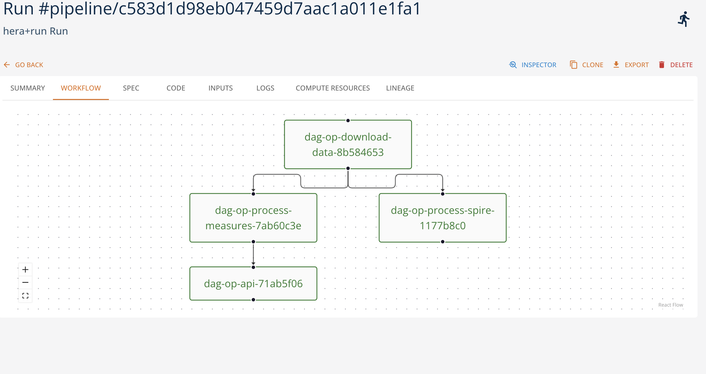

# Hera Pipelines Runtime

The **Hera runtime** allows you to run workflows within the platform. More specifically, [Hera](https://hera.readthedocs.io/) represents a workflow orchestration in Python powered by [Argo Workflows](https://argo-workflows.readthedocs.io/) in Kubernetes. 

Argo workflows are defined as Kubernetes Custom Resources and represent a composition of Kubernetes Jobs with data and parameter passing support. 

Hera uses Python-based DSL to define the execution tasks of a workflow, which is then transformed into an Argo workflow specification and may be executed through the platform. 

In addition to Hera SDK and its DSL, we provide an extension of the platform SDK to run single functions of other runtimes directly as nodes of the Hera workflow. 

A Hera runtime function definition is therefore composed of the Hera pipeline code in Python. The two actions supported by the runtime are:

- `build`, necessary to compile the Hera DSL specification into an Argo Workflow definition. **Note that this action should be always executed before the actual pipeline execution**.
- `pipeline`, which performs the actual instantiation and execution of the workflow within the platform, using Argo Workflow operator. It is possible to pass parameters to pipelines. 

The following figure represents the execution graph of an example worklfow in the platform:

Hera runtime replaces the Kubeflow Pipeline runtime for the same Argo workflow-based functionality.

## Management with SDK

Check the [SDK Hera runtime documentation](https://scc-digitalhub.github.io/sdk-docs/reference/runtimes/hera/overview/) for more information.
