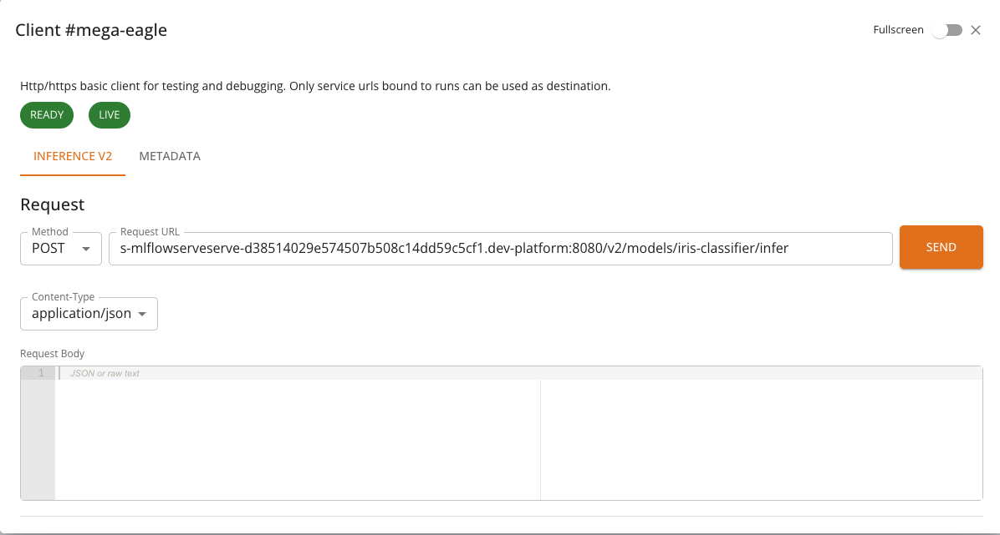
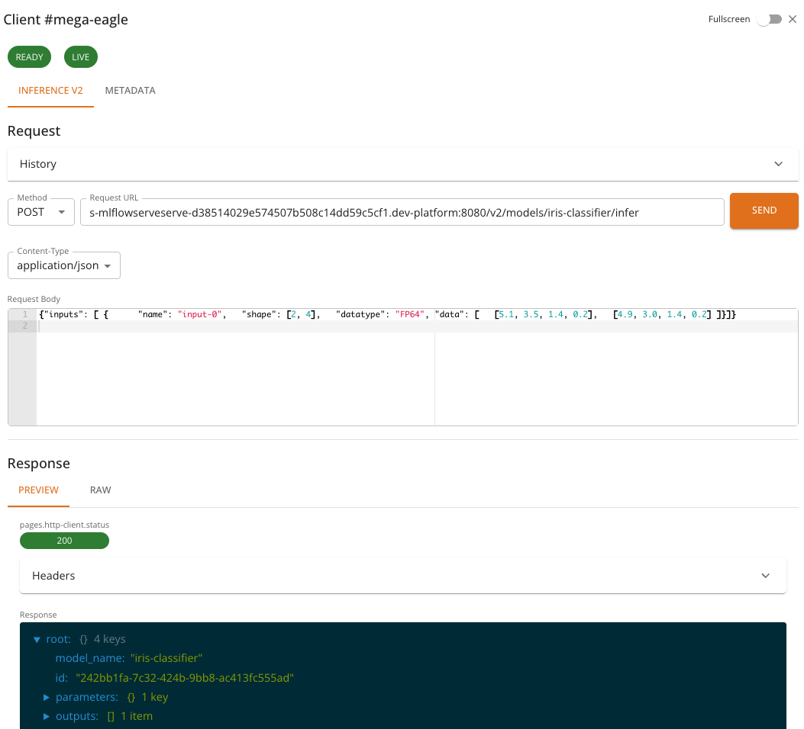
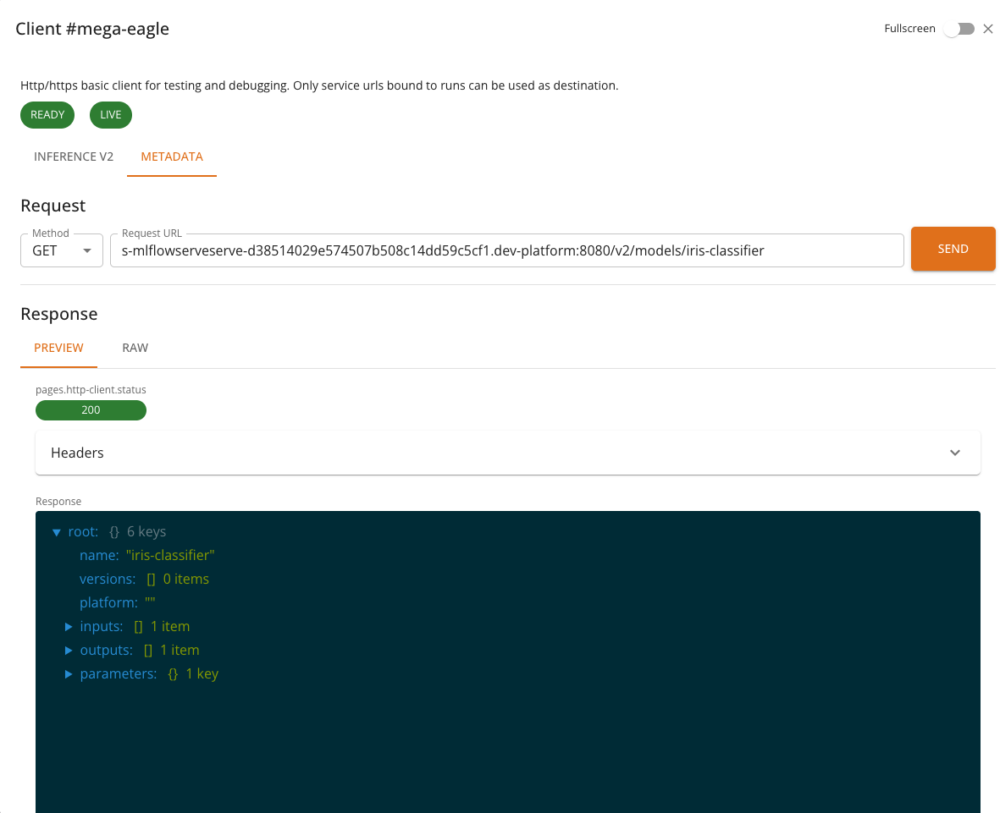

# InferenceV2 Client

The **InferenceV2 Client** is a specialized HTTP client built into the console for interacting with models served using the [Open Inference Protocol (V2)](https://kserve.github.io/website/latest/modelserving/data_plane/v2_protocol/). It provides a streamlined interface for sending inference requests and inspecting model metadata, along with real-time health monitoring.

The InferenceV2 Client is automatically selected when a service run exposes an Inference V2 endpoint. This applies to models deployed with the **MLflow Serve** or **Scikit-learn Serve** runtimes — both of which expose models via the Open Inference Protocol V2.

## Accessing the InferenceV2 Client

When a service run is in a **RUNNING** state and provides an Inference V2 endpoint, the **CLIENT** button becomes available on the service list or run detail page. Clicking the button opens a dialog with the InferenceV2 Client.



<!-- Screenshot: Show the InferenceV2 Client dialog with health chips and the Inference tab active -->

If the service does not expose an Inference V2 endpoint, the console will use the standard [HTTP Client](../tasks/services.md#http-client) or the [Chat Client](chat-client.md), depending on the service type.

## Health Monitoring

At the top of the InferenceV2 Client, two health indicators are displayed:

- **Ready**: Indicates whether the model server is ready to accept inference requests. Calls `GET {baseUrl}/v2/health/ready`.
- **Live**: Indicates whether the model server process is alive and responsive. Calls `GET {baseUrl}/v2/health/live`.

Each indicator is shown as a colored chip: **green** when healthy, **red** when unhealthy. If a health check fails, an error message is displayed below the chips.
Health checks are performed automatically when the client opens and reflect the current state of the model server.

## Tabs

The InferenceV2 Client provides two tabs:

### Inference

The **Inference** tab is used to send prediction requests to the model. It provides:

- A pre-configured **POST** request to `{baseUrl}/v2/models/{model}/infer`
- A JSON request body editor for composing the inference payload
- Response viewer for inspecting the model's prediction output
- Request history for reviewing and replaying previous requests

The request body must follow the Open Inference Protocol V2 format. A typical inference request looks like:

```json
{
  "inputs": [
    {
      "name": "input-0",
      "shape": [2, 4],
      "datatype": "FP64",
      "data": [
        [5.1, 3.5, 1.4, 0.2],
        [4.9, 3.0, 1.4, 0.2]
      ]
    }
  ]
}
```

And the response follows the V2 protocol format:

```json
{
  "model_name": "iris-classifier",
  "id": "242bb1fa-7c32-424b-9bb8-ac413fc555ad",
  "parameters": { "content_type": "np" },
  "outputs": [
    {
      "name": "output-1",
      "shape": [2, 1],
      "datatype": "INT64",
      "parameters": { "content_type": "np" },
      "data": [0, 0]
    }
  ]
}
```



<!-- Screenshot: Show the Inference tab with a sample request body and the model's response -->

### Metadata

The **Metadata** tab retrieves model metadata from the server. It sends a **GET** request to `{baseUrl}/v2/models/{model}` and displays information such as:

- Model name and version
- Supported inputs and outputs (names, shapes, data types)
- Platform and runtime details



<!-- Screenshot: Show the Metadata tab displaying model metadata information -->

## Features

- **Pre-configured endpoints**: The inference and metadata URLs are automatically constructed from the service's base URL and model name — no manual URL entry is required.
- **Health checks**: Real-time readiness and liveness indicators give immediate feedback on model availability.
- **Request history**: Previous inference requests and their responses are saved and can be replayed, making iterative testing easier.
- **JSON editor**: The request body editor supports syntax highlighting and validation for JSON payloads.
- **Response viewers**: Responses can be viewed as formatted JSON, raw text, or rendered HTML.
- **Full-screen mode**: Toggle full-screen mode for more working space.

## Usage

1. Deploy an ML model using the **MLflow Serve** or **Scikit-learn Serve** runtime. See [MLflow Serve Runtime](mlflowserve.md) or [Scikit-learn Serve Runtime](sklearnserve.md) for details.
2. Wait for the service to reach the **RUNNING** state.
3. Click the **CLIENT** button in the service list or run detail page.
4. Check the health indicators at the top — both **Ready** and **Live** should be green.
5. In the **Inference** tab, compose your request body in the JSON editor.
6. Click **Send** to submit the inference request.
7. Inspect the response in the viewer below.
8. Optionally, switch to the **Metadata** tab to view model information.

## Notes

- The InferenceV2 Client restricts requests to **POST** for inference and **GET** for metadata — the HTTP method cannot be changed manually.
- All communication is mediated by the platform backend. The model's service URL is internal to the cluster and not accessible from outside the platform.
- Request history is stored locally in the browser and is **not** shared across users or devices.
- The number of saved history entries is limited to the 10 most recent requests.
