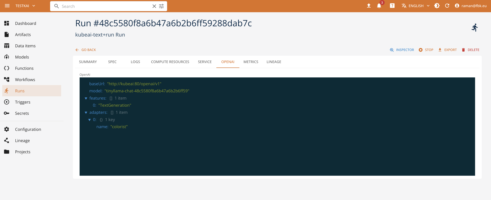

# LLM Model Serving Runtime

**LLM Model serving runtime** aims at supporing the possibility to expose LLM models as OpenAI-compatible APIs. For this purpose, several different runtimes are available, which the user may choose depending on a specific scenario's requirements.

- **KubeAI Text and Speech** `kubeai-text` and `kubeai-speech` runtimes rely on the [KubeAI](https://www.kubeai.org/) operator to expose models. The model is served by KubeAI through a single channel. These runtimes rely on different engines, including vLLM, OLLama and Infinity, for different tasks. KubeAI also supports serving multiple LoRA adapters, autoscaling, and many other useful options for production-ready environments. 
- **vLLM** (`vllmserve-text`, `vllmserve-speech` , and `vllmserve-pooling`) runtime exposes LLM models using vLLM engine. This is a custom implementation of the OpenAI-compatible API that is based on [vLLM](https://docs.vllm.ai/) engine. Based on a specific runtime version, the model supports the OpenAI generative AI APIs (completions, chat completions), OpenAI audio processing (audio transcription, audio translation), and a series of other OpenAI compatible functions (like embeddings, ranking, tokenization, classification, and raning).
- **HuggingFace Serving** (`huggingfaceserve`) runtime exposes standalone LLM models using KServe-based implementation (deprecated). In a nutshell, this runtime allows for exposing LLMs using the [vLLM](https://docs.vllm.ai/) engine. The engine supports, in particular, completions and chat completions APIs compatible with the OpenAI protocol, embedding, and a series of other functions (like embeddings, fill mask, classification) using Open Inference Protocol. See corresponding [kserve](https://kserve.github.io/archive/0.14/modelserving/v1beta1/llm/huggingface/) documentation for the details. 

## KubeAI Text and Speech runtimes

KubeAI Text and Speech runtimes rely on the KubeAI platform for model serving.

[KubeAI](https://www.kubeai.org/) is an AI Inference Operator to deploy and scale machine learning models on Kubernetes currently built for LLMs, embeddings, and speech-to-text.

KubeAI does not depend on other systems like Istio & Knative (for scale-from-zero), or the Prometheus metrics adapter (for autoscaling). This allows KubeAI to work out of the box in almost any Kubernetes cluster. Day-two operations are greatly simplified as well - no need to worry about inter-project version and configuration mismatches.
KubeAI does not depend on other systems like Istio & Knative (for scale-from-zero), or the Prometheus metrics adapter (for autoscaling). This allows KubeAI to work out of the box in almost any Kubernetes cluster. Day-two operations are greatly simplified as well - no need to worry about inter-project version and configuration mismatches.

For each serve action performed with these runtimes, a corresponding deployment is created, while no dedicated service is exposed - the models are served by the KubeAI service directly.

A KubeAI deployment offers different advantages:

- Multiple backend engines optimized for different goals. For example, OLLama is best suited for testing models without GPU, while vLLM is more suitable for GPU-based environments.
- Model proxy: the KubeAI proxy provides an OpenAI-compatible API. Behind this API, the proxy implements a prefix-aware load balancing strategy that optimizes for KV the cache utilization of the backend serving engines (i.e. vLLM). The proxy also implements request queueing (while the system scales from zero replicas) and request retries (to seamlessly handle bad backends).
- Model operator: the KubeAI model operator manages backend server Pods directly. It automates common operations such as downloading models, mounting volumes, and loading dynamic LoRA adapters via the KubeAI Model CRD. The KubeAI operator abstract the concepts of specific implementations and tasks providing a common specification model for defining models under different engines (OLlama, vLLM, Infinity, FasterWhisper).
3. [Open WebUI](https://openwebui.com/) - an extensible, feature-rich, user-friendly self-hosted AI platform designed to operate entirely offline. It supports OpenAI-compatible APIs, with built-in inference engine for RAG. Its interface is integrated with the SSO authentication adopted by the platform and provides the management tools to expose and test the AI models. 

The specification of text and speech runtimes amounts to defining:

- base model URL (from S3 storage or HuggingFace catalog)
- list of adapters (from S3 storage or HuggingFace catalog)
- name of the model to expose
- Model task or feature: text generation (default), speech to text, or embedding
- Backend engine: vLLM, OLLama, or Infinity (for embeddings only)
- optional base image for serving

The `serve` action allows for deploying the model and adapters, and a set of extra properties may be configured, including:

- inference server-specific arguments
- load balancing strategy and properties
- prefix cache length
- scaling configuration (min/max/default replicas, scale delays and request targets)
- Resource confguration (e.g., run profile), environments and secrets (e.g., reference to `HF_TOKEN` if needed for accessing Huggingface resources)

!!! note "Using GPU for model seving"

    Please note that, in case of large models, using a corresponding GPU-based profile may be required.

When deployed, the corresponding `serve` run specification contains extra information for using the LLM model. This includes:

- the base URL of the kube AI environment to use by the clients
- the name of the deployed model (randomized to avoid clashes) and adapters to be used in the OpenAI requests
- LLM metadata - feature information, engine, base model, etc

It is also possible to access the exposed model API through the KubeAI model proxy. The proxy exposes the OpenAI-compatible endpoints in function of the specified task. See the KubeAI documentation on how to use and access the models, to integrate this with the client libraries and applications. 

## vLLM Serving runtime

The specification of the vLLM runtime functions consists of the following elements:

- `url` defining the URL of the model, either from the platform storage or from HuggingFace catalog (e.g., 'hf://Qwen/Qwen2.5-0.5B')
- `model_name` defining the name of the exposed model
- `image` defining the base image to use for serving the model if different from the one used by the platform by default
- `adapters` defining the list of LoRA adapters (with `name` and `url`) to be used for serving the model

The specification of the vLLM run additionally, allows for defining the following elements:

- `url` defining the URL of the model to serve, either from the platform storage or from HuggingFace catalog (e.g., 'hf://Qwen/Qwen2.5-0.5B')
- `args` defining the list of arguments to be passed to the vLLM engine
- `enable_telemetry` defining if the telemetry should be enabled or not
- `use_cpu_image` defining if the CPU-only image should be used for serving the model.

Once deployed, a model is exposed with the corresponding Kubernetes service. The sevice endpoint is avaialble as a part of the `status/service` data of the run.

## Huggingface Serve runtime (deprecated)

The specification of the HuggingfaceServe runtime functions consists of the following elements:

- `path` defining the URL of the model, either from the platform storage or from HuggingFace catalog (e.g., 'huggingface://Qwen/Qwen2.5-0.5B')
- `model` defining the name of the exposed model 
- and optional base image to use for serving the model if different from the one used by the platform by default

The runtime supports the `serve` action that may specify further deployment details including

- backend engine type (vLLM or custom Kserve implementation called "huggingface")
- inference task (e.g., `sequence_classification`, `fill_mask`, `text_generation`, `text_embedding`, etc)
- Specific parameters refering to the context length, data types, logging properties, tokenizer revision, engine args, etc.
- Resource confguration (e.g., run profile), environments and secrets (e.g., reference to `HF_TOKEN` if needed for accessing Huggingface resources)

Once deployed, a model is exposed with the corresponding Kubernetes service. The sevice endpoint is avaialble as a part of the `status/service` data of the run.

## Testing deployed models

Once a model is running, you can interact with it directly from the console using the [Chat Client](chat-client.md), which provides a built-in OpenAI-compatible chat interface for testing and interacting with deployed LLM services without external tools.

## Management with SDK

Check the [SDK runtime documentation](https://scc-digitalhub.github.io/sdk-docs/reference/runtimes/modelserve/overview/) for more information.

## See Also

- [How to manage LLM Models with KubeAI Runtime](../../tutorials/mlllm/llmkubeai/)
- [How to manage speech-to-text models with KubeAI Runtime](../../tutorials/mlspeech/kubeaispeech/)
- [Model Serving Runtime Reference](../runtimes/modelserve.md)
