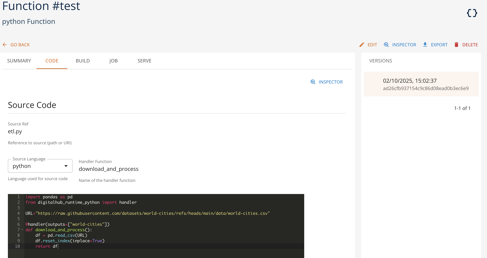

# Python

The **python runtime** allows you to run generic python function within the platform in two different ways:

- as a **Job** (``action="job"``) representing a single piece of work (e.g., model training, data processing), or
- as a "**Service** (``action="serve"``) representing a Serverless function responding to HTTP requests.

Each Python runtime function is defined with

- source code, being an inline python code, a reference to the git repository, or a zip archive. The source code should provide also a reference to the ``handler`` - the procedure to be called (i.e., specific python function to be executed). In case of Job, this will be the operation executed by the platform. In case of Service this will be an operation called upon receiving the HTTP request with the request entity as a payload. Additionally, in case of Services, it is possible to specify the ``init`` operation that will be called once upon the service start.
- Python version (supported by the platform).
- optional list of Python dependencies and optionally a custom base image to be used.

To facilitate the operation start and optimize the use of resources, it is possible to perform ``build`` operation on the function. This operation creates a container image starting from the source code, dependency list and optional list of additional instructions. Next time the Job or Service starts, this prebuilt container image will be used for execution.

The function definition in the Core UI looks as follows:

Here the function 'test' defines a simple transformation of an external CSV file represented with ``download_and_process`` operation, which returns a dataframe that will be stored by the platform as ``world-cities`` Data Item. 

When the action run is created, it is possible to specify the following information

- resource configuration (see [here](../tasks/run-resources.md) for details about configuring run resources)
- parameters as a key-value dictionary (to be passed in input to the Job execution or to ``init`` operation of the Service execution)
- inputs as a key-value dictionary with the references to the platform entities (more precisely, their unique ``key`` values), such as artifacts or dataitems. They are treated explicitly by the platform and allow for reconstructing the lineage of data within the project.

Please note that the Python runtime allows both for the execution of a Job function both in the platform (more precisely, in the underlying Kubernetes infrastructure) and locally (with ``local_execution=True``). This latter modality allows for testing/debugging of the function in the development environment if there are resources available for performing such execution.  

The details about the specification, parameters, execution, and semantics of the Python runtime may be found in the SDK Python Runtime reference.

## Management with SDK

Check the [SDK python runtime documentation](https://scc-digitalhub.github.io/sdk-docs/reference/runtimes/python/overview/) for more information.
