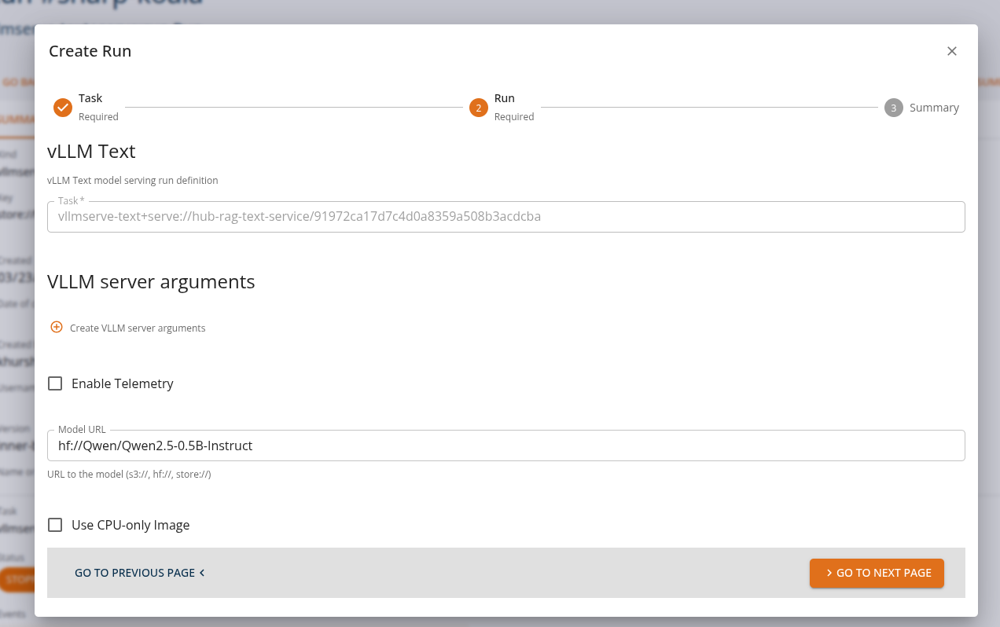
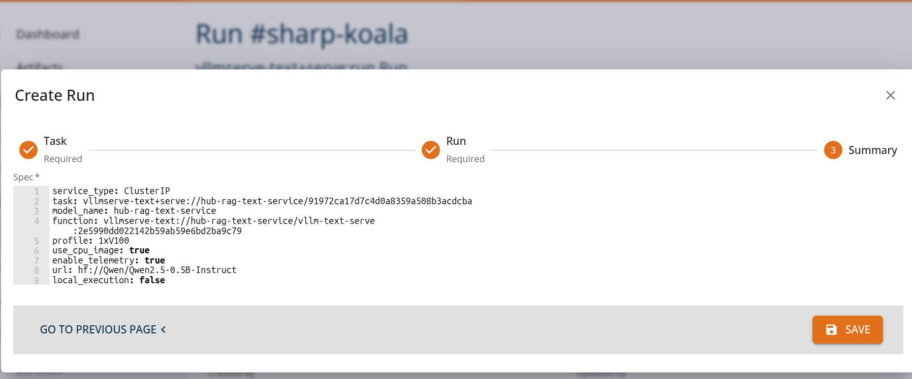
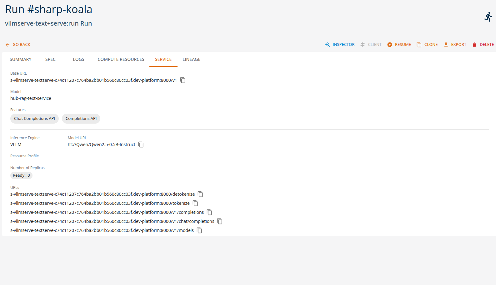
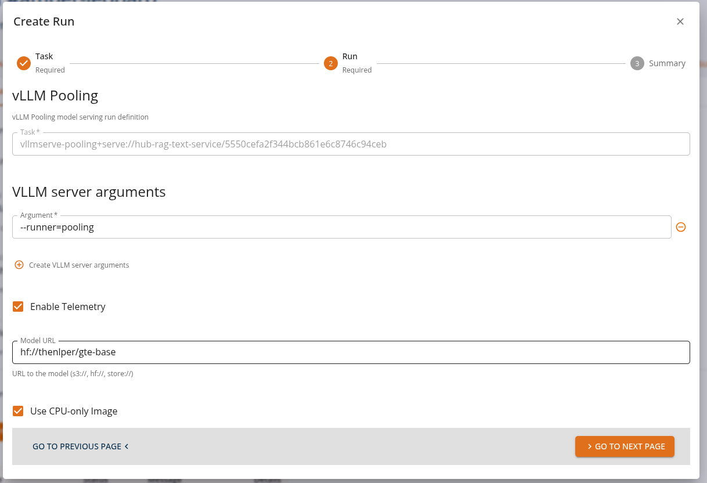
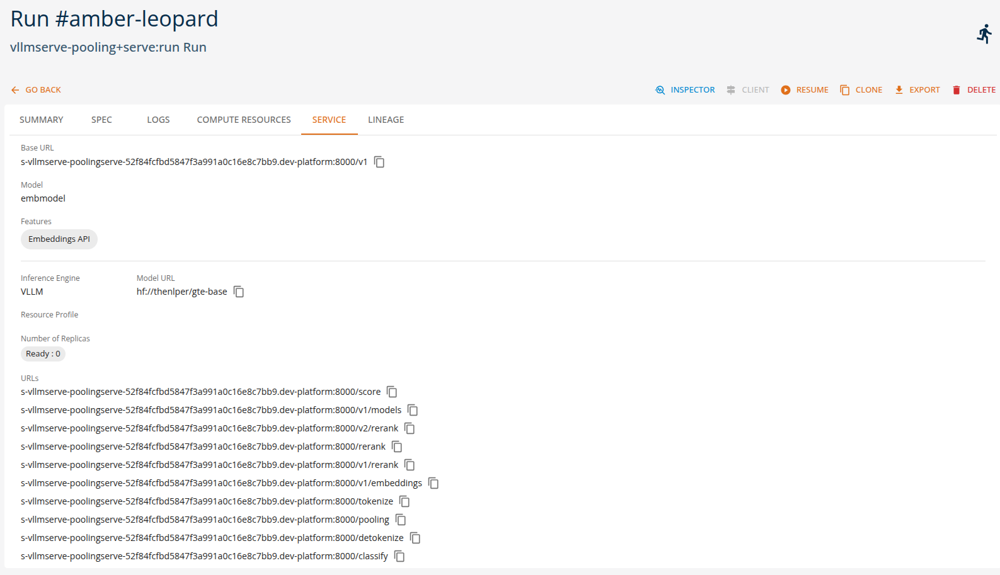
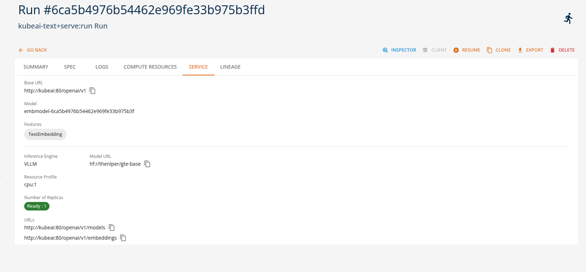
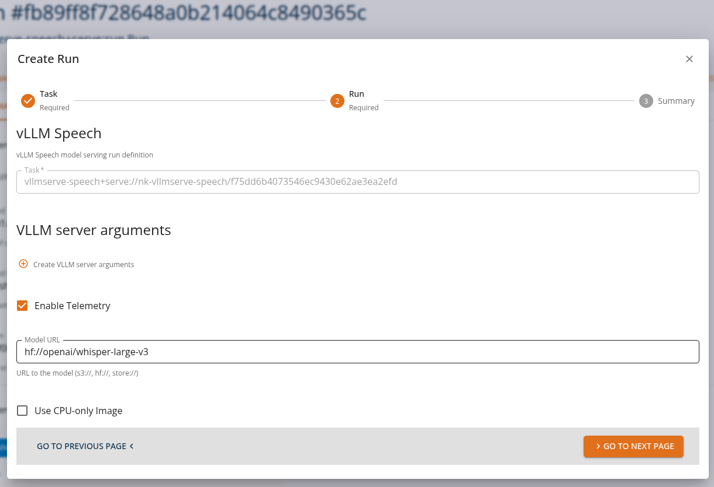
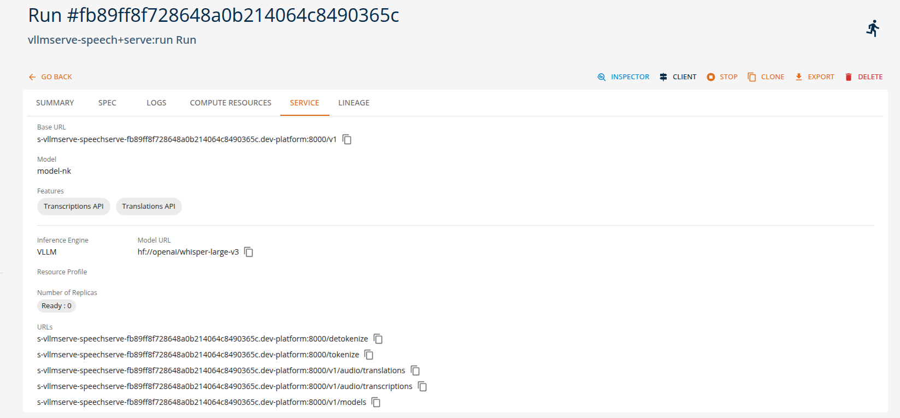

# Serving Generative Models

Serving generative models means exposing trained models through APIs so that applications can send requests and receive generated outputs in real time. Once deployed, the runtime environment manages inference requests, routing, preprocessing, and response generation.

On the **DigitalHub platform**, these interactions are performed through **OpenAI-compatible APIs**, allowing applications and tools to interact with deployed models using standard OpenAI protocols. This enables easy integration of generative AI capabilities into applications, automation pipelines, and development tools without requiring custom APIs. By combining these serving options with OpenAI-compatible APIs, the DigitalHub platform enables users to quickly deploy and operate generative AI models without implementing custom inference services. Using the available runtimes, users can configure and deploy models directly through the platform by specifying only a small set of parameters such as the model model name, runtime type, and optional adapters or runtime arguments. 

This approach enables **no-code or low-code model deployment**, where the platform automatically handles the underlying infrastructure required to run the model, including container configuration, API exposure, and runtime orchestration.

Different runtimes support different types of generative workloads. The following examples illustrate typical runtime tasks that can be executed on the platform using either the platform SDK or the core console UI as indicated below.

---

## Text Generation Tasks (vllmserve-text)

The **vllmserve-text runtime** is commonly used for text generation and conversational workloads. Through the OpenAI-compatible APIs available in the DigitalHub platform, applications can send prompts or chat messages and receive generated responses.

### Example runtime tasks

**Chat assistants**

Applications send chat completion requests to generate conversational responses.

Example:
- A chatbot sends a user prompt asking for help writing an email.
- The request is sent to the model using the OpenAI **chat completions API**.
- The generated response is streamed back to the client application.

From the Core Manage UI, users can create a chat assistant API task of kind 'vllmserve-text+serve:run' as shown.

Users can view the API endpoints for their deployed services in the 'services' tab.

---

## Embedding and Vector Tasks (vllmserve-pooling)

The **vllmserve-pooling runtime** is designed for generating vector embeddings used in search, recommendation systems, and semantic analysis. These tasks can be executed through the OpenAI-compatible **embeddings API**.

### Example runtime tasks

**Semantic search**

Applications convert queries and documents into embeddings to perform similarity searches.

Example:
- A user searches for documents related to a specific topic.
- The runtime generates an embedding vector for the query.
- The search engine compares it with stored document embeddings.

From the Core Manage UI, users can create a chat assistant API task of kind 'vllmserve-pooling+serve:run' as shown. 

Users can view the API endpoints for their deployed services in the 'services' tab.

---

## Multi-Model Serving Tasks (kubeai-text)

The **kubeai-text runtime** enables flexible serving scenarios where multiple models or adapters can be deployed and managed dynamically. Requests can still be performed using the same OpenAI-compatible APIs available on the platform.

### Example runtime tasks

**Text embedding with KubeAI**

Applications convert text into vector embeddings for semantic search and similarity analysis.

Example:
- A document management system needs to index and search documents.
- The runtime generates embedding vectors for documents and queries.
- Similarity comparisons identify relevant documents.

From the Core Manage UI, users can create a text embedding API task of kind 'kubeai-text+serve:run' and the services will be avaliable as shown below.

---
## Audio Processing Tasks (vllmserve-speech)

The **vllmserve-speech runtime** supports audio-based AI tasks such as speech recognition and translation. These capabilities are also accessible through OpenAI-compatible audio APIs exposed by the platform.

### Example runtime tasks

**Speech transcription**

Audio recordings are processed and converted into text.

Example:
- A meeting recording is uploaded through the **audio transcription API**.
- The runtime invokes the speech model.
- The generated transcript is returned to the client.

From the Core Manage UI, users can create a chat assistant API task of kind 'vllmserve-speech+serve:run' as shown. 

Users can view the API endpoints for their deployed services in the 'services' tab.

---

## Summary

On the DigitalHub platform, generative models can be served using multiple runtimes while maintaining a **consistent OpenAI-compatible API interface**. This enables applications to perform a variety of AI tasks—such as text generation, speech processing, and embedding creation—without changing the client-side integration.

| Runtime | Example Tasks |
|--------|---------------|
| vllmserve-text | chat generation, text completion, code generation |
| vllmserve-speech | speech transcription, audio translation |
| vllmserve-pooling | embeddings, semantic search, recommendations |
| kubeai-text | multi-model serving, adapter routing, autoscaling |
