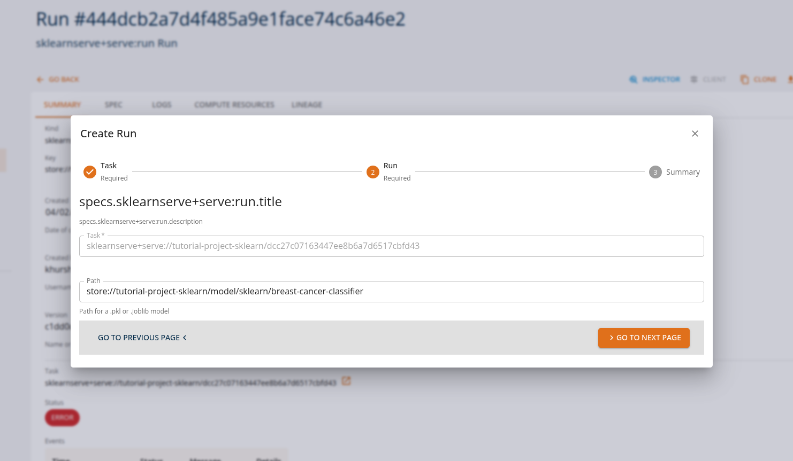
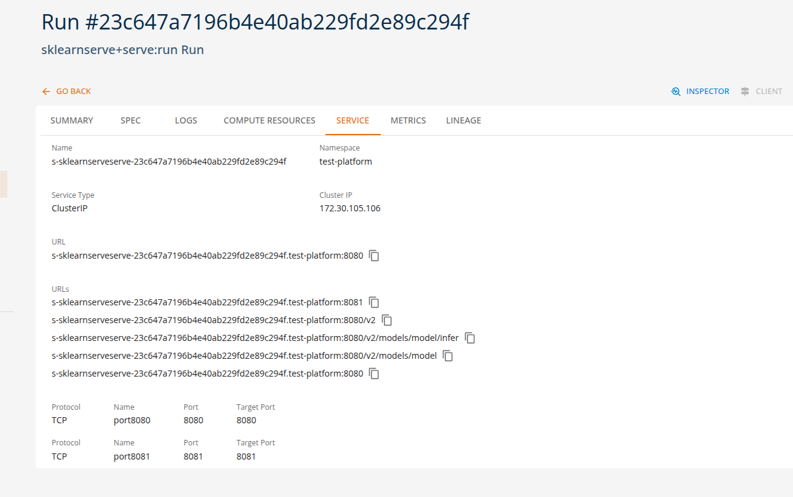
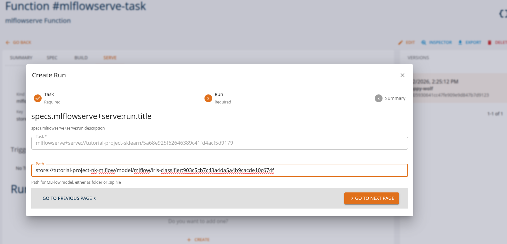
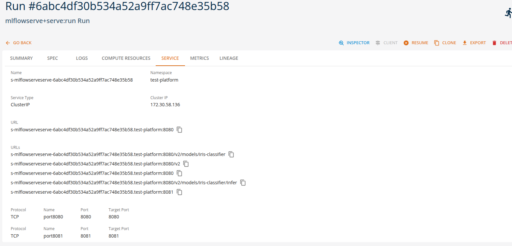

# Serving Machine Learning Models

Serving machine learning models means exposing trained models through APIs so that applications can send requests and receive predictions in real time. Once deployed, the runtime environment manages inference requests, routing, preprocessing, and response generation.

On the **DigitalHub platform**, these interactions are performed through **standard ML APIs**, allowing applications and tools to interact with deployed models using industry-standard protocols. This enables easy integration of machine learning capabilities into applications, automation pipelines, and development tools without requiring custom APIs.

Using the available runtimes, users can configure and deploy models directly through the platform by specifying only a small set of parameters such as the model name, runtime type, and optional runtime arguments.

This approach enables **no-code or low-code model deployment**, where the platform automatically handles the underlying infrastructure required to run the model, including container configuration, API exposure, and runtime orchestration.

Different runtimes support different types of machine learning workloads. The following examples illustrate typical runtime tasks that can be executed on the platform using either the platform SDK or the core console UI.

---

## Scikit-Learn Model Serving (sklearnserve)

The **sklearnserve runtime** is commonly used for serving scikit-learn models for classification, regression, and clustering tasks. Applications can send feature vectors and receive predictions through standardized prediction APIs.

### Example runtime tasks

**Classification predictions**

Applications send feature data to generate classification predictions.

Example:
- Train a breast cancer classifier, deploy it as a REST API service.

From the Core Manage UI, users can create a model serving task of kind 'sklearnserve+serve:run'.

Users can view the API endpoints for their deployed services in the 'services' tab.

---

## MLflow Model Serving (mlflowserve)

The **mlflowserve runtime** is designed for serving models tracked and logged with MLflow, supporting multiple frameworks including scikit-learn, TensorFlow, PyTorch, and XGBoost. These tasks can be executed through MLflow's standard serving API.

### Example runtime tasks

**Multi-framework model serving**

Applications send inference requests to models regardless of the underlying framework.

Example:
- Train an iris classifier (e.g., scikit-learn), log the model with MLflow, and deploy the logged artifact as a REST serving endpoint.

From the Core Manage UI, users can create a model serving task of kind 'mlflowserve+serve:run'.

Users can view the API endpoints for their deployed services in the 'services' tab.

---

## Summary

On the DigitalHub platform, machine learning models can be served using multiple runtimes while maintaining **consistent prediction API interfaces**. This enables applications to perform various ML inference tasks without changing client-side integration.

| Runtime | Example Tasks |
|---------|---------------|
| sklearnserve | classification, regression, clustering |
| mlflowserve | multi-framework serving, model versioning, A/B testing |

**Note**: Refer to the Tutorial section for more detailed usage and examples.