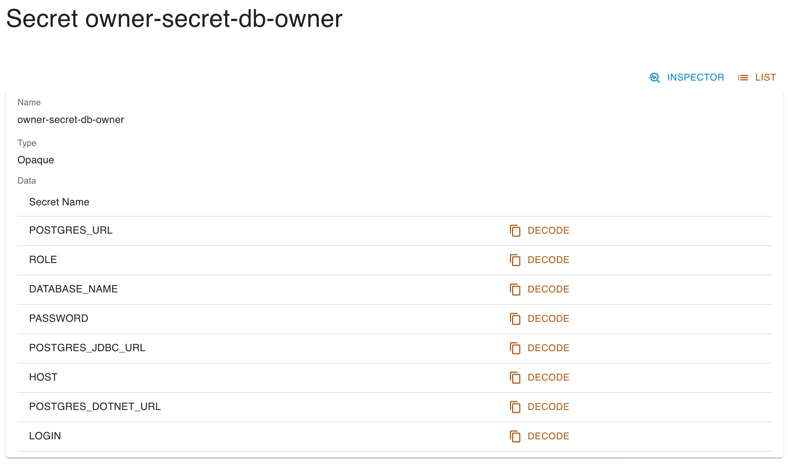

# PostgREST scenario introduction

In this scenario, we download some data into a Postgres database, then use *PostgREST* - a tool to make Postgres tables accessible via REST API - to expose this data and run a simple request to view the results.

## Database set-up

Let's start by setting up the database. Access your KRM instance and **Postgres DBs** on the left menu, then click *Create*.

- `Name`: This is just an identifier for Kubernetes. Type `my-db`.
- `Database`: The actual name on the database. Type `mydb`.
- Toggle on `Drop on delete`, which conveniently deletes the database when you delete the custom resource.

Click *Save*. You should now see your database listed.

## Add users to database

PostgREST needs a user to authenticate and a user to assume its role when the API is called. These can be separate users, but for our purposes, we will create just one to fill both roles.
Click *Show* on your database's entry and then *Add user* on the bottom. Enter values as follows:

- `Name`: An identifier for Kubernetes. Type `db-owner`.
- `Role`: The actual name on the database. Type `owner`.
- `Privileges`: Indicates what privileges the user will have. Pick `Owner`.
- `Secret name`: The secret to authenticate the user. Type `owner`.

## Retrieve POSTGRES_URL

Together with the user, a secret has also been created. Go to **Secrets** on the left menu; the list should contain a secret with a name referring the user you created. Find it and click *Show*.

Write down the following information somewhere, as we will need it later:
- *Name* of the secret
- Value of `POSTGRES_URL` (click on *Decode* to obtain it)
- Value of `ROLE`

