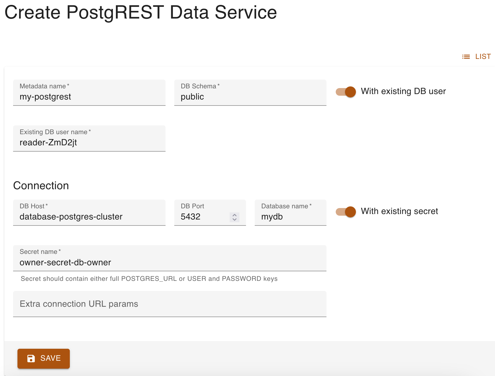

# Expose data with PostgREST

We will go back to KRM to create a PostgREST service and expose the database's table via API.

## Inspect users' secrets

There are a number of parameters we need to configure PostgREST. Similarly to what you did in the first stage of the scenario, go to **Secrets** on the left and look for the two secrets, belonging to the *owner* and *reader* users you created.

You will need the following properties, so write them down somewhere for convenience:

For the **owner**:

- The *Name* of the secret.
- *DATABASE_NAME*
- *HOST*

For the **reader**:

- *ROLE*

## Creating the PostgREST service
Click **PostgREST Data Services** on the left and then *Create*.

Fill the first few fields as follows:

- `Name`: Anything you'd like, it's once again an identifier for Kubernetes.
- `Schema`: `public`
- Toggle on `With existing DB user`.
- `Existing DB user name`: Value of the **reader**'s secret *ROLE*.

Under *Connection*, fill the fields as follows:

- `DB Host`: Value of the **owner**'s secret *HOST*.
- `DB Port`: `5432`. In case the host's value contains the port, remove it from there (delete the `:` symbol) and put it here.
- `Database name`: Value of the **owner**'s secret *DATABASE_NAME*.
- Toggle on `With existing secret`.
- `Secret name`: The *Name* of the **owner**'s secret.

When you hit *Save*, the PostgREST instance will be launched!

