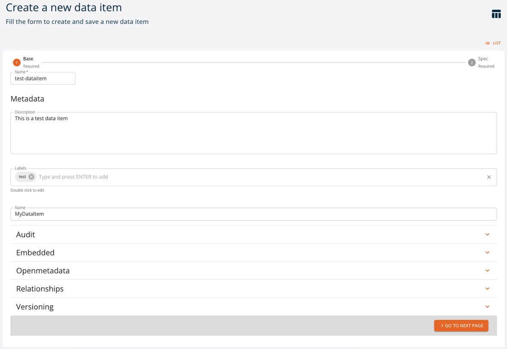

# Data and Transformations

The platform supports data of different types to be stored and operated by the underlying storage subsystems.

Specifically, the platform natively supports two types of storages:

- *persistence* object storage (datalake S3 Minio), which manages immutable data in the form of files.
- *operational* relational data storage (PostgreSQL database), which is used for efficient querying of mutable data. *Postgres* is rich with extensions, most notably for geo-spatial and time-series data.

The data is represented in the platform as entities of different types, depending on its usage and format. More specifically, we distinguish:

- *data items*, which represent immutable data sets resulting from different transformation operations and are ready for use in differerent types of analysis. Data items are enriched with metadata (versions, lineage, stats, profiling, schema, ...) and unique keys and managed and persisted to the datalake directly by the platform in the form of *Parquet* files. It is possible to treat tabular data (items of ``table`` kind) as, for example, *DataFrames*, using conventional libraries.
- *artifacts*, which represent arbitrary files, not limited to tabular format, stored to the datalake with some extra metadata.

Each data entity may be accessed and manipulated by the platform via UI or using the API, for example with SDK.

## Management via UI

### Artifacts

Artifacts can be managed as *entities* from the UI. You can access them from the left menu. You can:

- `create` a new artifact
- `filter` artifacts by name and kind
- `expand` an artifact to see its 5 latest versions
- `show` the details of an artifact
- `edit` an artifact
- `delete` an artifact

Here we analyze how to [create](#create), [read](#read), [update](#update) and [delete](#delete) artifacts using the UI, similarly to what can be done through the SDK.

#### Create

Click `CREATE` and a two-step form will be shown:

Mandatory fields are:

- **`Name`**: name and identifier of the artifact
- **`Kind`**: kind of the artifact
- (Spec) **`Path`**: remote path where the artifact is stored. If you instead upload the artifact at the bottom of the form, this will be the path to where it will be stored.

Other fields are optional and may be updated later.

- (Metadata) **`Description`**: a human-readable description of the artifact
- (Metadata) **`Labels`**: list of labels
- (Metadata) **`Name`**: name of the artifact
- (Metadata) **`Audit`**: author of creation and modification
- (Metadata) **`Embedded`**: flag for embedded metadata
- (Metadata) **`Openmetadata`**: flag to publish metadata
- (Metadata) **`Relationships`**: relationships with other entities
- (Metadata) **`Versioning`**: version of the function
- (Spec) **`Source path`**: local path to the artifact, used in case of upload into remote storage

#### Read

Click `SHOW` to view an artifact's details.

On the right side, all versions of the resource are listed, with the current one highlighted. By clicking a different version, values displayed will change accordingly.

The `INSPECTOR` button will show a dialog containing the resource in JSON format.

The `EXPORT` button will download the resource's information as a yaml file.

#### Update

You can update an artifact by clicking `EDIT`. Greyed-out fields may not be updated.

#### Delete

You can delete an artifact from either its detail page or the list of artifacts, by clicking `DELETE`.

### Data items

Data items can be created and managed as *entities* with the console. You can access them from the dashboard or the left menu. You can:

- `create` a new data item
- `expand` a data item and see its 5 latest versions
- `show` the details of a data item
- `edit` a data item
- `delete` a data item
- `filter` data items by name and kind

Here we analyze how to [create](#create_1), [read](#read_1), [update](#update_1) and [delete](#delete_1) data items using the UI, similarly to what can be done through the SDK.

#### Create

Click `CREATE` and a two-step form will be shown:

Mandatory fields are:

- **`Name`**: name of the dataitem
- **`Kind`**: kind of the dataitem
- (Spec) **`Path`**: remote path where the data item is stored. If you instead upload the data item at the bottom of the form, this will be the path to where it will be stored.

Other fields are optional and may be updated later:

- (Metadata) **`Description`**: a human-readable description
- (Metadata) **`Labels`**: list of labels
- (Metadata) **`Name`**: name of the data item
- (Metadata) **`Audit`**: author of creation and modification
- (Metadata) **`Embedded`**: flag for embedded metadata
- (Metadata) **`Openmetadata`**: flag to publish metadata
- (Metadata) **`Relationships`**: relationships with other entities
- (Metadata) **`Versioning`**: version of the function

##### Kind

There are 2 possible kinds for dataitems:

- **`Dataitem`**: indicates it is a generic data item. There are no specific attributes in the creation page.
- **`table`**: indicates that the data item points to a table. The optional parameter is the schema of the table in [table_schema](https://specs.frictionlessdata.io/table-schema/) format.

#### Read

Click `SHOW` to view a data item's details.

Based on the `kind`, there may be a **`schema`**, indicating that the dataitem point to a table.

On the right side, all versions of the resource are listed, with the current one highlighted. By clicking a different version, values displayed will change accordingly.

The `INSPECTOR` button will show a dialog containing the resource in JSON format.

The `EXPORT` button will download the resource's information as a yaml file.

#### Update

You can update a data item by clicking `EDIT`. Greyed-out fields may not be updated.

#### Delete

You can delete a data item from either its detail page or the list of data items, by clicking `DELETE`.

### Data exploration in S3 browser

The S3 object storage can be explored in a dedicated page. Check the [File Browser section](./files.md) for more information.

## Management via SDK

### Managing artifacts with SDK

Artifacts can be created and managed as *entities* with the SDK CRUD methods.
Check the [SDK Artifacts documentation](https://scc-digitalhub.github.io/sdk-docs/objects/artifact/entity/) for more information.

### Managing dataitems with SDK

Dataitems can be created and managed as *entities* with the SDK CRUD methods.
Check the [SDK Dataitem documentation](https://scc-digitalhub.github.io/sdk-docs/objects/dataitem/entity/) for more information.
