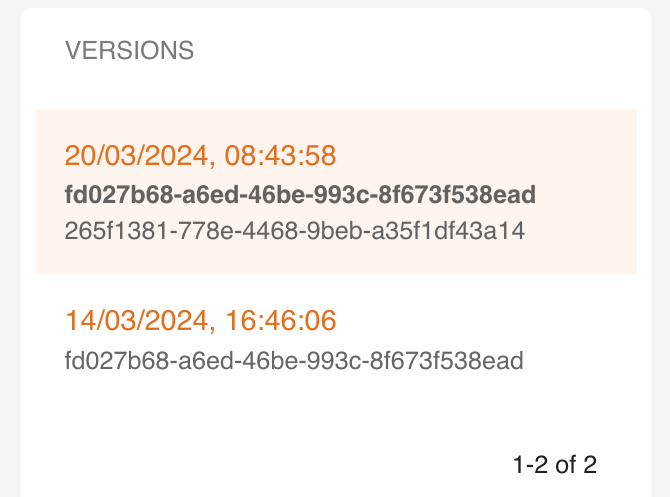
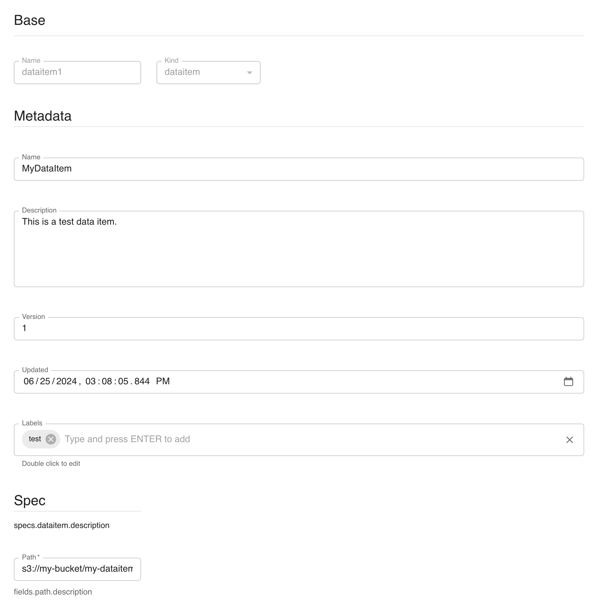
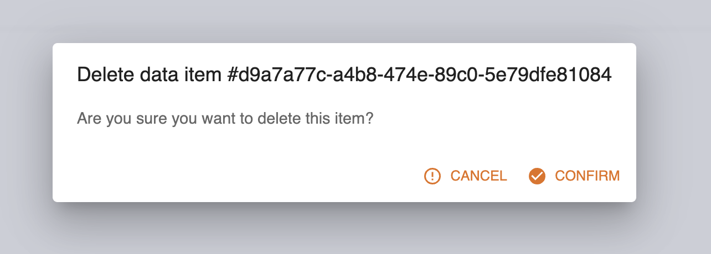

# Data and transformations

The platform supports data of different types to be stored and operated by the underlying storage subsystems.

Digital Hub natively supports two types of storages:

- *persistence* object storage (datalake S3 Minio), which manages immutable data in the form of files.
- *operational* relational data storage (PostgreSQL database), which is used for efficient querying of mutable data. *Postgres*
   is rich with extensions, most notably for geo-spatial and time-series data.

The data is represented in the platform as entities of different types, depending on its usage and format. More specifically, we distinguish:

- *data items* which represent immutable datasets resulting from different transformation operations and ready for use in differerent types of analysis. Data items are enriched with metadata (e.g., versions, lineage, stats, profiling, schema) and unique keys and managed and persisted to the datalake directly by the platform in the form of Apache Parquet files. Dealing with tabular data (dataitems of ``table`` kind) it is possible to treat them as, e.g., DataFrames with the conventional libraries.
- *artifacts* which represent arbitrary files stored to the datalake with some extra metadata, but are not limited to tabular formats.

Each data entity may be accessed and manipulated by the platform via UI or using the API, e.g., with SDK.

## Manipulating data via UI

### Artifacts

Artifacts can be created and managed as *entities* with the console. This can be done accessing through the user's menu or using the shortcut on the dashboard.


Pressing on Artifact side menu button, the paginated list of the artifacts is showed. From this pages is possible:

- `create` a new artifact
- `expand` an artifact and see the last 5 versions
- `show` the details of an artifact
- `edit` an artifact
- `delete` an artifact
- `filter` the artifact by name and kind


In the next section, we will see how to create, read, update and delete artifacts.

#### Artifact Management via UI

Here we analyze how to Create, Read, Update and Delete Artifacts using the UI, similarly to what happens with the SDK.

##### Create

A project is created pressing the button `CREATE` in the Artifacts' list page. After pressing the button, the dialog asking the Artifact's parameter is shown:


It has the following mandatory parameters:
The mandatory parameters are:

- **`name`**: the name of the artifact
- **`kind`**: the kind of the artifact

The only `Metadata` mandatory parameter is:

- **`path`**: the remote path where the artifact is stored

The other `Metadata` parameters are optional and mutable after the creation:

- **`name`**: the name of the artifact
- **`version`**: the version of the artifact
- **`description`**: a human readable description of the artifact
- **`updated`**: the date of the last modification made to the artifact
- **`src_path`**: local path of the artifact, used in case of upload into remote storage
- **`labels`**: the labels of the artifact

##### Read

To read an artifact you can click on the `SHOW` button.


The page shows the following details

- **`id`**: the id of the artifact
- **`kind`**: the kind of the artifact
- **`Key`**: the unique URL that identifies the resource

The `Metadata` values are:

- **`name`**: the name of the artifact
- **`description`**: a human readable description of the artifact
- **`version`**: the version of the artifact
- **`created`**: the date of the creation to the artifact
- **`updated`**: the date of the last modification made to the artifact
- **`labels`**: the labels of the artifact
- **`path`**: the remote path where the artifact is stored
- **`src_path`**: local path of the artifact, used in case of upload into remote storage

On the right side of this page are all the version of the resource is listed and the actual version is highlighted. Selecting a different element
the different version is shown.



From the menu on top is possible to `EDIT`, `DELETE`, `INSPECT` or `EXPORT` the current artifact. For the first 2 options there are specific section
of this document.

Clicking on `INSPECTOR` a dialog that shows the artifact in JSON format is shown.


Clicking the `EXPORT` button the artifact is downloaded in a yaml file.

##### Update

You can update artifact's `Metadata` pressing the button `EDIT` in the list or in the show page. All the `Metadata` values can be modified

- **`name`**: the name of the artifact
- **`description`**: a human readable description of the artifact
- **`version`**: the version of the artifact
- **`updated`**: the date of the last modification made to the artifact
- **`labels`**: the labels of the artifact
- **`path`**: the remote path where the artifact is stored
- **`src_path`**: local path of the artifact, used in case of upload into remote storage


##### Delete

You can delete an artifact from the list or from the detail pressing the button `DELETE`. A dialog asking confirmation is shown


### Dataitems

Dataitems can be created and managed as *entities* with the console. This can be done accessing through the user's menu or using the shortcut on the dashboard.


Pressing on Data items side menu button, the paginated list of the resource is showed. From this pages is possible:

- `create` a new dataitem
- `expand` an dataitem and see the last 5 versions
- `show` the details of an dataitem
- `edit` an dataitem
- `delete` an dataitem
- `filter` the dataitem by name and kind


In the next section, we will see how to create, read, update and delete dataitems.

#### Dataitem Management via UI

Here we analyze how to Create, Read, Update and Delete Dataitems using the UI, similarly to what happens with the SDK.

##### Create

A project is created pressing the button `CREATE` in the Dataitems' list page. After pressing the button, the dialog asking the Dataitem's parameter is shown:


It has the following mandatory parameters:
The mandatory parameters are:

- **`name`**: the name of the dataitem
- **`kind`**: the kind of the dataitem

The only `Metadata` mandatory parameter is:

- **`path`**: the remote path where the dataitem is stored

The other `Metadata` parameters are optional and mutable after the creation:

- **`name`**: the name of the dataitem
- **`version`**: the version of the dataitem
- **`description`**: a human readable description of the dataitem
- **`updated`**: the date of the last modification made to the dataitem
- **`src_path`**: local path of the dataitem, used in case of upload into remote storage
- **`labels`**: the labels of the dataitem

###### Kind

There are 2 possible kinds for dataitems:

- **`Dataitem`**: indicates that the dataitem is a generic dataitem. There are no specific attributes in the creation page.
- **`table`**: indicates that the dataitem point to a table. The optional parameter is the schema of the table in [table_schema](https://specs.frictionlessdata.io/table-schema/) format

##### Read

To read an dataitem you can click on the `SHOW` button.


The page shows the following details

- **`id`**: the id of the dataitem
- **`kind`**: the kind of the dataitem
- **`Key`**: the unique URL that identifies the resource

The `Metadata` values are:

- **`name`**: the name of the dataitem
- **`description`**: a human readable description of the dataitem
- **`version`**: the version of the dataitem
- **`created`**: the date of the creation to the dataitem
- **`updated`**: the date of the last modification made to the dataitem
- **`labels`**: the labels of the dataitem
- **`path`**: the remote path where the dataitem is stored

Based on the kind of the dataitem, there may be **`schema`**, indicates that the dataitem point to a table.

On the right side of this page are all the version of the resource is listed and the actual version is highlighted. Selecting a different element
the different version is shown.


From the menu on top is possible to `EDIT`, `DELETE`, `INSPECT` or `EXPORT` the current dataitem. For the first 2 options there are specific section
of this document.

Clicking on `INSPECTOR` a dialog that shows the dataitem in JSON format is shown.


Clicking the `EXPORT` button the dataitem is downloaded in a yaml file.

##### Update

You can update dataitem's `Metadata` pressing the button `EDIT` in the list or in the show page. All the `Metadata` values can be modified

- **`name`**: the name of the dataitem
- **`description`**: a human readable description of the dataitem
- **`version`**: the version of the dataitem
- **`updated`**: the date of the last modification made to the dataitem
- **`labels`**: the labels of the dataitem
- **`path`**: the remote path where the dataitem is stored

Based on the kind of the dataitem, there may be **`schema`**, indicates that the dataitem point to a table.



##### Delete

You can delete an dataitem from the list or from the detail pressing the button `DELETE`. A dialog asking confirmation is shown



## Managing data with SDk

### Artifacts

Artifacts (ARTIFACT) are (binary) objects stored in one of the artifact stores of the platform, and available to every process, module and component as files (or data streams).
Artifacts can be created and managed as *entities* with the SDK CRUD methods. This can be done directly from the package or through the `Project` object.
To manage artifacts, you need to have `digitalhub_core` layer installed.

In the first section, we will see how to create, read, update and delete artifacts.
In the second section, we will see what can be done with the `Artifact` object.

#### Artifact Management via SDK

An `artifact` is created entity can be managed with the following methods.

- **`new_artifact`**: create a new artifact
- **`get_artifact`**: get an artifact
- **`update_artifact`**: update an artifact
- **`delete_artifact`**: delete an artifact
- **`list_artifacts`**: list all artifacts

This is done in two ways. The first is through the SDK and the second is through the `Project` object.
Example:

```python
import digitalhub as dh

project = dh.get_or_create_project("my-project")

## From library
artifact = dh.new_artifact(project="my-project",
                           name="my-artifact",
                           kind="artifact",
                           path="s3://my-bucket/my-artifact.ext")

## From project
artifact = project.new_artifact(name="my-artifact",
                                kind="artifact",
                                path="s3://my-bucket/my-artifact.ext")
```

The syntax is the same for all CRUD methods. The following sections describe how to create, read, update and delete an artifact. It focus on managing artifacts from library. If you want to manage artifacts from the project, you can use the `Project` object and avoid to specify the `project` parameter.

##### Create

To create an artifact you can use the `new_artifact()` method.

The mandatory parameters are:

- **`project`**: the project in which the artifact will be created
- **`name`**: the name of the artifact
- **`kind`**: the kind of the artifact
- **`path`**: the remote path where the artifact is stored

The optional parameters are:

- **`uuid`**: the uuid of the artifact (this is automatically generated if not provided). **Must** be a valid uuid v4.
- **`description`**: the description of the artifact
- **`source`**: the remote source of the artifact (git repository)
- **`labels`**: the labels of the artifact
- **`embedded`**: whether the artifact is embedded or not. If `True`, the artifact is embedded (all the spec details are expressed) in the project. If `False`, the artifact is not embedded in the project
- **`src_path`**: local path of the artifact, used in case of upload into remote storage
- **`kwargs`**: keyword arguments passed to the *spec* constructor

Example:

```python
artifact = dh.new_artifact(project="my-project",
                           name="my-artifact",
                           kind="artifact",
                           path="s3://my-bucket/my-artifact.ext")
```

##### Read

To read an artifact you can use the `get_artifact()` or `import_artifact()` methods. The first one searches for the artifact into the backend, the second one load it from a local yaml.

###### Get

The mandatory parameters are:

- **`project`**: the project in which the artifact will be created

The optional parameters are:

- **`entity_name`**: to use the name of the artifact as identifier. It returns the latest version of the artifact
- **`entity_id`**: to use the uuid of the artifact as identifier. It returns the specified version of the artifact
- **`kwargs`**: keyword arguments passed to the client that comunicate with the backend

Example:

```python
artifact = dh.get_artifact(project="my-project",
                           entity_name="my-artifact")

artifact = dh.get_artifact(project="my-project",
                           entity_id="uuid-of-my-artifact")
```

###### Import

The mandatory parameters are:

- **`file`**: file path to the artifact yaml

Example:

```python
artifact = dh.import_artifact(file="./some-path/my-artifact.yaml")
```

##### Update

To update an artifact you can use the `update_artifact()` method.

The mandatory parameters are:

- **`artifact`**: artifact object to be updated

The optional parameters are:

- **`kwargs`**: keyword arguments passed to the client that comunicate with the backend

Example:

```python
artifact = dh.new_artifact(project="my-project",
                           name="my-artifact",
                           kind="artifact",
                           path="s3://my-bucket/my-artifact.ext")

artifact.metadata.description = "My new description"

artifact = dh.update_artifact(artifact=artifact)
```

##### Delete

To delete an artifact you can use the `delete_artifact()` method.

The mandatory parameters are:

- **`project`**: the project in which the artifact will be created

The optional parameters are:

- **`entity_name`**: to use the name of the artifact as identifier
- **`entity_id`**: to use the uuid of the artifact as identifier
- **`delete_all_versions`**: if `True`, all versions of the artifact will be deleted. Its mutually exclusive with the `entity_id` parameter
- **`kwargs`**: keyword arguments passed to the client that comunicate with the backend

Example:

```python
artifact = dh.new_artifact(project="my-project",
                           name="my-artifact",
                           kind="artifact",
                           path="s3://my-bucket/my-artifact.ext")

dh.delete_artifact(project="my-project",
                   entity_id=artifact.id)
```

##### List

To list all artifacts you can use the `list_artifacts()` method.

The mandatory parameters are:

- **`project`**: the project in which the artifact will be created

The optional parameters are:

- **`kwargs`**: keyword arguments passed to the client that comunicate with the backend

Example:

```python
artifacts = dh.list_artifacts(project="my-project")
```

#### Artifact object

The `Artifact` object is built using the `new_artifact()` method. There are several variations of the `Artifact` object based on the `kind` of the artifact. The SDK supports the following kinds:

- **`artifact`**: represents a generic artifact

For each different kind, the `Artifact` object has a different set of methods and different `spec`, `status` and `metadata`.
All the `Artifact` kinds have a `save()` and an `export()` method to save and export the *entity* artifact into backend or locally as yaml.

To create a specific artifact, you must use the desired `kind` in the `new_artifact()` method.

##### Artifact

The `artifact` kind indicates that the artifact is a generic artifact.
There are no specific `spec` parameters.

The `artifact` kind has the following methods:

- **`as_file()`**: collects the artifact into a local temporary file
- **`download()`**: downloads the artifact into a specified path
- **`upload()`**: uploads the artifact to a specified path

###### As file

The `as_file()` method returns the artifact as a temporary file. The file **is not** automatically deleted when the program ends.
The method returns the path of the downloaded artifact.

###### Download

The `download()` method downloads the artifact into a specified path.
The method returns the path of the downloaded artifact.
The method accepts the following parameters:

- **`target`**: remote path of the artifact to be downloaded (eg. `s3://my-bucket/my-artifact.ext`). By default, it is used the `spec` `path`
- **`dst`**: local path where the artifact will be downloaded. By default, it is in the current working directory
- **`overwrite`**: if `True`, the target path will be overwritten if it already exists

###### Upload

The `upload()` method uploads the artifact to a specified path.
The method returns the path of the uploaded artifact.
The method accepts the following parameters:

- **`source`**: local path of the artifact to be uploaded
- **`target`**: remote path of the artifact to be uploaded (eg. `s3://my-bucket/my-artifact.ext`). By default, it is used the `spec` `path`


### Dataitems

Data items (DATAITEM) are data objects which contain a dataset of a given type, stored in an addressable repository and accessible to every component able to understand the type (kind) and the source (path). Do note that data items could be stored in the artifact store as artifacts, but that is not a dependency or a requirement.
Dataitems can be created and managed as *entities* with the SDK CRUD methods. This can be done directly from the package or through the `Project` object.
To manage dataitems, you need to have `digitalhub_data` layer installed.

In the first section, we will see how to create, read, update and delete dataitems.
In the second section, we will see what can be done with the `Dataitem` object.

#### Dataitem Management via SDK

An `dataitem` is created entity can be managed with the following methods.

- **`new_dataitem`**: create a new dataitem
- **`get_dataitem`**: get a dataitem
- **`update_dataitem`**: update a dataitem
- **`delete_dataitem`**: delete a dataitem
- **`list_dataitems`**: list all dataitems

This is done in two ways. The first is through the SDK and the second is through the `Project` object.
Example:

```python
import digitalhub as dh

project = dh.get_or_create_project("my-project")

## From library
dataitem = dh.new_dataitem(project="my-project",
                           name="my-dataitem",
                           kind="dataitem",
                           path="s3://my-bucket/my-dataitem.ext")

## From project
dataitem = project.new_dataitem(name="my-dataitem",
                                kind="dataitem",
                                path="s3://my-bucket/my-dataitem.ext")
```

The syntax is the same for all CRUD methods. The following sections describe how to create, read, update and delete a dataitem. It focus on managing dataitems from library. If you want to manage dataitems from the project, you can use the `Project` object and avoid to specify the `project` parameter.

##### Create

To create a dataitem you can use the `new_dataitem()` method.

The mandatory parameters are:

- **`project`**: the project in which the dataitem will be created
- **`name`**: the name of the dataitem
- **`kind`**: the kind of the dataitem
- **`path`**: the remote path where the dataitem is stored

The optional parameters are:

- **`uuid`**: the uuid of the dataitem (this is automatically generated if not provided). **Must** be a valid uuid v4.
- **`description`**: the description of the dataitem
- **`source`**: the remote source of the dataitem (git repository)
- **`labels`**: the labels of the dataitem
- **`embedded`**: whether the dataitem is embedded or not. If `True`, the dataitem is embedded (all the spec details are expressed) in the project. If `False`, the dataitem is not embedded in the project
- **`kwargs`**: keyword arguments passed to the *spec* constructor

Example:

```python
dataitem = dh.new_dataitem(project="my-project",
                           name="my-dataitem",
                           kind="dataitem",
                           path="s3://my-bucket/my-dataitem.ext")
```

##### Read

To read a dataitem you can use the `get_dataitem()` or `import_dataitem()` methods. The first one searches for the dataitem into the backend, the second one load it from a local yaml.

###### Get

The mandatory parameters are:

- **`project`**: the project in which the dataitem will be created

The optional parameters are:

- **`entity_name`**: to use the name of the dataitem as identifier. It returns the latest version of the dataitem
- **`entity_id`**: to use the uuid of the dataitem as identifier. It returns the specified version of the dataitem
- **`kwargs`**: keyword arguments passed to the client that comunicate with the backend

Example:

```python
dataitem = dh.get_dataitem(project="my-project",
                           entity_name="my-dataitem")

dataitem = dh.get_dataitem(project="my-project",
                           entity_id="uuid-of-my-dataitem")
```

###### Import

The mandatory parameters are:

- **`file`**: file path to the dataitem yaml

Example:

```python
dataitem = dh.import_dataitem(file="./some-path/my-dataitem.yaml")
```

##### Update

To update a dataitem you can use the `update_dataitem()` method.

The mandatory parameters are:

- **`dataitem`**: dataitem object to be updated

The optional parameters are:

- **`kwargs`**: keyword arguments passed to the client that comunicate with the backend

Example:

```python
dataitem = dh.new_dataitem(project="my-project",
                           name="my-dataitem",
                           kind="dataitem",
                           path="s3://my-bucket/my-dataitem.ext")

dataitem.metadata.description = "My new description"

dataitem = dh.update_dataitem(dataitem=dataitem)
```

##### Delete

To delete a dataitem you can use the `delete_dataitem()` method.

The mandatory parameters are:

- **`project`**: the project in which the dataitem will be created

The optional parameters are:

- **`entity_name`**: to use the name of the dataitem as identifier
- **`entity_id`**: to use the uuid of the dataitem as identifier
- **`delete_all_versions`**: if `True`, all versions of the dataitem will be deleted. Its mutually exclusive with the `entity_id` parameter
- **`kwargs`**: keyword arguments passed to the client that comunicate with the backend

Example:

```python
dataitem = dh.new_dataitem(project="my-project",
                           name="my-dataitem",
                           kind="dataitem",
                           path="s3://my-bucket/my-dataitem.ext")

dh.delete_dataitem(project="my-project",
                   entity_id=dataitem.id)
```

##### List

To list all dataitems you can use the `list_dataitems()` method.

The mandatory parameters are:

- **`project`**: the project in which the dataitem will be created

The optional parameters are:

- **`kwargs`**: keyword arguments passed to the client that comunicate with the backend

Example:

```python
dataitems = dh.list_dataitems(project="my-project")
```

#### Dataitem object

The `Dataitem` object is built using the `new_dataitem()` method. There are several variations of the `Dataitem` object based on the `kind` of the dataitem. The SDK supports the following kinds:

- **`dataitem`**: represents a generic dataitem
- **`table`**: represents a table dataitem

For each different kind, the `Dataitem` object has a different set of methods and different `spec`, `status` and `metadata`.

To create a specific dataitem, you must use the desired `kind` in the `new_dataitem()` method.
All the `Dataitem` kinds have a `save()` and an `export()` method to save and export the *entity* dataitem into backend or locally as yaml.

##### Dataitem

The `dataitem` kind indicates that the dataitem is a generic dataitem.
There are no specific `spec` parameters nor specific method exposed. It acts as a generic dataitem.

##### Table

The `table` kind indicates that the dataitem point to a table.
The optional `spec` parameters are:

- **`schema`**: the schema of the table in [table_schema](https://specs.frictionlessdata.io/table-schema/) format

The `table` kind also has the following methods:

- **`as_df()`**: to collect the data in a pandas dataframe
- **`write_df()`**: to write the dataitem as parquet

###### Read table

The `as_df()` method returns the data in a pandas dataframe.
The method accepts the following parameters:

- **`format`**: the format of the data. If not provided, the format will be inferred from the file extension. We support **ONLY** parquet or csv.
- **`kwargs`**: keyword arguments passed to the pandas `read_parquet` or `read_csv` method

###### Write table

The `write_df()` method writes the dataitem as parquet.
The method accepts the following parameters:

- **`target_path`**: the path of the target parquet file. If not provided, the target path will created by the SDK and the dataitem will be stored in the default store
- **`kwargs`**: keyword arguments passed to the pandas `to_parquet` method
