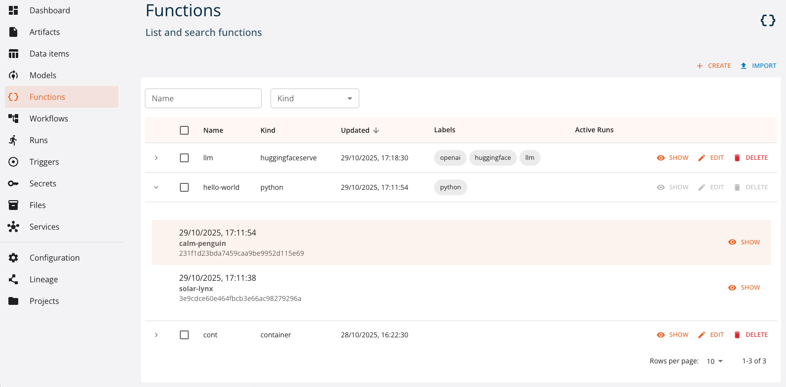
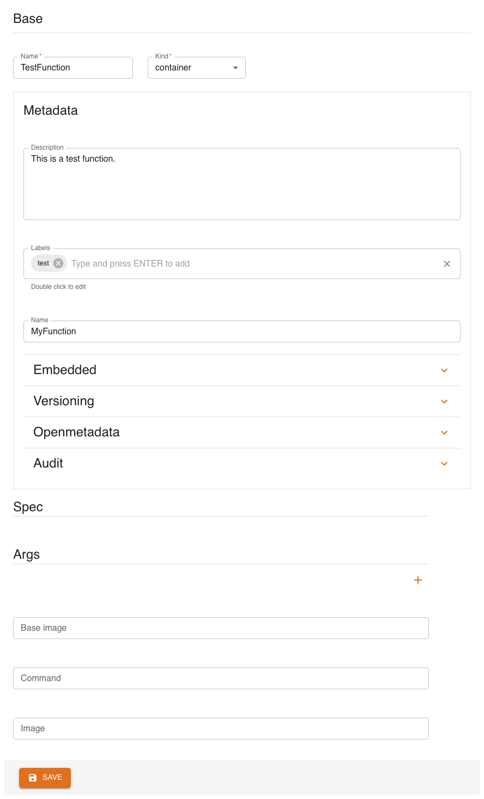
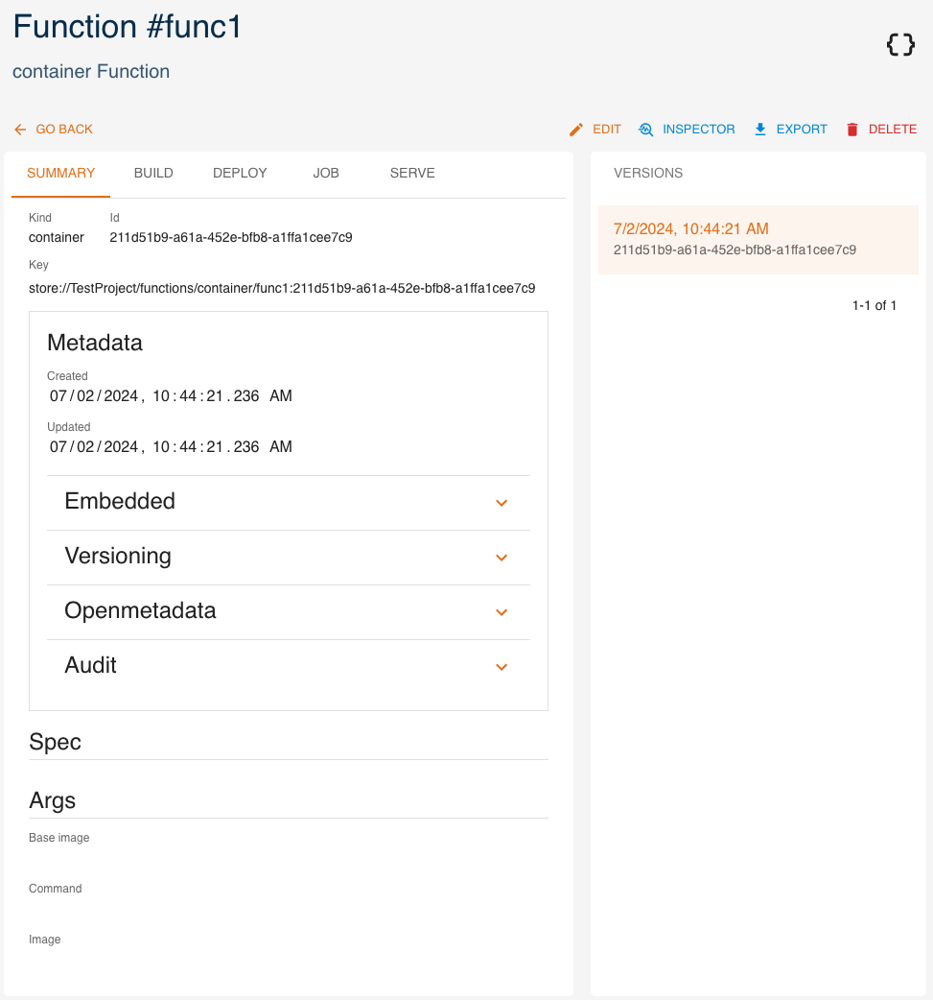

# Functions and Runtimes

**Functions** are the logical description of something that the platform may execute and track for you. A function may represent code to run as a job, an ML model inference to be used as batch procedure or as a service, a data validation, etc.

In the platform we perform **actions** over functions (also referred to as "tasks"), such as job execution, deploy, container image build. A single action execution is called **run**, and the platform keeps track of these runs, with metadata about function version, operation parameters, and runtime parameters for a single execution.

They are associated with a given **runtime**, which implements the actual execution and determines which actions are available. Examples are DBT, Container, Python, etc. Runtimes  are highly specialized components which can translate the representation of a given execution, as expressed in the run, into an actual execution operation performed via libraries, code, external tools etc.

Runtimes define the key point of extension of the platform: new runtimes may be added in order to implement the low-level logic of "translating" the high level operation definition into an executable run. For example, DBT runtime allows for defining the transformation as a task that, given the input table reference,
produces a datastt appyling the function defined as SQL code. The runtime in this case is responsible for converting the specification and the references to a dedicated Kubernetes Job that runs DBT transformation and stores the corresponding dataset.

The set of the supported runtimes is documented in Runtimes References section. Independently of the specific runtime implementation, the flow of actions
with respect to the function definition and execution is the following:

- define a new function providing its name, runtime, definition (e.g., source code), and configuration (e.g., dependencies). The function definition is saved by the project. Each change to the function spec creates a new function version so that the executions of different function versions are independently tracked.
- execute a task over the function providing the configuration of the task (e.g., the K8S resources needed for the execution), the execution parameters and inputs (if any). This creates a new task specification and a new run instance tracked by the platform.

The definition and execution of the functions may be performed either via UI or via Python SDK.

## Management via UI

### Functions

Functions can be created and managed as *entities* from the console. You can access them from the dashboard or the left menu. You can:

- `create` a new function
- `expand` a function to see its 5 latest versions
- `show` the details of a function
- `edit` a function
- `delete` a function
- `filter` functions by name and kind

Here we analyze how to [create](#create), [read](#read), [update](#update) and [delete](#delete) functions using the UI, similarly to what can be done through the SDK.

#### Create

Click `CREATE` and a form will be shown:

Mandatory fields are:

- **`Name`**: name and identifier of the function
- **`Kind`**: kind of function

Metadata fields are optional and may be updated later.

- **`Description`**: a human-readable description
- **`Labels`**: list of labels
- **`Name`**: name of the function
- **`Embedded`**: flag for embedded metadata
- **`Versioning`**: version of the function
- **`Openmetadata`**: flag to publish metadata
- **`Audit`**: author of creation and modification

`Spec` fields will change depending on the function's kind.

#### Read

Click `SHOW` to view a function's details.

Tabs next to `SUMMARY` will change depending on the function's `kind`. Some of them allow you to create runs, but we will see this in a [later section](#runs).

On the right side, all versions of the resource are listed, with the current one highlighted. By clicking a different version, values displayed will change accordingly.

The `INSPECTOR` button will show a dialog containing the resource in JSON format.

The `EXPORT` button will download the resource's information as a yaml file.

#### Update

You can update a function by clicking `EDIT`. Greyed-out fields may not be updated.

#### Delete

You can delete a function from either its detail page or the list of functions, by clicking `DELETE`.

### Runs

#### Create

A run represents the execution of a task through a function. As such, the starting point to create a run is the function it is based on. Select one of the functions you created. You will notice multiple tabs at the top, next to `SUMMARY`. These tabs may differ depending on the function's `kind`.

Click `CREATE` to create a new run. You will start a 3-steps process to create a run.

The **first** step will ask for parameters that depend on the function's `kind` and the task you are creating the run for, but will generally also ask if you wish to configure resources to allocate, environment variables, secrets, volumes and node modules.

The **second** step will ask, if applicable, to specify inputs, outputs and parameters.

The **third** step will simply present a recap.

#### View and manage

By going through a function's tabs, you can access the corresponding runs, but you may also access all runs from the *Runs* section in the left menu (also available as *Jobs and runs* in the dashboard).

You can filter runs by name, kind and status.

Click on a run to view its details.

From here, click on `LOGS` to view its logs.

## Management via SDK

Functions can be created and managed as *entities* with the SDK CRUD methods.
Check the [SDK Functions documentation](https://scc-digitalhub.github.io/sdk-docs/objects/function/entity/) for more information.
