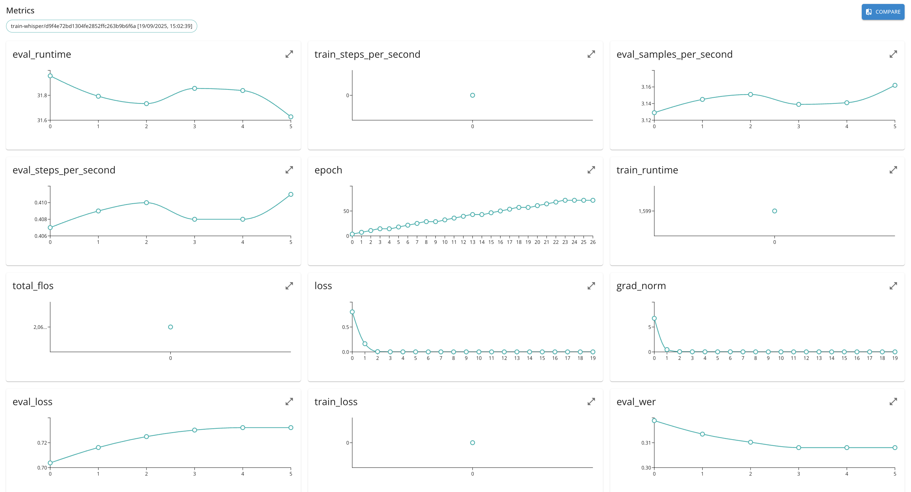

# Tracking and Metrics

Traceability in AI solutions refers to the ability to track and document every stage of a machine learning (ML) system’s lifecycle—from data collection and preprocessing to model training, deployment, and monitoring. It ensures transparency, reproducibility, and accountability by maintaining records of data sources, model versions, parameters, and performance metrics.

Model and data metrics are key components of this traceability.

- Data metrics assess the quality, balance, and drift of datasets (e.g., missing values, bias, or changes in data distribution).

- Model metrics evaluate performance, such as accuracy, precision, recall, or fairness indicators, and help compare model versions over time.

In MLOps (Machine Learning Operations), traceability and metrics are essential for maintaining reliable, compliant, and scalable AI systems. They enable teams to audit decisions, reproduce results, detect performance degradation, and ensure models remain aligned with business and ethical requirements throughout their operational lifecycle.

Within the platform metrics and trracking are first-class elements and are implemented as follows.

## Model and Run Metrics 

First, it is possible to associate quantitiative metrics to the ML models that are being created and logged by the platform. In this way it is possible to associate single-value metric value (e.g., accuracy) or value series (e.g., loss over epochs) to a model. To perform this operation one can use Python SDK and perform ``log_metrics`` oepration over model instance (see [Python SDK documentation](https://scc-digitalhub.github.io/sdk-docs/reference/objects/model/methods/#digitalhub.entities.model._base.entity.Model.log_metrics) for details).

Second, the metrics may be associated to the function runs. Similarly to model metrics, the run metrics may be logged using Python SDK.



 Once reported, the metrics of the entities may be compared (e.g., training over different hyper parameter sets).

While it is possible to log arbitrary metrics collected within the execution, in some cases it is possibile to rely on the functionality provided by the ML frameworks.

In case of MLFlow model, it is possible to use ``autolog`` functionality of the framework to collect and assocaite metrics. For example

```python
import mlflow
from digitalhub import from_mlflow_run, get_mlflow_model_metrics
from digitalhub_runtime_python import handler

...

    # Enable MLflow autologging for sklearn
    mlflow.sklearn.autolog(log_datasets=True)
    
    # training
    ...

    # Get MLflow run information
    run_id = mlflow.last_active_run().info.run_id
    # Extract MLflow run artifacts and metadata for DigitalHub integration
    model_params = from_mlflow_run(run_id)
    metrics = get_mlflow_model_metrics(run_id)

```

In case of models built / fine-tuned with HuggingFace Transformers, one can use the callbacks to report the metrics during the execution. For example

```python
from transformers import (
    AutoTokenizer,
    AutoModelForCausalLM,
    BitsAndBytesConfig,
    TrainingArguments,
    EarlyStoppingCallback,
    TrainerCallback
)

class LoggingCallback(TrainerCallback):

    def __init__(self, run):
        self.run = run

    def on_log(self, args, state, control, logs, model=None, **kwargs):
        metrics = {}
        for k, v in logs.items():
            if isinstance(v, (int, float)):
                metrics[k] = v
            elif isinstance(v, torch.Tensor) and v.numel() == 1:
                metrics[k] = v.item()
            else:
                logger.warning(
                    f'Trainer is attempting to log a value of "{v}" of type {type(v)} for key "{k}" as a metric. '
                    "MLflow's log_metric() only accepts float and int types so we dropped this attribute."
                )
        self.run.log_metrics(metrics)

...

    trainer = SFTTrainer(
        model=model,
        processing_class=tokenizer,
        train_dataset=train_dataset,
        eval_dataset=dev_dataset,
        callbacks=callbacks,
        ...
```
