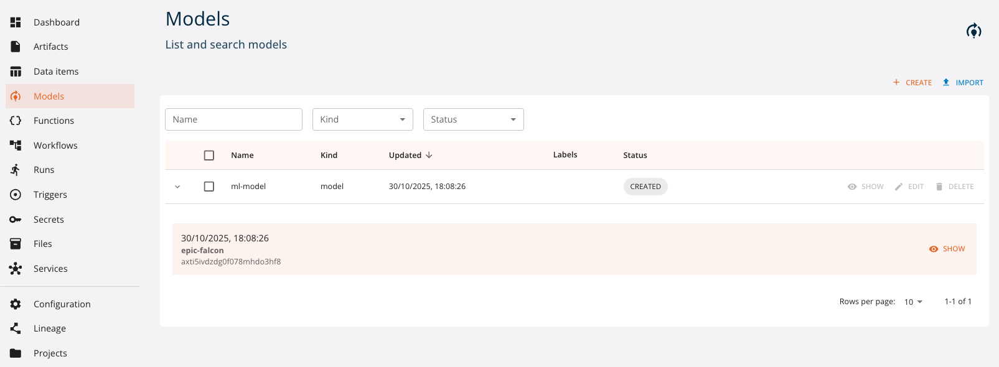
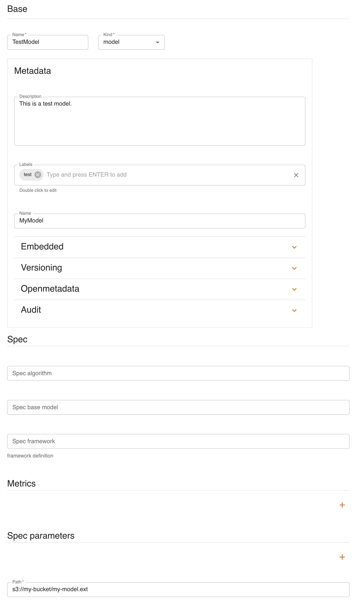

# ML Models

## Model management via UI

Models can be created and managed as *entities* with the console. You can access them from the dashboard or the left menu. You can:

- `create` a new model
- `expand` a model to see its 5 latest versions
- `show` the details of a model
- `edit` a model
- `delete` a model
- `filter` models by name and kind



We will now see how to [create](#create), [read](#read), [update](#update) and [delete](#delete) models using the UI, similarly to what is done with the SDK.

### Create

Click `CREATE` and a form will be shown:



Mandatory fields are:

- **`Name`**: name and identifier of the model
- **`Kind`**: kind of the model
- (Spec) **`Path`**: remote path where the model is stored

### Read

Click `SHOW` to view a model's details.


On the right side, all versions of the resource are listed, with the current one highlighted. By clicking a different version, values displayed will change accordingly.

The `INSPECTOR` button will show a dialog containing the resource in JSON format.


The `EXPORT` button will download the resource's information as a yaml file.

### Update

You can update a model by clicking `EDIT`. Greyed-out fields may not be updated.

### Delete

You can delete a model from either its detail page or the list of models, by clicking `DELETE`.

## Model management via SDK

A `model` can be managed with the following methods.

- [**`new_model`**](#create_1): create a new model
- [**`get_model`**](#read_1): get a model
- [**`update_model`**](#update_1): update a model
- [**`delete_model`**](#delete_1): delete a model
- [**`list_models`**](#list): list all models

This is done in two ways. The first is through the SDK and the second is through the `Model` object.
Example:

```python
import digitalhub as dh

project = dh.get_or_create_project("my-project")

## From library
model = dh.new_model(project="my-project",
                           name="my-model",
                           kind="model",
                           path="s3://my-bucket/my-model.ext")

## From project
model = project.new_model(name="my-model",
                                kind="model",
                                path="s3://my-bucket/my-model.ext")
```

The syntax is the same for all CRUD methods. The following sections describe how to create, read, update and delete a model, focusing on managing models through the library. If you want to manage models from the project, you can use the `Project` object and avoid having to specify the `project` parameter.

### Create

To create a model you can use the `new_model()` method.

Mandatory parameters are:

- **`project`**: the project in which the model will be created
- **`name`**: name of the model
- **`kind`**: kind of the model
- **`path`**: remote path where the model is stored

Optional parameters are:

- **`uuid`**: uuid of the model (this is automatically generated if not provided). **Must** be a valid uuid v4.
- **`description`**: description of the model
- **`source`**: remote source of the model (git repository)
- **`labels`**: labels of the model
- **`embedded`**: whether the model is embedded or not. If `True`, the model is embedded (all the spec details are expressed) in the project. If `False`, the model is not embedded in the project
- **`src_path`**: local path of the model, used in case of upload into remote storage
- **`kwargs`**: keyword arguments passed to the *spec* constructor

Example:

```python
model = dh.new_model(project="my-project",
                           name="my-model",
                           kind="model",
                           path="s3://my-bucket/my-model.ext")
```

### Read

To read a model you can use the `get_model()` or `import_model()` methods. The first one searches for the model into the backend, the second one loads it from a local yaml.

#### Get

Mandatory parameters are:

- **`project`**: the project in which the model will be created

Optional parameters are:

- **`entity_name`**: to use the name of the model as identifier. It returns the latest version of the model
- **`entity_id`**: to use the uuid of the model as identifier. It returns the specified version of the model
- **`kwargs`**: keyword arguments passed to the client that communicates with the backend

Example:

```python
model = dh.get_model(project="my-project",
                           entity_name="my-model")

model = dh.get_model(project="my-project",
                           entity_id="uuid-of-my-model")
```

#### Import

Mandatory parameters are:

- **`file`**: file path to the model yaml

Example:

```python
model = dh.import_model(file="./some-path/my-model.yaml")
```

### Update

To update a model you can use the `update_model()` method.

Mandatory parameters are:

- **`model`**: model object to be updated

Optional parameters are:

- **`kwargs`**: keyword arguments passed to the client that communicates with the backend

Example:

```python
model = dh.new_model(project="my-project",
                           name="my-model",
                           kind="model",
                           path="s3://my-bucket/my-model.ext")

model.metadata.description = "My new description"

model = dh.update_model(model=model)
```

### Delete

To delete a model you can use the `delete_model()` method.

Mandatory parameters are:

- **`project`**: the project in which the model exists

Optional parameters are:

- **`entity_name`**: to use the name of the model as identifier
- **`entity_id`**: to use the uuid of the model as identifier
- **`delete_all_versions`**: if `True`, all versions of the model will be deleted. Mutually exclusive with the `entity_id` parameter.
- **`kwargs`**: keyword arguments passed to the client that communicates with the backend

Example:

```python
model = dh.new_model(project="my-project",
                           name="my-model",
                           kind="model",
                           path="s3://my-bucket/my-model.ext")

dh.delete_model(project="my-project",
                   entity_id=model.id)
```

### List

To list all models you can use the `list_models()` method.

Mandatory parameters are:

- **`project`**: the project containing the models

Optional parameters are:

- **`kwargs`**: keyword arguments passed to the client that communicates with the backend

Example:

```python
models = dh.list_models(project="my-project")
```

## Model object

The `Model` object is built using the `new_model()` method. There are several variations of the `Model` object based on the `kind` of the model. The SDK supports the following kinds:

- **`model`**: represents a generic model

For each different kind, the `Model` object has a different set of methods and different `spec`, `status` and `metadata`.
All the `Model` kinds have a `save()` and an `export()` method to save and export the *entity* model into backend or locally as yaml.

To create a specific model, you must use the desired `kind` in the `new_model()` method.

##### Model

The `model` kind indicates that the model is a generic model.
There are no specific `spec` parameters.

The `model` kind has the following methods:

- **`as_file()`**: collects the model into a local temporary file
- **`download()`**: downloads the model into a specified path
- **`upload()`**: uploads the model to a specified path

###### As file

The `as_file()` method returns the model as a temporary file. The file **is not** automatically deleted when the program ends.
The method returns the path of the downloaded model.

###### Download

The `download()` method downloads the model into a specified path.
The method returns the path of the downloaded model.
The method accepts the following parameters:

- **`target`**: remote path of the model to be downloaded (eg. `s3://my-bucket/my-model.ext`). By default, uses the `spec` `path`.
- **`dst`**: local path where the model will be downloaded. By default, it is in the current working directory
- **`overwrite`**: if `True`, the target path will be overwritten if it already exists

###### Upload

The `upload()` method uploads the model to a specified path.
The method returns the path of the uploaded model.
The method accepts the following parameters:

- **`source`**: local path of the model to be uploaded
- **`target`**: remote path of the model to be uploaded (eg. `s3://my-bucket/my-model.ext`). By default, uses the `spec` `path`.