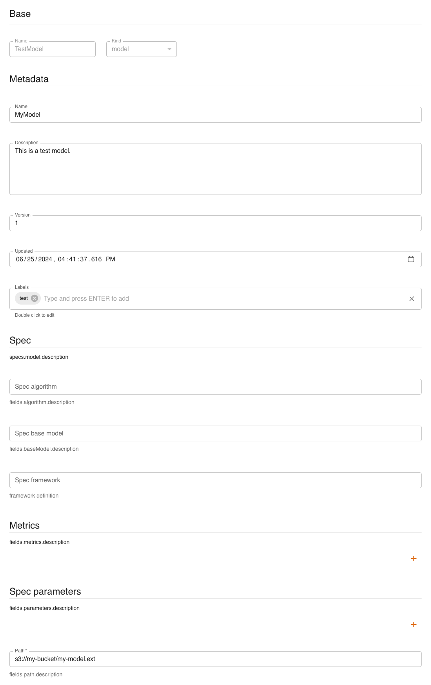

# ML Models

## Model management via UI

Models can be created and managed as *entities* with the console. You can access them from the dashboard or the left menu. You can:

- `create` a new model
- `expand` a model to see its 5 latest versions
- `show` the details of a model
- `edit` a model
- `delete` a model
- `filter` models by name and kind

We will now see how to [create](#create), [read](#read), [update](#update) and [delete](#delete) models using the UI, similarly to what is done with the SDK.

### Create

Click `CREATE` and a form will be shown:

Mandatory fields are:

- **`Name`**: name and identifier of the model
- **`Kind`**: kind of the model
- (Spec) **`Path`**: remote path where the model is stored

### Read

Click `SHOW` to view a model's details.

On the right side, all versions of the resource are listed, with the current one highlighted. By clicking a different version, values displayed will change accordingly.

The `INSPECTOR` button will show a dialog containing the resource in JSON format.

The `EXPORT` button will download the resource's information as a yaml file.

### Update

You can update a model by clicking `EDIT`. Greyed-out fields may not be updated.

### Delete

You can delete a model from either its detail page or the list of models, by clicking `DELETE`.

## Model management via SDK

A `model` can be managed with the following methods.

- [**`new_model`**](#create_1): create a new model
- [**`get_model`**](#read_1): get a model
- [**`update_model`**](#update_1): update a model
- [**`delete_model`**](#delete_1): delete a model
- [**`list_models`**](#list): list all models

### Create

### Read

#### Get

#### Import

### Update

### Delete

### List