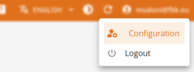
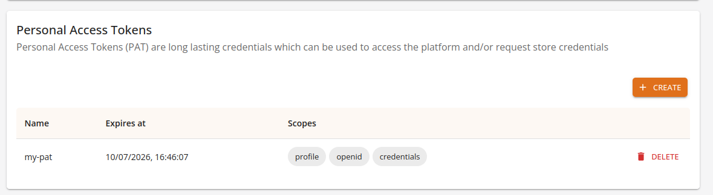
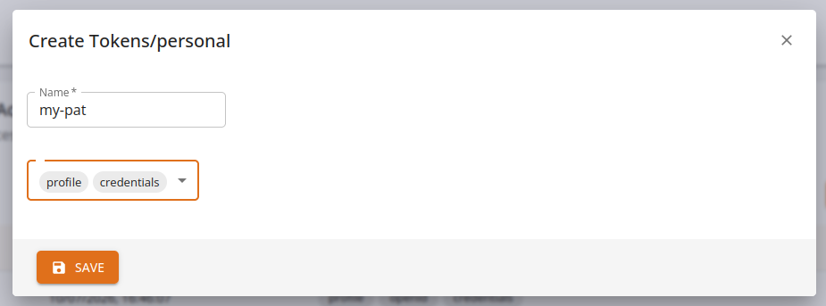

# Personal Access Tokens (PATs)

Personal Access Tokens (PATs) are a special type of access token that users can generate directly from the platform’s web console. PATs are designed to simplify user authentication for long-lived or automation-related use cases, offering the same functionality as standard access tokens with additional control features.

Key Characteristics:

*    **No Automatic Expiration by Default**:
    PATs do not expire automatically unless an expiration policy is enforced by platform administrators. This makes them suitable for use cases requiring persistent access without frequent reauthentication.

*    **Interoperable with Standard Access Token Workflows**:
    PATs can be used in any context where a standard access token is accepted, including calling APIs and authenticating with platform services.

*    **Supports Token Exchange (Security Token Service - STS)**:
    PATs can be used in token exchange flows to obtain short-lived standard access tokens and associated credentials, aligning with security best practices for downstream service interactions.

*    **Named Tokens**:
    Each PAT must be assigned a human-readable name upon creation. This name helps users identify and manage their tokens more easily in the web console.

*    **User-Controlled Lifecycle Management**:
    PATs can be revoked at any time by their owner via the web console, providing a manual method of invalidating tokens if they are no longer needed or are believed to be compromised.

*    **Opaque Format**:
    PATs are opaque strings, meaning their contents are not encoded in a readable format like JWTs (JSON Web Tokens). Their structure and claims are not introspectable by clients and must be validated by the platform.

Typical Use Cases

*    Command-line tools or scripts requiring persistent access without interactive login

*    Integration with CI/CD pipelines

*    Applications that require non-expiring or manually managed credentials

*    Access delegation to long-lived background jobs

### Security Considerations

Because PATs typically do not expire automatically and are opaque, they should be treated as sensitive credentials. It is strongly recommended to:

*    Store PATs securely (e.g., in encrypted secrets managers)

*    Use token exchange to obtain short-lived credentials for actual API calls

*    Regularly review and rotate PATs

*    Revoke unused or compromised tokens immediately

## Token management via UI

When logged in the web console, users can create, review and revoke **Personal Access Tokens** from the user menu, accessible via the top right dropdown with the username. 

Select *configuration* to open the user management page and then scroll down to the *Personal Access Tokens* section.

When adding a *PAT*, the form asks for a name and then lets users select which kind of permissions will be given to the newly created token. On creation, the token *value* will be shown once, and then stored secretly in the platform.

**Copy the token value and store securely: it won't be readable anymore!**

From now on, the token can be freely used wherever an *access token* would be required. At any given time, owner can revoke the token from the same page by selecting *Delete* and confirming the removal.