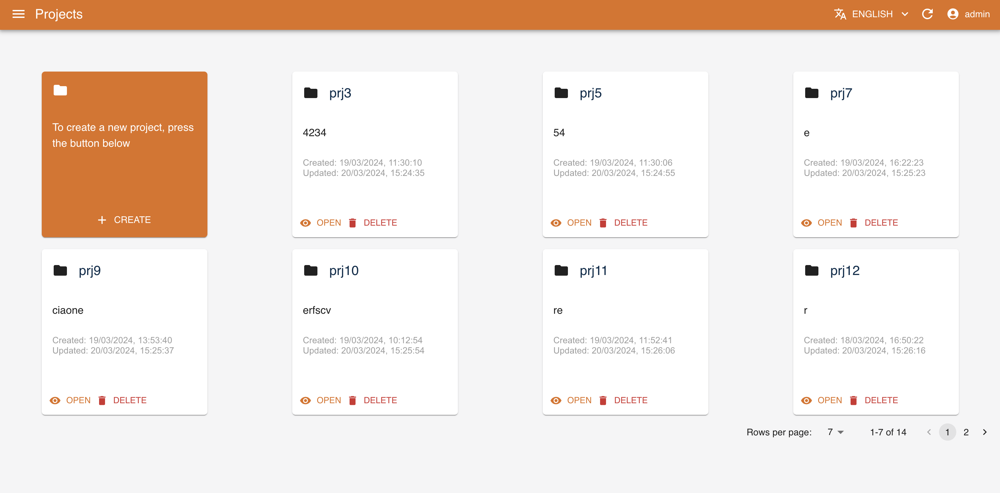
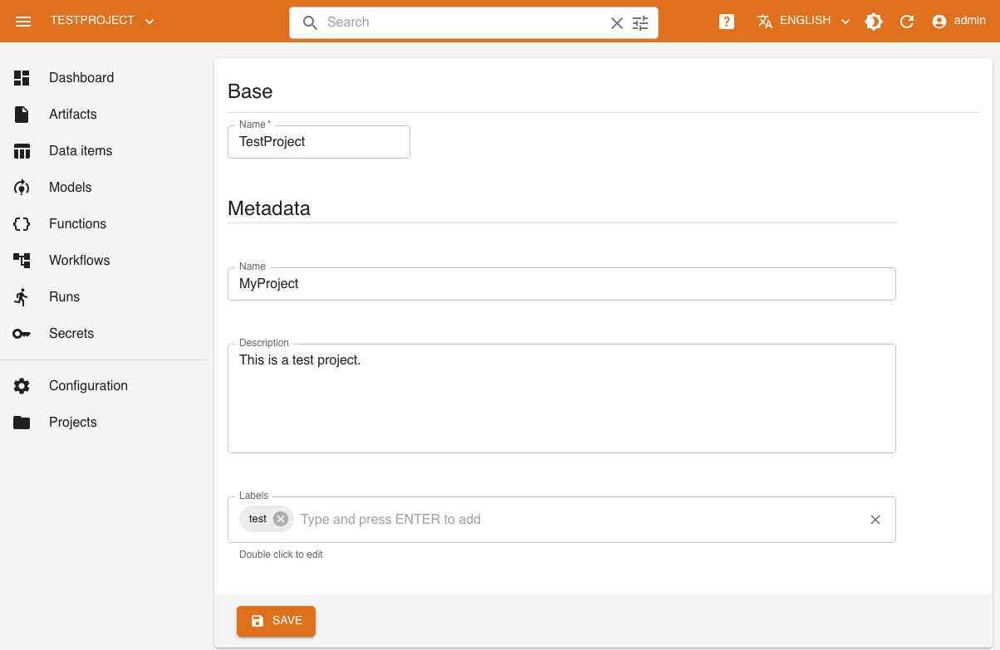
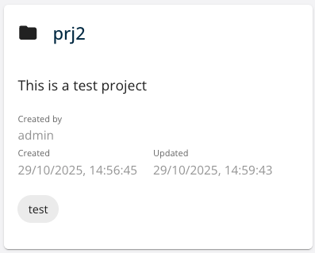
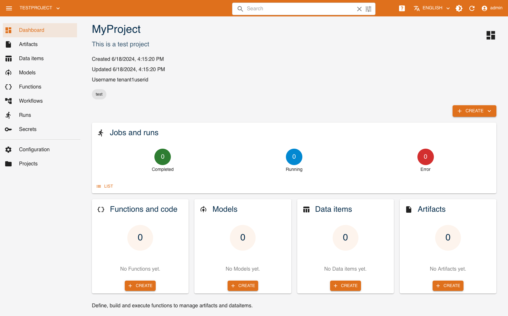
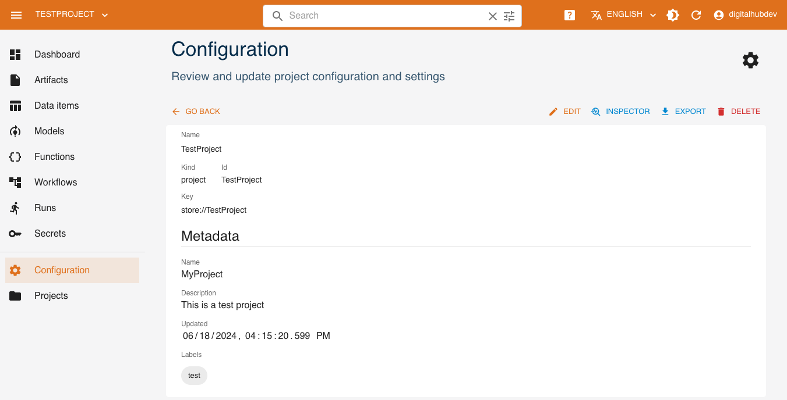
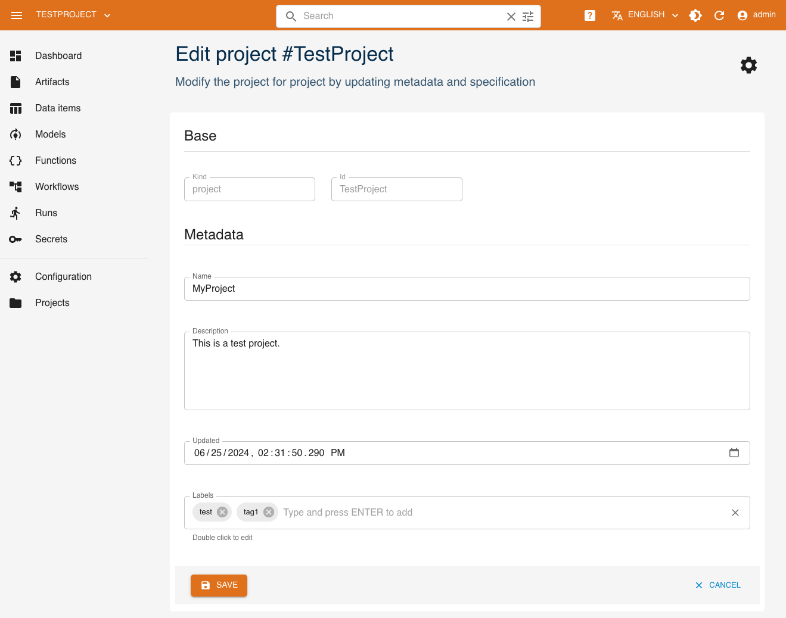
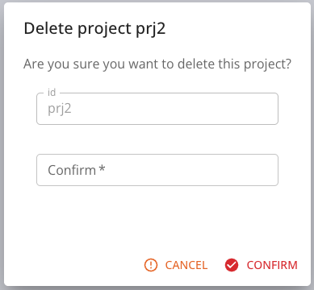

# Projects

A project in Core is the context in which you can run functions and manage data and artifacts.
Projects can be created and managed from the UI or from the SDK.

## Managing Projects via SDK

In the following sections we document the project CRUD methods available in the SDK and the methods exposed by the `Project` entity.

### CRUD

Here we analyze how to create, read, update and delete projects using the SDK.

#### Create

A project is created with `new_project()` method. It has the following mandatory parameters:

- **`name`**: the name of the project, it is also the identifier of the project

The other parameters are optional:

- **`context`**: path where project can export yaml files locally
- **`description`**: a human readable description of the project
- **`source`**: a Git repository URL where lies the project code
- **`labels`**: a list of labels
- **`local`**: a boolean value, if `True` the project will be managed without *Core backend*. Defaults to `False`
- **`config`**: a dictionary containing the project configuration like user and password for basic auth or a bearer token
- **`setup_kwargs`**: a dictionary containing the project hook setup arguments
- **`kwargs`**: a list of keyword arguments passed to the client that comunicate with the backend

Example:

``` python
import digitalhub as dh

project = dh.new_project("my-project", context="./", description="my new project")
```

##### Config

The **`config`** parameter can be used to provide a dictionary containing the project configuration like user and password for basic auth or a bearer token. The format of the dictionary for basic auth must be as this:

```python
{
    "user": "user",
    "password": "password"
}
```

The format of the dictionary for bearer token must be as this:

```python
{
    "access_token": "token"
}
```

##### Setup kwargs

The **`setup_kwargs`** parameter can be used to provide a dictionary containing the project hook setup arguments. The concept behind this parameter is that at the beginning of the project lifecycle, the project can be configured with an hook script that will be executed when the project is created / got.
First of all, the configuration script **MUST** comply with the following format:

- It must be a Python script named `setup_project.py` inside the project context directory.
- It must contain an handler (a python function) named `setup` as entrypoint.
- The `setup` function must accept a `Project` instance as the only positional argument.
- `setup_kwargs` must be passed as keyword arguments to the `setup` function.

The project setup will create a `.CHECK` file at the end of the `setup` function execution. This sentinel file is used to indicate that the project is set up and new executions will be ready.

A use case scenario can be the instantiation of entities used by the user like artifacts or functions.

Example:

``` python
setup_kwargs = {
    "some_arg1": "arg1",
    "some_arg2": "arg2"
}

# Setup script

def setup(project, some_arg1=None, some_arg2=None):
    # Do something with project and args

```

#### Read

You can read a project with three methods, from remote backend with `get_project()`, from local directory with `import_project()` or from either with `load_project()`.

##### Get project

With `get_project()` you can load a project from the backend. The method requires the following manadatory parameters:

- **`name`**: the name of the project

The other parameters are optional:

- **`local`**: a boolean value, if `True` the project will be managed without *Core backend*. Defaults to `False`
- **`config`**: a dictionary containing the project configuration like user and password for basic auth or a bearer token
- **`setup_kwargs`**: a dictionary containing the project hook setup arguments
- **`kwargs`**: a list of keyword arguments passed to the client that comunicate with the backend

Example:

``` python
project = dh.get_project("my-project")
```

##### Import project

With `import_project()` you can load a project from a local directory. The method requires the following manadatory parameters:

- **`file`**: path to the yaml project file

The other parameters are optional:

- **`local`**: a boolean value, if `True` the project will be managed without *Core backend*. Defaults to `False`
- **`config`**: a dictionary containing the project configuration like user and password for basic auth or a bearer token
- **`setup_kwargs`**: a dictionary containing the project hook setup arguments
- **`kwargs`**: a list of keyword arguments passed to the client that comunicate with the backend

Example:

``` python
project = dh.import_project("./my-project.yaml")
```

##### Load project

With `load_project()` you can load a project from the backend or from a local directory.
The method requires either one of the following parameters:

- **`name`**: the name of the project
- **`file`**: path to the yaml project file

If you pass the name, the method will try to load the project from the backend, otherwise it will try to load it from the local directory. Note that both parameters are mutually exclusive and keyword arguments.

The other parameters are optional:

- **`local`**: a boolean value, if `True` the project will be managed without *Core backend*. Defaults to `False`
- **`config`**: a dictionary containing the project configuration like user and password for basic auth or a bearer token
- **`setup_kwargs`**: a dictionary containing the project hook setup arguments
- **`kwargs`**: a list of keyword arguments passed to the client that comunicate with the backend

Example:

``` python
project = dh.load_project(name="my-project")
project = dh.load_project(file="./my-project.yaml")
```

#### Create or read

The `digitalhub` SDK provides a method `get_or_create_project()` that allows you to create a project if it does not exist. The method has the following mandatory parameters:

- **`name`**: the name of the project.

The other parameters are optional:

- **`context`**: path where project can export yaml files locally
- **`local`**: a boolean value, if `True` the project will be managed without *Core backend*. Defaults to `False`
- **`config`**: a dictionary containing the project configuration like user and password for basic auth or a bearer token
- **`setup_kwargs`**: a dictionary containing the project hook setup arguments
- **`kwargs`**: a list of keyword arguments passed to the client that comunicate with the backend

Example:

``` python
project = dh.get_or_create_project("my-project", context="./")
```

#### Update

You can update a project with `update_project()` method. It has the following mandatory parameters:

- **`project`**: the project entity that will be updated

The other parameters are optional:

- **`kwargs`**: a list of keyword arguments passed to the client that comunicate with the backend

Example:

``` python
project = dh.update_project(project)
```

#### Delete

You can delete a project with `delete_project()` method. It has the following mandatory parameters:

- **`name`**: the name of the project

The other parameters are optional:

- **`cascade`**: a boolean value, if `True` the project and all the related resources will be deleted from the backend. Defaults to `True`. It is only available in the Core backend.
- **`clean_context`**: a boolean value, if `True` the project context will be deleted (no more object can be created locally under the project).
- **`local`**: a boolean value, if `True` the project will be managed without *Core backend*. Defaults to `False`
- **`kwargs`**: a list of keyword arguments passed to the client that comunicate with the backend

Example:

``` python
project = dh.delete_project("my-project")
```

### Project methods

The `Project` class exposes two basic methods that allow you to save remotely or export locally the project.
Furthermore, according to the SDK digitalhub layer installed, the `Project` class exposes CRUD methods for a variety of entities.

#### Save and export

The methods `save()` and `export()` are used to save the project on the backend or export the project locally.

##### Save

The `save()` method is used to save the project on the backend and it accepts the following optional parameters:

- **`update`**: a boolean value, if `True` the project will be updated on the backend

Please note that the save method will usually raise an exception if called without the `update` parameter on runtime. This is because the project (managed with CRUD SDK methods) should already exists on the backend if exists as object.

##### Export

The `export()` method is used to export the project locally as yaml file and it accepts the following optional parameters:

- **`filename`**: the name of the file to export

Note that the filename must have the `.yaml` extension. The project will be exported as a yaml file inside the context directory. If no filename is passed, the project will be exported as a yaml file named `project_{project-name}.yaml`.

According to the SDK digitalhub layer installed, the `Project` class exposes CRUD methods for a variety of entities.

#### Entities CRUD

The project acts as context for other entities as mentioned in the introduction. With a `Project` object, you can create, read, update and delete these entities. The methods exposed are basically five for all entities, and are:

- **`new`**: create a new entity
- **`get`**: get an entity from backend
- **`update`**: update an entity
- **`delete`**: delete an entity
- **`list`**: list entities related to the project

Each digitalhub layer exposes CRUD handles different aspects of data and ml entities. Here follows a list of the methods exposed by the `Project` class for each layer. Please refer to the specific entity documentation for more information.

##### Core layer

The entity handled by the `Project` class in the core layer (`digitalhub_core`) are:

- **`functions`**
- **`artifacts`**
- **`workflows`**
- **`secrets`**

##### Data layer

The entity handled by the `Project` class in the data layer (`digitalhub_data`) are:

- **`dataitems`**

##### Ml layer

The entity handled by the `Project` class in the ml layer (`digitalhub_ml`) are:

- **`models`**

## Managing Projects via UI

In the following sections we document the Project management through UI available using the  `Digital Hub Console`.

### CRUD

Here we analyze how to Create, Read, Update and Delete Projects using the UI, similarly to what happens with the SDK

#### Create

A project is created pressing the button `CREATE` in the Homepage od the Console.



After pressing the button, the dialog asking the Project's parameter is shown:



 It has the following mandatory parameters:

- **`name`**: the name of the project, it is also the identifier of the project 
- **`description`**: a human readable description of the project

The other `Metadata` parameters are optional and mutable after the creation:

- **`name`**: the name of the project
- **`description`**: a human readable description of the project
- **`updated`**: the date of the last modification made to the project
- **`labels`**: a list of labels (strings)

Pressing on the `Save` button, the project is added to the list of the projects in Homepage
#### Read

In the Home Page are listed all the projects present in the database. The tile shows:

- **`name`**: the name of the project
- **`id`**: the identifier of the project
- **`created`**: the date of the creation of the project
- **`updated`**: the date of the last modification made to the project

On the bottom the button for `Open` and enter in the Project and the `Delete`



Clicking on the `Open` button, the following Dashboard is shown



This dashboard reports a summary of the resources associated with the project and a series
of features to access the management of these resources.
 
- **`Artifacts`**: the number and the list of the last Artifacts created
- **`Data items`**: the number and the list of the last Data items created
- **`Functions and code`**: the number and the list of the last Functions created
- **`Jobs and runs`**: the status and list of runs performed

From any page of the dashboard it is possible to change the project by selecting from the menu at the top of the bar


#### Update

You can update a project `Metadata` pressing the button `Configuration` in the side Menubar.



Pressing the `Edit` button on the top right of the page the form for editing the `Metadata` values of the project is shown.
In the example below, the labels `test` and `prj1` are added


After the modification, pressing Save the new configuration is stored

#### Delete

You can delete a project from the `Home page`  and from the `Configuration` pressing the `Delete` button.
For confirm the choice of deleting, insert the name of the project in the dialog




