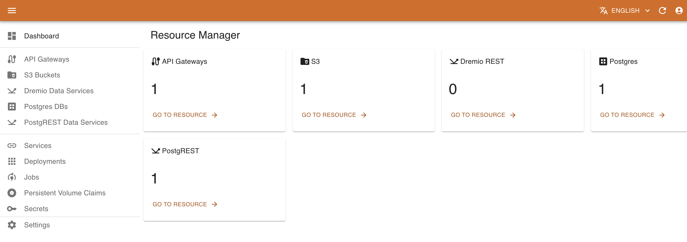
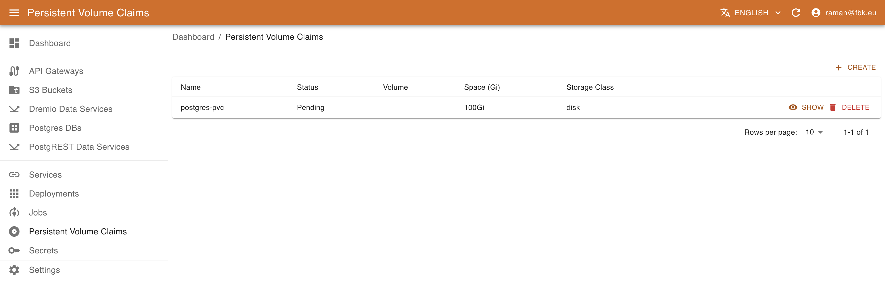
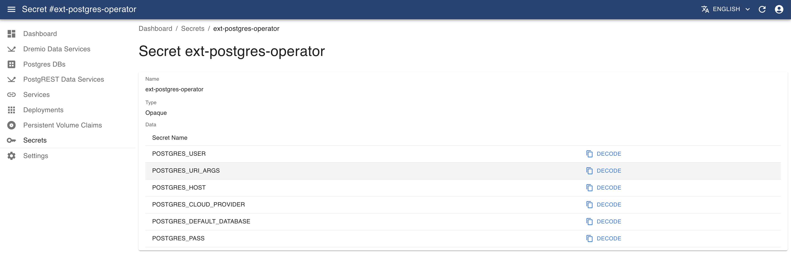
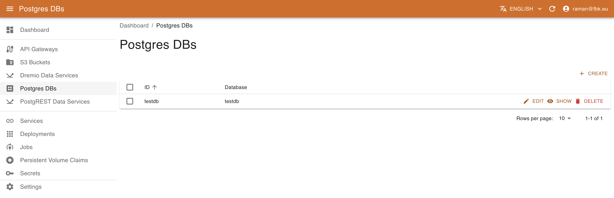
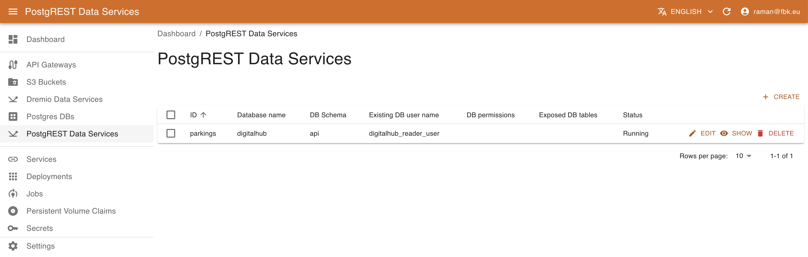
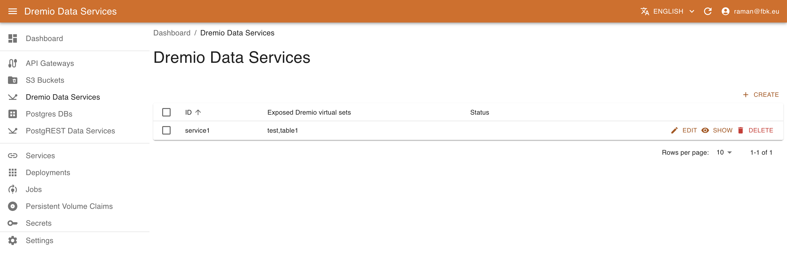
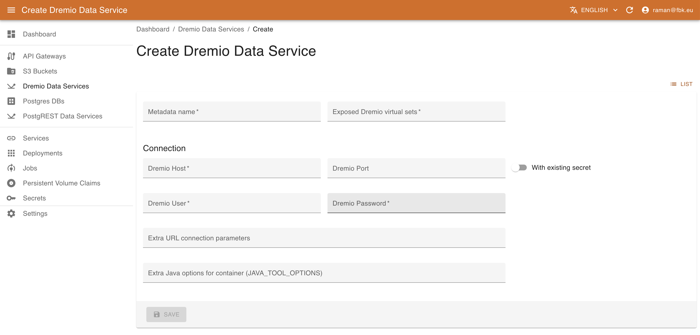
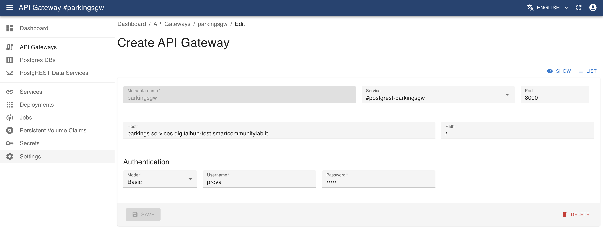

# Resource Management with KRM

Different platform entities are associated with and represented as Kubernetes resources: they are deployed as services, user volumes and secrets, captured as Custom Resources, etc. Kubernetes Resource Manager (KRM) component allows for performing various operations over these resources depending on their kind.

KRM navigation menu provides access to different types of resources. This includes both the standard resources (Services, Deployments, Persistent Volume Claims, Secrets) and custom resources based on Custom Resource Definitions currently installed on the platform. Some custom resources are managed with the customized UI
(e.g., PostgreSQL instances, PostgREST Data services o Dremio Data service), while the others may be managed with the standard UI based on 
their JSON schema.

## Management of Standard Kubernetes Resources

KRM allows for accessing and managing the standard K8S resources relevant for the DigitalHub platform: space (through Persistent Volume Claims), services and deployments, and secrets.

### Listing K8S Services 

Accessing the `Services` menu of the KRM, it is possible to list the (subset of) services deployed on Kubernetes relevant to DigitalHub.

For each service KRM shows its name, type (e.g., Coder workspace type), exposed port type and value. In the service details view it is possible to access other metadata, such as labels, creation timestamps. version, etc.

### Listing K8S Deployments 

Accessing the `Deployments` menu of the KRM, it is possible to list the (subset of) deployments on Kubernetes relevant to DigitalHub.

For each deployment KRM shows its name and availability of instances. In the deployment details view it is possible to access other metadata, such as labels, creation timestamps. version, etc.

### Managing Persistent Volume Claims

In certain cases, the operations developed with the Digital Hub may require more substantial disk space, e.g., for training / producing significant amount of data. In this case, it is possible to attach to the tasks the corresponding Persistent Volume Claim (PVC) references. To create a new PVC for the use of the pipeline or Job, KRM provides the corresponding interface.

Accessing `Persistent Volume Claims` menu, it is possible to list and manage the PVCs of the platform. 

For each PVC it is shown the status (Pending or Bound) of the PVC, the name of the volume (if specified), the storage class and the size in Gb. The details view provides further metadata regarding the PVC.

It is also possible to delete the PVC and create new ones.

!!! warning "Deleting PVC"

    Please note that deleting a PVC bound to a Pod or a Job may affect negatively their execution.

To create a new PVC, provide the following:

- name of the resource
- Disk space requeste
- Storage class name (select one of the available in your deployment)
- (Optional) name of the volume
- Access modes (standard K8S values)
- PVC mode (Filesystem or Block)

### Listing K8S Secrets 

Accessing the `Secrets` menu of the KRM, it is possible to list the (subset of) secrets on Kubernetes relevant to DigitalHub.

For each secret KRM shows its name, type, and number of elements. In the secret details view it is possible to access other metadata and also a list of secret elements. The values are not available directly; to retrieve the actual value of the secret element, use `Decode` button that will copy the decoded content of the secret into Clipboard.

## Managing Custom Resources

KRM allows for the management of generic CRs as well as for the management of some predefined ones, such as PostgreSQL instances, PostgREST and Dremio Data services.

### Managing PostgreSQL instances with KRM

Using PostgreSQL operator (https://github.com/movetokube/postgres-operator) it is possible to create new DB instances and the DB users to organize the data storage.

Accessing `Postgres DBs` menu of the KRM, it is possible to list, create, and delete PostgreSQL databases.

To create a new Database, provide the following:

- name of the database to create
- whether to drop the DB on resource deletion
- Comma-separated list of PostgreSQL extensions to enable (e.g., timescale and/or postgis) as supported by the platform deployment (optional). 
- Comma-separated list of schemas to create in DB (optional) 
- Name of the master role for the DB access management (optional) 

In the Database details view it is possible also to configure the DB users that can access and operate the Database (create, edit, view, delete). To create a new user, it is necessary to specify:

- name of the associated resource
- name of the user to be created
- access privileges (e.g., Owner, Read, or Write)
- name of the secret to be create to store the user credentials and DB access information. This results in creating a secret  `<user-cr-name>-<secret-name>` that can be accessed in the Secrets section of KRM.

### Managing PostgREST Data Services with KRM

Using KRM it is possible to instantiate and deploy new PostgREST Data services. A PostgREST service exposes
a set of PostgreSQL tables as API, allowing for querying the information and even modifying it.

Accessing `PostgREST Data Services` menu it is possible to list, create, and delete data service instances.

To create a new data service, it is necessary to provide the information about the exposed schema and tables,
the DB access information, and the role with which the service operates. This latter may be specified either as an
existing users with the appropriate permissions or may be created if the DB access information is sufficient for 
that operation. More specifically, it is necessary to provide the following information:

- name of the resource.
- name of the DB schema to expose.
- the existing DB user (role) on behalf of which the service will operate OR the list of DB permissions to enable for this service and list of exposed DB tables. In this case the user will be created (if the connection information allows for it).
- Connection information with cluster DB host and port (optional), name of the database, DB username / password OR, alternatively, DB secret to use in order to extract the connection credentials. In this later case the secret should contain elements `USERNAME` and `PASSWORD`, or alternatively `POSTGRES_URL` with the full connection information.

!!! warning "Connection information"

    Please note that in order to create a new role that will be used by the service to access the data, the user specified with the connection information
    should have sufficient privileges to perform the operation. By default, the owner/writer/readers users created by the Postgres operator do not have this permission.

!!! warning "Schema exposure"
    PostgREST exposes all the tables and views in the schema specified in the configuration. In order to have a better control over the exposed data, it is 
    recommended to create a separate schema (e.g., 'api') and provide the access to the data via views / stored procedures. To accomplish this, it is possible
    to use SQLPad to create schemas and views.

This will result in a deployment of PostgREST microservice connected to the specified database and exposing PostgREST API over the specified schema and tables. 
See [here](https://postgrest.org/en/stable/) for further details.

### Managing Dremio Data Services with KRM

Using KRM it is possible to instantiate and deploy new Dremio Data services that expose the data presented in Dremio views as API.

Accessing `Dremio Data Services` menu it is possible to list, create, and delete data service instances.

To create a new data service, provide the following:

- name of the resource
- list of exposed virtual datasets
- Connection information with dremio host and port (optional), Dremio username / password OR, alternatively, a secret to use in order to extract the connection credentials. In this later case the secret should contain elements `USER` and `PASSWORD`.

This will result in a deployment of Dremio REST microservice connected to the specified database and exposing a simple REST API over the specified datasets. 

### Exposing services externally

Various APIs and services (e.g., PostgREST or Dremio data services, Nuclio serverless functions) may be exposed externally, outside of the platform, on a public domain of the platform. Using KRM, the operation amounts to defining a new API gateway resource that will be transformed into the corresponding ingress routing specification. 

To create a new API gatway, provide the following:

- name of the gateway
- Kubernetes service to be exposed (select it from the dropdown list and the port will automatically be provided)
- host and relative path to be exposed. The host defines the full domain name to be exposed. By default it refers to the 'services' subdomain, e.g., ``myservice.services.example.com`` where ``example.com`` corresponds to the platform domain.
- authentication information. Currently, services may be unprotected (``None``) or protected with ``Basic`` authentication, specifying username and password.

## Defining and Managing CRD Schemas

To have a valid representation of the CRs in the system, it is necessary to have a JSON specification schema for each CRDs. Normally, such schema is
provided with the CRD definition and is used by KRM to manage the resources. However, in certain cases a CRD may have no structured schema definition attached.
To allow for managing such resources, it is possible to provide a custom schema for the CRD.

Creating a schema is fairly simple. Access the **Settings** section from the left menu and click *Create*.

The **CRD** drop-down menu will list all *Custom Resource Definitions* available on the Kubernetes instance; when you pick one, the **Version** field will automatically be filled with the version of the currently active schema.

Provide the **Schema** definition and save it in KRM for future CR management.
