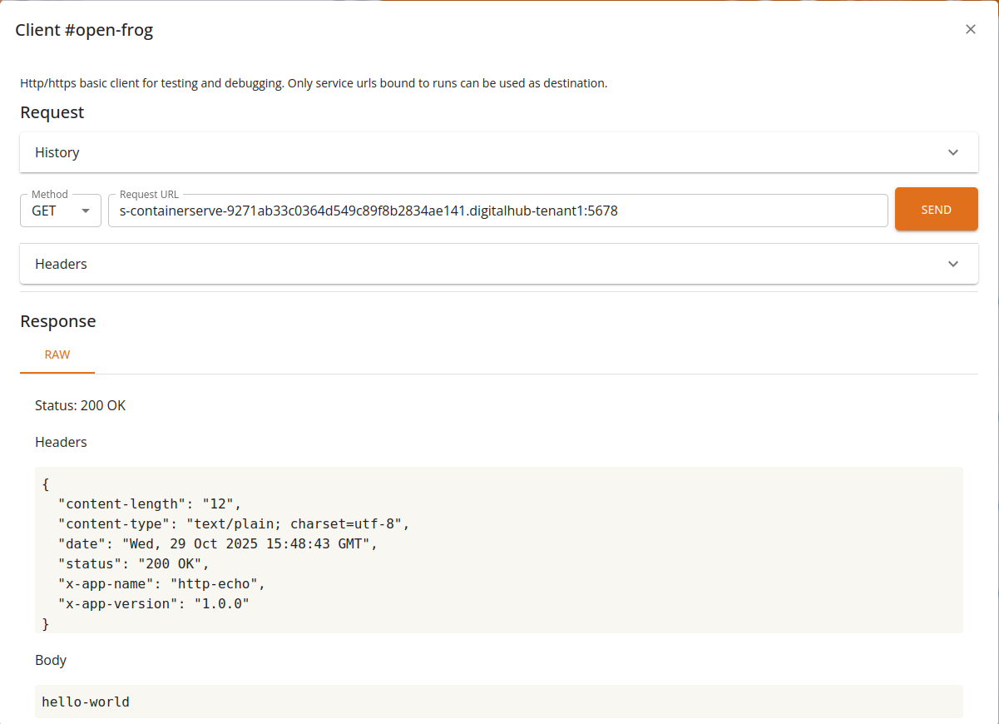

# Services

When executing _runs_, tasks of type _service_ will result in a deployment with an HTTP service published inside the platform.

Those runs will receive a unique, addressable identifier along with an IP address and an internal service URL. The detailed information are stored in the run _status_ field, under the `service` keyword. Together with the base service url, all well known urls will be registered and exposed to users.

```yaml
service:
  name: s-containerserve-9271ab33c0364d549c89f8b2834ae141
  type: ClusterIP
  clusterIP: 172.16.143.129
  ports:
    - name: port5678
      port: 5678
      protocol: TCP
      targetPort: 5678
  url: s-containerserve-9271ab33c0364d549c89f8b2834ae141:5678
```

By calling the URL, users are thus able to invoke their function interactively.

The service view will present at any given time the status of active _services_, i.e. runs with a service exposed. Users can get a quick glimpse of the health of their deployments, with quick actions available.


As we can see from the screenshot, the current _status_ is highlighted, and any contextual message is directly reported.

**Important!**

Do note that service URLs are not exposed outside the perimeter of the platform. Only clients from inside the platform, such as workspaces, other functions and the core console are able to access. In order to expose the service _externally_ an api gateway is required.

## Service invocation

Services which are in an healthy state can be invoked from inside the platform, either manually (by custom code or standard HTTP clients) or via the python SDK `invoke` method on runs.

```python

run = function.run(...)
# invoke the service only when ready!

result = run.invoke(...)

```

See the [SDK Reference documentation](https://scc-digitalhub.github.io/sdk-docs) for details.

## HTTP client

The user console implements a basic HTTP client, able to perform operations on textual content (e.g. text/plain, application/json etc).

By selecting a valid service run and clicking the _CLIENT_ button, the console will open a simplified dialog as depicted in following figure.



From the client, users will be able to perform basic operations and visualize the results.

#### Features

- Supports GET/POST/PUT/DELETE operations
- Can invoke internal urls leveraging core as gateway
- Supports custom HTTP headers
- Full request/response history
- Basic _raw_ text support
- Interactive preview for JSON and YAML

#### Notes

The service is not exposed to the user's browser: access is mediated by the console through the core backend. As such, only a limited set of content is allowed: **text-based** requests and responses with a reasonable size limit.
