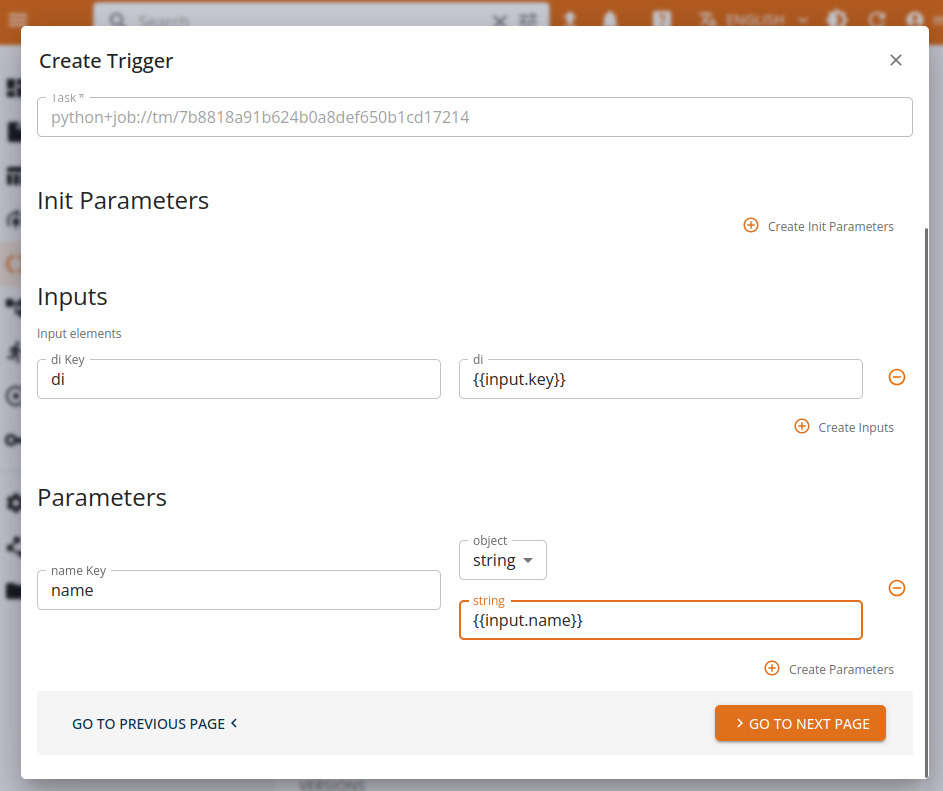
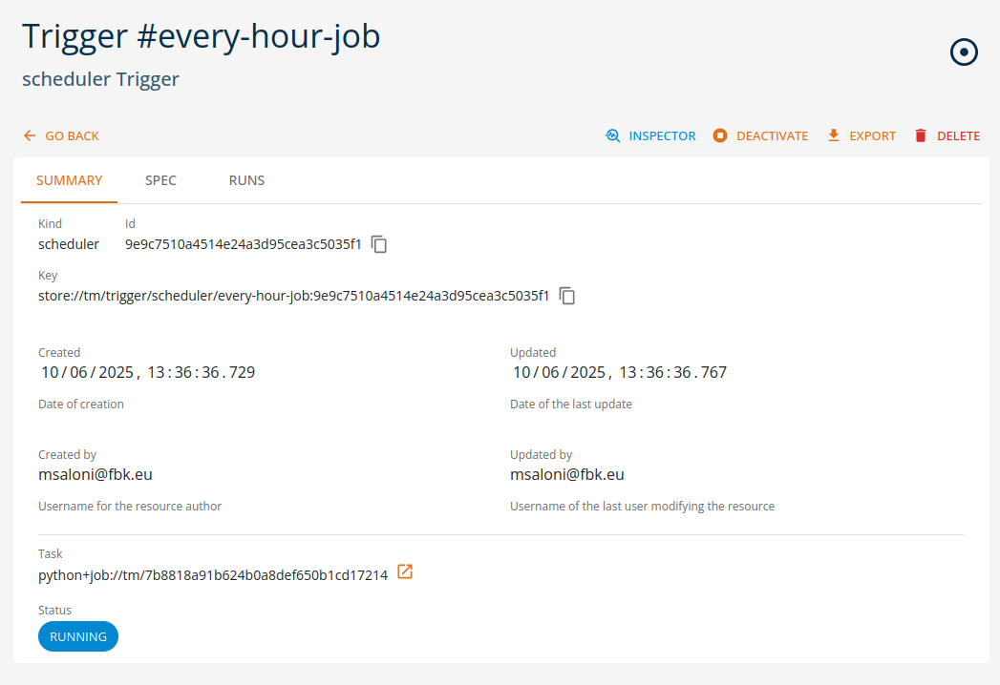

# Triggers and automation

Triggers define a way for users to describe a set of *conditions* which should result in the execution of a function's task, i.e. a **run**.

Triggers solve the problem of automatically executing a function when a specific condition is achieved, such as a schedule, an event, a change of status of a persisted entity. Their purpose is to let users define simple *automations*, which execute a task based on a given variable input, following the  not to implement *pipelines*.

Every trigger must be bound to a specific function's task: when the trigger *fires*, the result will be an execution of that very specific task, i.e. a **run**.

Triggers are handled by **actuators**, dedicated, internal components which will process a trigger's definition and then monitor the conditions required for *firing* the trigger. For example, with a *scheduler* trigger defining a cron expression, the actuator will fire the trigger every time the expression is satisfied.

The platform handles the persistence, consistency and lifecycle of triggers by storing them as entities related to functions.

Users can run or stop triggers at will, enabling or disabling the execution.


## Templates and inputs

Triggers are designed to produce a function's run every time they are fired. In the platform, a *run* is a self described, fully enclosed definition of a function's execution. As such, the configuration (context, resources, parameters, inputs, secrets...) is passed as **spec** for the run. In the trigger flow, the spec is dynamically built by the platform, leveraging the context of the user and the triggers execution. Every parameter meant to go in the run's *spec* has to be either statically pre-defined or dynamically generated at runtime. 

The trigger's spec includes a `template` field which serves as the base used to derive the run's `spec`: static parameters are copied, while the context and the environment are built by core. This solution can satisfy basic needs, such as *"execute this function every day"*, but fails to cover more complex uses, where the function's parameters must be dynamically populated.


```yaml

template:
  envs:
    - name: MY_ENV
      value: VALUE
  parameters:
    param1: value123
  resources:
    cpu:
      requests: "1"
    mem:
      requests: 64Mi

```


To solve this need, triggers can produce *inputs*, based on their context and the specific execution event. These inputs can be consumed by user-defined functions to perform specific, parametrized tasks: for example a validation function could perform a check on a given data table. In order to *consume* inputs, the function must accept variable parameters.

For example, a function could receive a parameter shaped as a core entity as follow:

```python

def validate(project, di:DataItem):
    # download dataitem as local file
    path = di.download(overwrite=True)

...

```

This function could be used via a *lifecycle trigger* to perform an automation which will validate every data table stored in the project's repository, by consuming the *input* produced by the trigger as function parameter.

Core supports a simple templating language, based on *Mustache*, which lets developers define placeholders inside the run's template, and have those placeholders inflated with the actual value at runtime.

Following the previous example, the template could expose the data item key for the python code to consume by defining the parametrized value in the template:

```yaml

template:
  inputs:
    di: "{{input.key}}"

```

This definition will instruct the templating engine in producing a run with a named input `di` valorized as the store key of the data item triggering the execution. Every resulting run will then receive a different, specific input enabling the automation to work.

The resulting spec for an execution triggered by entity `my-test-data` will be:

```yaml

spec:
  inputs:
    di: store://my-prj/dataitem/table/my-test-data:00...

```


## Scheduler trigger

The platform supports a basic, cron-like scheduler which will execute the associated task every time the cron *expression* is verified.

The only configuration parameter is:
* **schedule**: a cron-like expression describing the requested interval or time


For example:
```yaml
spec: 
    schedule: 0 * 0 ? * * * #every minute

```

The expression is based on Quartz syntax, see [Quartz doc](https://www.quartz-scheduler.org/documentation/quartz-2.3.0/tutorials/crontrigger.html) for reference.


Additionally, the scheduler supports the `@` syntax for repeated tasks, supporting:

* `@hourly` for tasks repeated every hour
* `@daily` for tasks repeated every day
* `@weekly` for tasks repeated every week
* `@monthly` for tasks repeated every month


Example
```yaml
spec: 
    schedule: '@hourly' #every hour

```

## Lifecycle trigger

The *lifecycle* actuator monitors the lifecycle of entities stored in the platform and can trigger a function's execution on state changes, such as files being uploaded or models being created. This lets users define simple automations for reacting to changes in the platform's store such as validating a content, or deploying a new version of a given model.

The template exposes an ``input`` object which contains the full definition of the entity triggering the specific event. Developers can consume the input as they see fit, by instrumenting their templates with variables and then consuming the content as parameters for the functions.

In order to define which content is relevant for a given trigger, the spec requires the following parameters to be defined:

* **key**: a store key accessor, with wildcard support, describing the content. The accessor can be as specific as a full key, identifying a single version of an item, or be more relaxed to match every version of the same item, all items of the same kind, or all items in the store. 

* **states**: a list of states (CREATED,UPLOADING,READY,ERROR,DELETED) which will be used to detect an event of interest.


For example, the following will produce a function's run every time a table with the name ending in `.csv` is uploaded in the store and ready for usage:

```yaml
spec:
    key: "store://my-proj/dataitem/table/*.csv"
    states:
    - READY

```

Note: the key **must** match the current project.


## Management via UI

Triggers can be managed via the user console, by navigating to the function's task of interest and then filling the `Create trigger` form in every detail.


Template parameters can be filled in under the *Task* and *Run* sections, using variable expansion via `{VAR}` when needed.




Afterwards, triggers can be managed from their section as a normal entity.





## Management via SDK

Triggers are managed as *entities* with the SDK CRUD methods, connected to functions.
Check the [SDK Functions documentation](https://scc-digitalhub.github.io/sdk-docs/objects/function/entity/) for more information.
