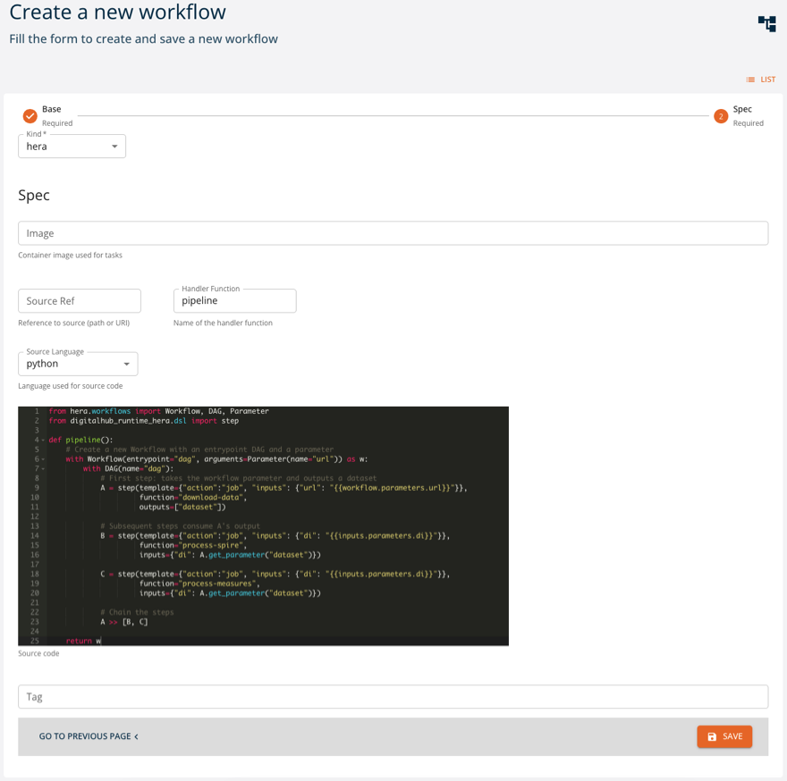

# Workflows

Workflows allow for organizing the single operations in a advanced management pipelines, to perform a series operation of data processing, ML model training and serving, etc. Workflows represent long-running procedures defined as Directed Acyclic Graphs (DAGs) where each node is a single unit of work performed by the platform (e.g., as a Kubernetes Job). 

As in case of functions, it is possible for the platform to have different workflow runtimes. Currently, the only workflow runtime implemented is the one based on Kubeflow Pipelines infrastructure. See [KFP Runtime](../runtimes/kfp_pipelines.md) for further details about how the workflow is defined and executed with the Kubeflow Pipelines component of the platform. 

Similarly, to functions the workflows may be managed via console UI or via Python SDK. 

## Management via UI

Workflows can be created and managed as *entities* from the console. You can access them from the dashboard or the left menu. You can:

- `create` a new workflow
- `expand` a workflow to see its 5 latest versions
- `show` the details of a workflow
- `edit` a workflow
- `delete` a workflow
- `filter` workflows by name and kind


We will now see how to [create](#create), [read](#read), [update](#update) and [delete](#delete) workflows using the UI, similarly to what is done with the SDK.

### Create

Click `CREATE` and a form will be shown:



Mandatory fields are:

- **`Name`**: name and identifier of the workflow
- **`Kind`**: kind of workflow

Metadata fields are optional and may be updated later.

- **`Description`**: a human-readable description
- **`Labels`**: list of labels
- **`Name`**: name of the function
- **`Embedded`**: flag for embedded metadata
- **`Versioning`**: version of the function
- **`Openmetadata`**: flag to publish metadata
- **`Audit`**: author of creation and modification

In case of a `kfp` workflow, the `fields.sourceCode.source.title` field is mandatory as well.

### Read

Click `SHOW` to view a workflow's details.


On the right side, all versions of the resource are listed, with the current one highlighted. By clicking a different version, values displayed will change accordingly.

The `INSPECTOR` button will show a dialog containing the resource in JSON format.


The `EXPORT` button will download the resource's information as a yaml file.

### Update

You can update a workflow by clicking `EDIT`. Greyed-out fields may not be updated.

### Delete

You can delete a workflow from either its detail page or the list of workflows, by clicking `DELETE`.

## Management via SDK

A `workflow` can be managed with the following methods.

- [**`new_workflow`**](#create_1): create a new workflow
- [**`get_workflow`**](#read_1): get a workflow
- [**`update_workflow`**](#update_1): update a workflow
- [**`delete_workflow`**](#delete_1): delete a workflow
- [**`list_workflows`**](#list): list all workflows

This is done in two ways. The first is through the SDK and the second is through the `Workflow` object.
Example:

```python
import digitalhub as dh

project = dh.get_or_create_project("my-project")

## From library
workflow = dh.new_workflow(project="my-project",
                           name="my-workflow",
                           kind="workflow",
                           path="s3://my-bucket/my-workflow.ext")

## From project
workflow = project.new_workflow(name="my-workflow",
                                kind="workflow",
                                path="s3://my-bucket/my-workflow.ext")
```

The syntax is the same for all CRUD methods. The following sections describe how to create, read, update and delete a workflow, focusing on managing workflows through the library. If you want to manage workflows from the project, you can use the `Project` object and avoid having to specify the `project` parameter.

### Create

To create a workflow you can use the `new_workflow()` method.

Mandatory parameters are:

- **`project`**: the project in which the workflow will be created
- **`name`**: name of the workflow
- **`kind`**: kind of the workflow
- **`path`**: remote path where the workflow is stored

Optional parameters are:

- **`uuid`**: uuid of the workflow (this is automatically generated if not provided). **Must** be a valid uuid v4.
- **`description`**: description of the workflow
- **`source`**: remote source of the workflow (git repository)
- **`labels`**: labels of the workflow
- **`embedded`**: whether the workflow is embedded or not. If `True`, the workflow is embedded (all the spec details are expressed) in the project. If `False`, the workflow is not embedded in the project
- **`src_path`**: local path of the workflow, used in case of upload into remote storage
- **`kwargs`**: keyword arguments passed to the *spec* constructor

Example:

```python
workflow = dh.new_workflow(project="my-project",
                           name="my-workflow",
                           kind="workflow",
                           path="s3://my-bucket/my-workflow.ext")
```

### Read

To read a workflow you can use the `get_workflow()` or `import_workflow()` methods. The first one searches for the workflow into the backend, the second one loads it from a local yaml.

#### Get

Mandatory parameters are:

- **`project`**: the project in which the workflow will be created

Optional parameters are:

- **`entity_name`**: to use the name of the workflow as identifier. It returns the latest version of the workflow
- **`entity_id`**: to use the uuid of the workflow as identifier. It returns the specified version of the workflow
- **`kwargs`**: keyword arguments passed to the client that communicates with the backend

Example:

```python
workflow = dh.get_workflow(project="my-project",
                           entity_name="my-workflow")

workflow = dh.get_workflow(project="my-project",
                           entity_id="uuid-of-my-workflow")
```

#### Import

Mandatory parameters are:

- **`file`**: file path to the workflow yaml

Example:

```python
workflow = dh.import_workflow(file="./some-path/my-workflow.yaml")
```

### Update

To update a workflow you can use the `update_workflow()` method.

Mandatory parameters are:

- **`workflow`**: workflow object to be updated

Optional parameters are:

- **`kwargs`**: keyword arguments passed to the client that communicates with the backend

Example:

```python
workflow = dh.new_workflow(project="my-project",
                           name="my-workflow",
                           kind="workflow",
                           path="s3://my-bucket/my-workflow.ext")

workflow.metadata.description = "My new description"

workflow = dh.update_workflow(workflow=workflow)
```

### Delete

To delete a workflow you can use the `delete_workflow()` method.

Mandatory parameters are:

- **`project`**: the project in which the workflow exists

Optional parameters are:

- **`entity_name`**: to use the name of the workflow as identifier
- **`entity_id`**: to use the uuid of the workflow as identifier
- **`delete_all_versions`**: if `True`, all versions of the workflow will be deleted. Mutually exclusive with the `entity_id` parameter.
- **`kwargs`**: keyword arguments passed to the client that communicates with the backend

Example:

```python
workflow = dh.new_workflow(project="my-project",
                           name="my-workflow",
                           kind="workflow",
                           path="s3://my-bucket/my-workflow.ext")

dh.delete_workflow(project="my-project",
                   entity_id=workflow.id)
```

### List

To list all workflows you can use the `list_workflows()` method.

Mandatory parameters are:

- **`project`**: the project containing the workflows

Optional parameters are:

- **`kwargs`**: keyword arguments passed to the client that communicates with the backend

Example:

```python
workflows = dh.list_workflows(project="my-project")
```

## Workflow object

The `Workflow` object is built using the `new_workflow()` method. There are several variations of the `Workflow` object based on the `kind` of the workflow. The SDK supports the following kinds:

- **`kfp`**: represents a generic workflow

For each different kind, the `Workflow` object has a different set of methods and different `spec`, `status` and `metadata`.
All the `Workflow` kinds have a `save()` and an `export()` method to save and export the *entity* workflow into backend or locally as yaml.

To create a specific workflow, you must use the desired `kind` in the `new_workflow()` method.

##### Kind: kfp

The `kfp` kind indicates that the workflow is a generic workflow.
There are no specific `spec` parameters.

The `kfp` kind has the following methods:

- **`as_file()`**: collects the workflow into a local temporary file
- **`download()`**: downloads the workflow into a specified path
- **`upload()`**: uploads the workflow to a specified path

###### As file

The `as_file()` method returns the workflow as a temporary file. The file **is not** automatically deleted when the program ends.
The method returns the path of the downloaded workflow.

###### Download

The `download()` method downloads the workflow into a specified path.
The method returns the path of the downloaded workflow.
The method accepts the following parameters:

- **`target`**: remote path of the workflow to be downloaded (eg. `s3://my-bucket/my-workflow.ext`). By default, uses the `spec` `path`.
- **`dst`**: local path where the workflow will be downloaded. By default, it is in the current working directory
- **`overwrite`**: if `True`, the target path will be overwritten if it already exists

###### Upload

The `upload()` method uploads the workflow to a specified path.
The method returns the path of the uploaded workflow.
The method accepts the following parameters:

- **`source`**: local path of the workflow to be uploaded
- **`target`**: remote path of the workflow to be uploaded (eg. `s3://my-bucket/my-workflow.ext`). By default, uses the `spec` `path`.